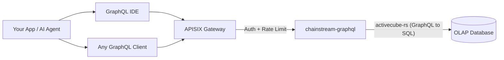

<Info>
ChainStream GraphQL은 멀티체인 온체인 데이터(Solana, Ethereum, BSC, Polygon)를 단일 GraphQL 엔드포인트를 통해 제공하는 OLAP 분석 API입니다. 필요한 필드만 정확히 쿼리하고, 실시간으로 데이터를 집계하며, 스키마를 인터랙티브하게 탐색할 수 있습니다 — 모두 고성능 OLAP 데이터베이스로 구동됩니다.
</Info>

## ChainStream GraphQL이란

ChainStream GraphQL은 온체인 분석 데이터를 위한 **선언적 쿼리 인터페이스**를 제공합니다. 고정된 응답 형태를 가진 수십 개의 REST 엔드포인트를 호출하는 대신, 원하는 데이터, 필터링 방식, 집계 방식을 정확히 지정하는 단일 GraphQL 쿼리를 작성하면 됩니다.

이 서비스는 **activecube-rs** 위에 구축되어 있으며, **Cube** 정의로부터 GraphQL 스키마를 동적으로 생성합니다 — 각 Cube는 분석 데이터 모델(예: DEX 트레이드, 토큰 전송, OHLC 캔들)을 나타냅니다. 쿼리는 최적화된 SQL로 컴파일되어 고성능 OLAP 데이터베이스에서 실행됩니다.

---

## GraphQL vs REST Data API

| | **GraphQL API** | **REST Data API** |
|:--|:--|:--|
| **쿼리 방식** | 선언적 — 형태, 필터, 집계를 직접 정의 | 명령적 — 미리 정의된 파라미터가 있는 고정 엔드포인트 |
| **필드 선택** | 클라이언트가 필요한 필드만 정확히 선택 | 서버가 고정된 응답 스키마를 반환 |
| **집계** | 쿼리별 내장 `count`, `sum`, `avg`, `min`, `max` | 사전 정의된 집계 엔드포인트만 제공 |
| **엔드포인트** | 모든 데이터 모델에 대한 단일 엔드포인트 | 리소스별 개별 엔드포인트 |
| **페이지네이션** | 쿼리 인자에서 `limit` + `offset` | 쿼리 파라미터에서 `limit` + `offset` / 커서 |
| **적합한 용도** | 분석, 대시보드, 유연한 데이터 탐색 | 간단한 조회, 실시간 가격, 월렛 잔액 |
| **지연 시간** | 처리량 최적화 | 단일 리소스 저지연 읽기 최적화 |

<Tip>
유연한 분석 쿼리가 필요할 때 **GraphQL**을 사용하세요 — 트레이드 집계, 시간 범위별 PnL 계산, 커스텀 대시보드 구축 등. 현재 토큰 가격이나 월렛 잔액 같은 빠르고 간단한 조회에는 **REST API**를 사용하세요.
</Tip>

---

## 핵심 장점

<CardGroup cols={3}>
  <Card title="단일 엔드포인트" icon="bullseye">
    하나의 URL로 4개 체인에 걸쳐 25개 데이터 Cube를 제공합니다. 엔드포인트 난립 없이 쿼리만 변경하면 됩니다.
  </Card>
  <Card title="클라이언트 필드 선택" icon="filter">
    필요한 컬럼만 요청하세요. 오버페칭도 언더페칭도 없어 대역폭 제한 환경의 클라이언트에 이상적입니다.
  </Card>
  <Card title="내장 집계" icon="chart-column">
    후처리 없이 쿼리에서 직접 `count`, `sum`, `avg`, `min`, `max`를 계산할 수 있습니다.
  </Card>
</CardGroup>

---

## 지원 체인

| Network ID | 블록체인 | 체인 그룹 | 데이터 범위 |
|:--|:--|:--|:--|
| `eth` | Ethereum | EVM | 전체 DEX, 전송, 잔액 업데이트, 이벤트, 트레이스, 토큰 통계 |
| `bsc` | BNB Chain (BSC) | EVM | 전체 DEX, 전송, 잔액 업데이트, 이벤트, 트레이스, 토큰 통계 |
| `polygon` | Polygon | EVM | 전체 DEX, 전송, 잔액 업데이트, 예측 시장 |
| `sol` | Solana | Solana | 전체 DEX, 전송, 인스트럭션, 토큰 홀더, OHLC, PnL |

<Note>
쿼리는 세 개의 **체인 그룹**으로 구성됩니다: **EVM** (`network` 인자 필요), **Solana**, 그리고 **Trading** (크로스체인 OHLC 및 토큰 통계). 자세한 내용은 [체인 그룹](/ko/graphql/schema/chain-groups)을 참조하세요.
</Note>

---

## 사용 가능한 데이터 큐브

3개의 체인 그룹에 걸쳐 25개 Cube가 제공되며, 각각 고유한 분석 모델을 나타냅니다:

<AccordionGroup>
  <Accordion title="DEX 트레이딩">
    - **DEXTrades** — 매수/매도 금액, 가격, DEX 프로토콜 정보가 포함된 개별 DEX 스왑 이벤트
    - **DEXTradeByTokens** — 효율적인 토큰별 쿼리를 위해 토큰 기준으로 인덱싱된 DEX 트레이드
    - **DEXOrders** — 지정가 주문을 포함한 DEX 주문 이벤트 *(Solana 전용)*
  </Accordion>
  <Accordion title="풀 & 유동성">
    - **DEXPoolEvents** — DEX 풀의 유동성 추가/제거 이벤트
    - **DEXPools** — 현재 보유량과 메타데이터가 포함된 DEX 풀 스냅샷
    - **DEXPoolSlippages** — 풀 슬리피지 데이터 *(EVM 전용)*
    - **TokenSupplyUpdates** — 토큰 공급에 영향을 미치는 민트 및 번 이벤트
  </Accordion>
  <Accordion title="토큰 & 전송">
    - **Transfers** — 발신자, 수신자, 금액, USD 가치가 포함된 토큰 전송 이벤트
    - **BalanceUpdates** — 토큰별 월렛 잔액 변동 이벤트
    - **TokenHolders** — 토큰의 현재 홀더 목록 및 분포
    - **WalletTokenPnL** — 월렛-토큰 쌍별 PnL
  </Accordion>
  <Accordion title="트레이딩 분석 (크로스체인)">
    - **Pairs** — 설정 가능한 시간 간격의 OHLC 캔들스틱 데이터 (이전에 OHLC로 참조됨)
    - **Tokens** — 토큰별 집계 트레이드 통계: 거래량, 거래 횟수, 고유 트레이더 수 (이전에 TokenTradeStats로 참조됨)
  </Accordion>
  <Accordion title="블록체인 인프라">
    - **Blocks** — 블록 레벨 데이터 (타임스탬프, 높이, 마이너/밸리데이터)
    - **Transactions** — 트랜잭션 레벨 데이터 (해시, 상태, 가스/수수료)
    - **TransactionBalances** — 트랜잭션별 잔액 변동
    - **Events** — 스마트 컨트랙트 이벤트 로그 *(EVM 전용)*
    - **Calls** — 내부 호출 트레이스 *(EVM 전용)*
    - **Instructions** — 인스트럭션 레벨 데이터 *(Solana 전용)*
    - **InstructionBalanceUpdates** — 인스트럭션 레벨 잔액 변동 *(Solana 전용)*
  </Accordion>
  <Accordion title="보상 & 네트워크">
    - **Rewards** — 밸리데이터/스테이킹 보상 *(Solana 전용)*
    - **MinerRewards** — 마이너/밸리데이터 보상 *(EVM 전용)*
    - **Uncles** — 엉클 블록 데이터 *(EVM 전용)*
  </Accordion>
  <Accordion title="예측 시장">
    - **PredictionTrades** — 예측 시장 거래 이벤트 *(EVM — Polygon)*
    - **PredictionManagements** — 예측 시장 관리 이벤트 *(EVM — Polygon)*
    - **PredictionSettlements** — 예측 시장 정산 이벤트 *(EVM — Polygon)*
  </Accordion>
</AccordionGroup>

---

## 주요 쿼리 파라미터

표준 필터링 및 페이지네이션 외에도 ChainStream GraphQL은 체인 그룹 수준에서 두 가지 강력한 파라미터를 지원합니다:

| 파라미터 | 값 | 설명 |
|:--|:--|:--|
| **`dataset`** | `realtime`, `archive`, `combined` (기본값) | 데이터 소스 범위 제어 — 최근 데이터만, 과거 데이터, 또는 전체 범위 |
| **`aggregates`** | `yes`, `no`, `only` | 빠른 분석 쿼리를 위한 사전 집계 테이블 사용 여부 제어 |

<Tip>
자세한 사용법과 예제는 [데이터셋 & 어그리게이트](/ko/graphql/schema/dataset-aggregates)를 참조하세요.
</Tip>

---

## 아키텍처

<Info>
모든 요청은 인증 및 속도 제한을 위해 APISIX 게이트웨이를 통과합니다. `chainstream-graphql` 서비스는 GraphQL 쿼리를 OLAP 분석 데이터베이스에서 실행되는 최적화된 SQL로 컴파일합니다.
</Info>

---

## 다음 단계

<CardGroup cols={3}>
  <Card title="엔드포인트 & 인증" icon="key" href="/ko/graphql/getting-started/endpoints">
    엔드포인트 URL, 인증 헤더를 구성하고 요청/응답 형식을 이해합니다.
  </Card>
  <Card title="첫 번째 쿼리" icon="play" href="/ko/graphql/getting-started/first-query">
    IDE 또는 cURL에서 첫 번째 GraphQL 쿼리를 단계별로 실행합니다.
  </Card>
  <Card title="GraphQL IDE" icon="code" href="/ko/graphql/ide/introduction">
    자동 완성, 쿼리 템플릿, 코드 내보내기가 포함된 인터랙티브 GraphQL IDE를 탐색합니다.
  </Card>
</CardGroup>
