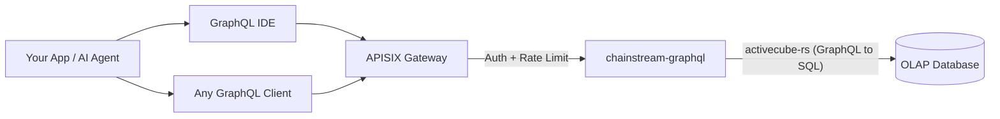

<Info>
ChainStream GraphQL은 OLAP 분석용 API로, Solana·Ethereum·BSC·Polygon 등 멀티체인 온체인 데이터를 단일 GraphQL 엔드포인트로 노출합니다. 필요한 필드만 조회하고, 필요에 따라 집계하며, 스키마를 대화형으로 탐색할 수 있으며, 고성능 OLAP DB가 백엔드를 담당합니다.
</Info>

## ChainStream GraphQL이란

ChainStream GraphQL은 온체인 분석 데이터를 위한 **선언형 쿼리 인터페이스**를 제공합니다. 고정 응답 형태의 REST 엔드포인트를 여러 번 호출하는 대신, 한 번의 GraphQL 쿼리로 원하는 데이터·필터·집계 방식을 지정합니다.

서비스는 **activecube-rs** 위에 구축되어 있으며, **Cube** 정의로부터 GraphQL 스키마를 동적으로 생성합니다. 각 Cube는 분석 데이터 모델(예: DEX 거래, 토큰 전송, OHLC 캔들)을 나타냅니다. 쿼리는 최적화된 SQL로 컴파일되어 고성능 OLAP DB에서 실행됩니다.

---

## GraphQL vs REST Data API

| | **GraphQL API** | **REST Data API** |
|:--|:--|:--|
| **쿼리 스타일** | 선언형 — 형태·필터·집계를 정의 | 명령형 — 고정 엔드포인트와 정해진 파라미터 |
| **필드 선택** | 클라이언트가 필요한 필드만 선택 | 서버가 고정 응답 스키마 반환 |
| **집계** | 쿼리마다 내장 `count`, `sum`, `avg`, `min`, `max` | 사전 정의된 집계 엔드포인트만 |
| **엔드포인트** | 모든 데이터 모델에 단일 엔드포인트 | 리소스마다 별도 엔드포인트 |
| **페이지네이션** | 쿼리 인자의 `limit` + `offset` | 쿼리 파라미터의 `limit` + `offset` / 커서 |
| **적합한 용도** | 분석, 대시보드, 유연한 탐색 | 단순 조회, 실시간 가격, 지갑 잔액 |
| **지연 시간** | 처리량 위주 최적화 | 단일 리소스 저지연 읽기 위주 최적화 |

<Tip>
거래 집계, 기간별 PnL, 맞춤 대시보드처럼 **유연한 분석 쿼리**가 필요하면 **GraphQL**을 쓰세요. 현재 토큰 가격·지갑 잔액처럼 **빠르고 단순한 조회**에는 **REST API**가 맞습니다.
</Tip>

---

## 핵심 장점

<CardGroup cols={3}>
  <Card title="단일 엔드포인트" icon="bullseye">
    하나의 URL로 4개 체인·25개 데이터 Cube를 제공합니다. 엔드포인트 난립 없이 쿼리만 바꾸면 됩니다.
  </Card>
  <Card title="클라이언트 필드 선택" icon="filter">
    필요한 컬럼만 요청합니다. 과다·과소 페칭이 없어 대역폭이 제한된 클라이언트에 적합합니다.
  </Card>
  <Card title="내장 집계" icon="chart-column">
    후처리 없이 쿼리 안에서 `count`, `sum`, `avg`, `min`, `max`를 계산할 수 있습니다.
  </Card>
</CardGroup>

---

## 지원 체인

| 네트워크 ID | 블록체인 | Chain Group | 커버리지 |
|:--|:--|:--|:--|
| `eth` | Ethereum | EVM | 전체 DEX, 전송, 잔액 업데이트, 이벤트, 트레이스, 토큰 통계 |
| `bsc` | BNB Chain (BSC) | EVM | 전체 DEX, 전송, 잔액 업데이트, 이벤트, 트레이스, 토큰 통계 |
| `polygon` | Polygon | EVM | 예측 시장(PredictionTrades/Managements/Settlements). 다른 Cube는 배포 중. |
| `sol` | Solana | Solana | 전체 DEX, 전송, instruction, 토큰 홀더, OHLC, PnL |

<Note>
쿼리는 세 가지 **Chain Group**으로 나뉩니다: **`network` 인자가 필요한 EVM**, **Solana**, **크로스체인 OHLC·토큰 통계의 Trading**. 자세한 내용은 [Chain Groups](/ko/graphql/schema/chain-groups)를 참고하세요.
</Note>

---

## 사용 가능한 데이터 Cube

세 Chain Group에 걸쳐 25개의 Cube가 있으며, 각각 별도의 분석 모델을 나타냅니다.

<AccordionGroup>
  <Accordion title="DEX 거래">
    - **DEXTrades** — 매수/매도 수량, 가격, DEX 프로토콜 정보가 포함된 개별 DEX 스왑 이벤트
    - **DEXTradeByTokens** — 토큰별 조회에 맞게 인덱싱된 DEX 거래
    - **DEXOrders** — 지정가 주문 등 DEX 오더 이벤트 *(Solana 전용)*
  </Accordion>
  <Accordion title="풀 & 유동성">
    - **DEXPoolEvents** — DEX 풀의 유동성 추가/제거 이벤트
    - **DEXPools** — 현재 준비금·메타데이터가 있는 DEX 풀 스냅샷
    - **DEXPoolSlippages** — 풀 슬리피지 데이터 *(EVM 전용)*
    - **TokenSupplyUpdates** — 토큰 공급에 영향을 주는 민트·번 이벤트
  </Accordion>
  <Accordion title="토큰 & 전송">
    - **Transfers** — 발신자·수신자·수량·USD 값이 있는 토큰 전송 이벤트
    - **BalanceUpdates** — 토큰별 지갑 잔액 변화 이벤트
    - **TokenHolders** — 토큰의 현재 홀더 목록·분포
    - **WalletTokenPnL** — 지갑-토큰 쌍별 PnL
  </Accordion>
  <Accordion title="거래 분석(크로스체인)">
    - **Pairs** — 설정 가능한 시간 간격의 OHLC 캔들 데이터(과거에는 OHLC로 언급)
    - **Tokens** — 토큰별 집계 거래 통계: 거래량, 거래 건수, 고유 트레이더(과거에는 TokenTradeStats로 언급)
  </Accordion>
  <Accordion title="블록체인 인프라">
    - **Blocks** — 블록 단위 데이터(타임스탬프, 높이, 마이너/검증자)
    - **Transactions** — 트랜잭션 단위 데이터(해시, 상태, 가스/수수료)
    - **TransactionBalances** — 트랜잭션별 잔액 변화
    - **Events** — 스마트 컨트랙트 이벤트 로그 *(EVM 전용)*
    - **Calls** — 내부 호출 트레이스 *(EVM 전용)*
    - **Instructions** — instruction 단위 데이터 *(Solana 전용)*
    - **InstructionBalanceUpdates** — instruction 단위 잔액 변화 *(Solana 전용)*
  </Accordion>
  <Accordion title="보상 & 네트워크">
    - **Rewards** — 검증자/스테이킹 보상 *(Solana 전용)*
    - **MinerRewards** — 마이너/검증자 보상 *(EVM 전용)*
    - **Uncles** — Uncle 블록 데이터 *(EVM 전용)*
  </Accordion>
  <Accordion title="예측 시장">
    - **PredictionTrades** — 예측 시장 거래 이벤트 *(EVM — Polygon)*
    - **PredictionManagements** — 예측 시장 관리 이벤트 *(EVM — Polygon)*
    - **PredictionSettlements** — 예측 시장 정산 이벤트 *(EVM — Polygon)*
  </Accordion>
</AccordionGroup>

---

## 주요 쿼리 파라미터

일반 필터·페이지네이션 외에 ChainStream GraphQL은 Chain Group 수준에서 강력한 파라미터 두 가지를 지원합니다.

| 파라미터 | 값 | 설명 |
|:--|:--|:--|
| **`dataset`** | `realtime`, `archive`, `combined`(기본) | 데이터 소스 범위 — 최근만, 역사만, 또는 전체 |
| **`aggregates`** | `yes`, `no`, `only` | 분석 쿼리 속도를 위해 사전 집계 테이블 사용 여부 |

<Tip>
자세한 사용법과 예시는 [Dataset & Aggregates](/ko/graphql/schema/dataset-aggregates)를 참고하세요.
</Tip>

---

## 아키텍처

<Info>
모든 요청은 APISIX 게이트웨이를 거쳐 인증·레이트 리밋이 적용됩니다. `chainstream-graphql` 서비스는 GraphQL 쿼리를 OLAP 분석 DB에서 실행할 최적화된 SQL로 컴파일합니다.
</Info>

---

## 다음 단계

<CardGroup cols={3}>
  <Card title="엔드포인트 및 인증" icon="key" href="/ko/graphql/getting-started/endpoints">
    엔드포인트 URL, 인증 헤더, 요청/응답 형식을 설정합니다.
  </Card>
  <Card title="첫 쿼리" icon="play" href="/ko/graphql/getting-started/first-query">
    IDE 또는 cURL로 첫 GraphQL 쿼리를 단계별로 실행합니다.
  </Card>
  <Card title="GraphQL IDE" icon="code" href="/ko/graphql/ide/introduction">
    자동 완성, 쿼리 템플릿, 코드보내기가 있는 대화형 GraphQL IDE를 탐색합니다.
  </Card>
</CardGroup>
