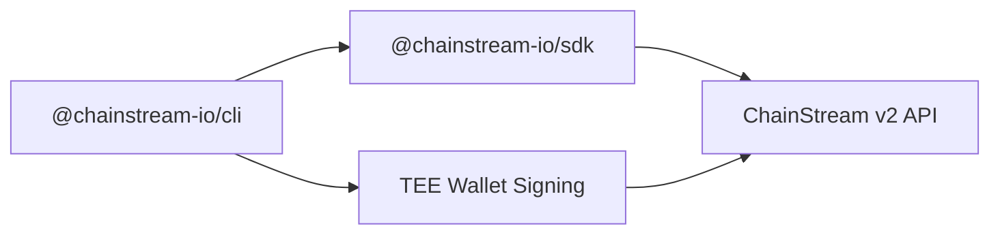

## ChainStream CLI란

ChainStream CLI (`@chainstream-io/cli`)는 Solana, BSC, Ethereum 전반에 걸쳐 온체인 데이터를 조회하고 DeFi 작업을 실행하는 커맨드 라인 도구입니다. 개발자와 AI 에이전트 모두를 위해 설계되었습니다.

<CardGroup cols={2}>
  <Card title="데이터 조회" icon="magnifying-glass" color="#4D9CFF">
    토큰 검색, 지갑 분석, 시장 동향 추적, 최근 거래 조회
  </Card>
  <Card title="DeFi 실행" icon="right-left" color="#9333EA">
    토큰 스왑, 런치패드에서 토큰 생성, 내장 지갑 서명을 통한 트랜잭션 브로드캐스트
  </Card>
</CardGroup>

## 설치

글로벌 설치 없이 `npx`로 바로 실행할 수 있습니다:

```bash
npx @chainstream-io/cli token search --keyword PUMP --chain sol
```

또는 글로벌 설치:

```bash
npm install -g @chainstream-io/cli
chainstream token search --keyword PUMP --chain sol
```

<Note>Node.js 18 이상이 필요합니다.</Note>

## 아키텍처



- **SDK 기반** — 모든 API 호출은 `@chainstream-io/sdk`를 통해 타입이 지정된 응답, 자동 재시도, 작업 폴링과 함께 처리됩니다
- **TEE 서명** — DeFi 트랜잭션은 TEE(Trusted Execution Environment)에서 원격 서명됩니다; 디바이스 키는 `~/.config/chainstream/keys/`에 로컬 저장됩니다
- **API Key 우선** — x402 구매 시 API Key가 설정에 자동 저장됩니다; 지갑 서명은 DeFi 실행에만 필요합니다

## 지원 체인

| 체인 | CLI ID | Data API | DeFi | WebSocket |
|-------|--------|----------|------|-----------|
| Solana | `sol` | 예 | 예 | 예 |
| BSC | `bsc` | 예 | 예 | 예 |
| Ethereum | `eth` | 예 | 예 | 예 |

## CLI vs MCP vs SDK

| 기능 | CLI | MCP Server | SDK |
|------------|-----|------------|-----|
| 토큰 검색 & 분석 | 예 | 예 | 예 |
| 시장 트렌딩 & 순위 | 예 | 예 | 예 |
| 지갑 프로파일링 & PnL | 예 | 예 | 예 |
| DEX 시세 | 예 | 예 | 예 |
| DEX 스왑 (서명) | 예 | 아니오 | 예 (WalletSigner 필요) |
| 토큰 생성 | 예 | 아니오 | 예 (WalletSigner 필요) |
| x402 자동 결제 | 예 | 해당 없음 | 수동 |
| 적합한 용도 | AI 에이전트, 스크립트, CI | AI 채팅 어시스턴트 | 커스텀 애플리케이션 |

## 빠른 시작

```bash
# 1. 인증 (최초 1회만 필요)
npx @chainstream-io/cli login

# 2. 토큰 검색
npx @chainstream-io/cli token search --keyword PUMP --chain sol

# 3. 토큰 보안 점검
npx @chainstream-io/cli token security --chain sol --address <token_address>

# 4. 인기 토큰 조회
npx @chainstream-io/cli market trending --chain sol --duration 1h

# 5. 지갑 PnL 분석
npx @chainstream-io/cli wallet pnl --chain sol --address <wallet_address>
```

## 다음 단계

<CardGroup cols={3}>
  <Card title="인증" icon="key" href="/ko/guides/cli/authentication">
    API Key 또는 지갑 로그인 설정
  </Card>
  <Card title="명령어 레퍼런스" icon="book" href="/ko/guides/cli/commands">
    전체 명령어 및 옵션 목록
  </Card>
  <Card title="자동 결제" icon="credit-card" href="/ko/guides/cli/x402-payment">
    USDC로 구독 자동 구매
  </Card>
</CardGroup>
