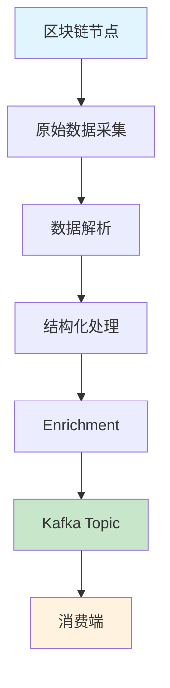

ChainStream 透過 Kafka Streams 提供多鏈實時鏈上資料流。相較於 GraphQL Subscriptions 和 WebSocket，Kafka Streams 面向對延遲敏感、可靠性要求高的服務端應用場景，提供更低延遲、更強容錯的資料消費能力。

<Card title="Protobuf Schema 倉庫" icon="github" href="https://github.com/chainstream-io/streaming_protobuf">
  ChainStream 官方 Protobuf Schema 定義，支援 Go 和 Python，包含 EVM、Solana、TRON 所有訊息型別。
</Card>

---

## 支援矩陣

| 鏈 | dex.trades | tokens | balances | dex.pools | transfers | candlesticks |
|:---|:---:|:---:|:---:|:---:|:---:|:---:|
| Ethereum (eth) | ✅ | ✅ | ✅ | ✅ | ✅ | ✅ |
| BSC (bsc) | ✅ | ✅ | ✅ | ✅ | ✅ | ✅ |
| Solana (sol) | ✅ | ✅ | ✅ | ✅ | ✅ | ✅ |
| TRON (tron) | ✅ | ✅ | ✅ | ✅ | ✅ | ✅ |

<Note>
所有鏈還支援 `token-supplies`、`token-prices`、`token-holdings`、`token-market-caps`、`trade-stats` 等 Topics。詳見完整 Topic 列表。
</Note>

---

## Kafka Streams vs WebSocket 選型指南

### 何時選擇 Kafka Streams

<CardGroup cols={2}>
  <Card title="延遲敏感" icon="bolt">
    延遲是首要考量，應用部署在雲端或專用伺服器
  </Card>
  <Card title="訊息可靠" icon="shield-check">
    不可接受丟失任何訊息，需要持久可靠的資料消費
  </Card>
  <Card title="複雜處理" icon="gears">
    需要對資料做複雜計算、過濾或格式化，超出預處理能力範圍
  </Card>
  <Card title="水平擴充套件" icon="server">
    需要多例項水平擴充套件消費能力
  </Card>
</CardGroup>

### 何時選擇 WebSocket

<CardGroup cols={2}>
  <Card title="快速原型" icon="rocket">
    正在構建原型，開發速度是首要因素
  </Card>
  <Card title="統一介面" icon="plug">
    應用同時需要歷史資料和實時資料，需要統一查詢與訂閱介面
  </Card>
  <Card title="瀏覽器端" icon="browser">
    應用直接在瀏覽器端消費資料（Kafka Streams 僅支援服務端）
  </Card>
  <Card title="動態過濾" icon="filter">
    需要根據頁面內容動態過濾資料
  </Card>
</CardGroup>

### 對比總結

| 特性 | Kafka Streams | WebSocket |
|:---|:---:|:---:|
| 延遲 | 最低 | 低 |
| 可靠性 | 持久化，不丟訊息 | 斷連可能丟失 |
| 擴充套件性 | 原生水平擴充套件 | 需額外設計 |
| 資料過濾 | 消費端處理 | 服務端預過濾 |
| 客戶端支援 | 僅服務端 | 服務端 + 瀏覽器 |
| 接入複雜度 | 較高 | 較低 |

---

## 接入憑證獲取

Kafka Streams 使用獨立的認證憑證，需要聯絡 ChainStream 團隊申請開通。

<Steps>
  <Step title="聯絡申請">
    傳送郵件至 [support@chainstream.io](mailto:support@chainstream.io) 申請 Kafka Streams 接入許可權
  </Step>
  <Step title="獲取憑證">
    稽核透過後，您將收到以下憑證資訊：
    - Username
    - Password
    - Broker 地址列表
  </Step>
  <Step title="配置連線">
    使用獲取的憑證配置 Kafka 客戶端連線
  </Step>
</Steps>

---

## 連線配置

### Broker 地址

<Note>
Broker 地址將在您的申請稽核透過後，隨憑證資訊一同提供。請勿使用任何未經授權的地址進行連線。
</Note>

### SASL_SSL 連線配置

<Tabs>
  <Tab title="Python">
    ```python
    from kafka import KafkaConsumer

    consumer = KafkaConsumer(
        'eth.dex.trades',
        bootstrap_servers=['<your_broker_address>'],
        security_protocol='SASL_SSL',
        sasl_mechanism='SCRAM-SHA-512',
        sasl_plain_username='your_username',
        sasl_plain_password='your_password',
        auto_offset_reset='latest',
        enable_auto_commit=False,
        group_id='your_group_id'
    )
    ```
  </Tab>
  <Tab title="JavaScript">
    ```javascript
    const { Kafka } = require('kafkajs');

    const kafka = new Kafka({
      clientId: 'my-app',
      brokers: ['<your_broker_address>'],
      ssl: true,
      sasl: {
        mechanism: 'scram-sha-512',
        username: 'your_username',
        password: 'your_password'
      }
    });

    const consumer = kafka.consumer({ groupId: 'your_group_id' });
    ```
  </Tab>
  <Tab title="Go">
    ```go
    package main

    import (
        "github.com/segmentio/kafka-go"
        "github.com/segmentio/kafka-go/sasl/scram"
    )

    func main() {
        mechanism, _ := scram.Mechanism(scram.SHA512, "your_username", "your_password")
        
        reader := kafka.NewReader(kafka.ReaderConfig{
            Brokers: []string{"<your_broker_address>"},
            Topic:   "eth.dex.trades",
            GroupID: "your_group_id",
            Dialer: &kafka.Dialer{
                SASLMechanism: mechanism,
                TLS:           &tls.Config{},
            },
        })
    }
    ```
  </Tab>
</Tabs>

---

## Topic 命名規範與完整列表

### 命名規範

Topic 命名遵循以下 pattern：

```
{chain}.{message_type}              # 原始事件数据
{chain}.{message_type}.processed    # 处理后的数据（含价格、标记等增强信息）
{chain}.{message_type}.created      # 创建事件（如代币创建）
```

其中 `{chain}` 包括：`sol`、`bsc`、`eth`、`tron`

### 訊息型別說明

| 型別 | 說明 |
|:---|:---|
| `dex.trades` | DEX 交易事件 |
| `dex.pools` | 流動性池事件 |
| `tokens` | Token 事件 |
| `balances` | 餘額變動事件 |
| `transfers` | 轉賬事件 |
| `token-supplies` | 代幣供應量事件 |
| `token-prices` | 代幣價格事件 |
| `token-holdings` | 代幣持倉資料 |
| `token-market-caps` | 代幣市值事件 |
| `candlesticks` | K線資料 |
| `trade-stats` | 交易統計資料 |

### 完整 Topic 列表

<Tabs>
  <Tab title="跨鏈通用 Topics">
    以下 Topics 適用於所有支援的鏈（將 `{chain}` 替換為 `sol`、`bsc`、`eth`）：

    ```
    # DEX 交易
    {chain}.dex.trades
    {chain}.dex.trades.processed    # 包含 USD/原生币价格、可疑标记

    # 代币事件
    {chain}.tokens
    {chain}.tokens.created          # 代币创建事件
    {chain}.tokens.processed        # 包含描述、图片、社交链接

    # 余额变动
    {chain}.balances
    {chain}.balances.processed      # 包含 USD/原生币价值

    # 流动性池
    {chain}.dex.pools
    {chain}.dex.pools.processed     # 包含流动性 USD/原生币价值

    # 代币数据
    {chain}.token-supplies
    {chain}.token-supplies.processed
    {chain}.token-prices
    {chain}.token-holdings
    {chain}.token-market-caps.processed

    # 聚合数据
    {chain}.candlesticks            # OHLCV K线数据
    {chain}.trade-stats             # 交易统计
    ```
  </Tab>
  <Tab title="Solana 專用">
    ```
    # 转账事件
    sol.transfers
    sol.transfers.processed         # 包含 USD/原生币价值
    ```
  </Tab>
  <Tab title="EVM 專用">
    ```
    # 转账消息（BSC / ETH）
    {chain}.v1.transfers.proto
    {chain}.v1.transfers.processed.proto
    ```
  </Tab>
  <Tab title="TRON 專用">
    ```
    # 转账消息
    tron.v1.transfers.proto
    tron.v1.transfers.processed.proto
    ```
  </Tab>
</Tabs>

<Tip>
完整的 Protobuf Schema 和 Topic 對映請參考 [streaming_protobuf 倉庫](https://github.com/chainstream-io/streaming_protobuf)。
</Tip>

---

## 消費模式與 Offset 管理

訂閱 topic 時需要關注兩個核心配置：

### Offset 策略選擇

消費者在連線 Kafka 後，需要決定從哪個位置開始讀取訊息。兩種常見策略：

<Tabs>
  <Tab title="僅消費最新訊息">
    每次連線從當前最新位置開始，適合只關心實時資料的場景。重連後不會回溯歷史訊息。

    ```javascript
    {
      autoCommit: false,
      fromBeginning: false,
      'auto.offset.reset': 'latest'
    }
    ```
  </Tab>
  <Tab title="持久消費不丟訊息">
    自動提交 offset，下次重連從上次消費位置繼續，確保訊息不丟失。

    ```javascript
    {
      autoCommit: true,
      fromBeginning: false,
      'auto.offset.reset': 'latest'
    }
    ```

    <Warning>
    如果服務重啟，會從上次記錄的 offset 繼續讀取，重啟期間的訊息可能在恢復後產生積壓。
    </Warning>
  </Tab>
</Tabs>

### Group ID 規則

多例項部署同一 Group ID 可實現故障轉移和負載均衡——同一 topic 的訊息只會被 Group 中的一個例項消費，Kafka 自動在例項間分配分割槽。

<Tip>
通常建議每個 topic 對應一個獨立 consumer，因為不同 topic 的訊息解析邏輯不同。
</Tip>

---

## Quick Start：5 分鐘跑通第一個 Consumer

以下示例展示如何消費 `eth.dex.trades` topic 並解析 DEX 交易資料。

<Steps>
  <Step title="獲取 Protobuf Schema">
    從官方倉庫克隆 Schema 定義：

    ```bash
    git clone https://github.com/chainstream-io/streaming_protobuf.git
    ```

    或作為 Git submodule 新增到專案：

    ```bash
    git submodule add https://github.com/chainstream-io/streaming_protobuf.git
    ```
  </Step>
  <Step title="安裝依賴">
    ```bash
    pip install kafka-python protobuf
    ```
  </Step>
  <Step title="配置連線並消費">
    ```python
    from kafka import KafkaConsumer
    from common import trade_event_pb2  # 从 streaming_protobuf 仓库获取

    # 创建 consumer
    consumer = KafkaConsumer(
        'eth.dex.trades',
        bootstrap_servers=['<your_broker_address>'],
        security_protocol='SASL_SSL',
        sasl_mechanism='SCRAM-SHA-512',
        sasl_plain_username='your_username',
        sasl_plain_password='your_password',
        auto_offset_reset='latest',
        enable_auto_commit=False,
        group_id='my-dex-consumer'
    )

    # 消费消息
    for message in consumer:
        # 解析 protobuf 消息
        trade_events = trade_event_pb2.TradeEvents()
        trade_events.ParseFromString(message.value)
        
        # 打印 DEX 交易信息
        for event in trade_events.events:
            print(f"Pool: {event.trade.pool_address}")
            print(f"Token A: {event.trade.token_a_address}")
            print(f"Token B: {event.trade.token_b_address}")
            print(f"Amount A: {event.trade.user_a_amount}")
            print(f"Amount B: {event.trade.user_b_amount}")
            print(f"Block: {event.block.height}")
            print("---")
    ```
  </Step>
</Steps>

---

## 核心資料結構

所有訊息型別共享以下基礎結構（定義於 `common/common.proto`）：

### 基礎結構

<Tabs>
  <Tab title="Block">
    區塊資訊：

    | 欄位 | 型別 | 說明 |
    |:---|:---|:---|
    | `timestamp` | int64 | 區塊時間戳 |
    | `hash` | string | 區塊雜湊 |
    | `height` | uint64 | 區塊高度 |
    | `slot` | uint64 | Slot 號（Solana） |
  </Tab>
  <Tab title="Transaction">
    交易資訊：

    | 欄位 | 型別 | 說明 |
    |:---|:---|:---|
    | `fee` | uint64 | 交易費用 |
    | `fee_payer` | string | 費用支付方 |
    | `index` | uint32 | 區塊內索引 |
    | `signature` | string | 交易簽名 |
    | `signer` | string | 簽名者地址 |
    | `status` | Status | 執行狀態（SUCCESS/FAILED） |
    | `bundles` | []BundleTransaction | Bundle 資訊（MEV 檢測） |
  </Tab>
  <Tab title="Instruction">
    指令資訊：

    | 欄位 | 型別 | 說明 |
    |:---|:---|:---|
    | `index` | uint32 | 指令索引 |
    | `is_inner_instruction` | bool | 是否內部指令 |
    | `inner_instruction_index` | uint32 | 內部指令索引 |
    | `type` | string | 指令型別 |
  </Tab>
  <Tab title="DApp">
    DApp 資訊：

    | 欄位 | 型別 | 說明 |
    |:---|:---|:---|
    | `program_address` | string | 程式地址 |
    | `inner_program_address` | string | 內部程式地址 |
    | `chain` | Chain | 鏈標識 |
  </Tab>
</Tabs>

### 主要訊息型別

<AccordionGroup>
  <Accordion title="TradeEvent - DEX 交易事件">
    **Topic**: `{chain}.dex.trades`

    ```protobuf
    message TradeEvent {
      Instruction instruction = 1;
      Block block = 2;
      Transaction transaction = 3;
      DApp d_app = 4;
      Trade trade = 100;
      BondingCurve bonding_curve = 110;
      TradeProcessed trade_processed = 200;  // processed topic 包含
    }
    ```

    **Trade 核心欄位**：

    | 欄位 | 說明 |
    |:---|:---|
    | `token_a_address` / `token_b_address` | 交易對代幣地址 |
    | `user_a_amount` / `user_b_amount` | 使用者交易數量 |
    | `pool_address` | 池子地址 |
    | `vault_a` / `vault_b` | 池子 Vault 地址 |
    | `vault_a_amount` / `vault_b_amount` | Vault 數量 |

    **TradeProcessed 增強欄位**（processed topic）：

    | 欄位 | 說明 |
    |:---|:---|
    | `token_a_price_in_usd` / `token_b_price_in_usd` | USD 價格 |
    | `token_a_price_in_native` / `token_b_price_in_native` | 原生幣價格 |
    | `is_token_a_price_in_usd_suspect` | 價格是否可疑 |
    | `is_token_a_price_in_usd_suspect_reason` | 可疑原因 |
  </Accordion>

  <Accordion title="TokenEvent - 代幣事件">
    **Topic**: `{chain}.tokens`, `{chain}.tokens.created`

    ```protobuf
    message TokenEvent {
      Instruction instruction = 1;
      Block block = 2;
      Transaction transaction = 3;
      DApp d_app = 4;
      EventType type = 100;        // CREATED, UPDATED
      Token token = 101;
      TokenProcessed token_processed = 200;
    }
    ```

    **Token 核心欄位**：

    | 欄位 | 說明 |
    |:---|:---|
    | `address` | 代幣地址 |
    | `name` / `symbol` | 名稱和符號 |
    | `decimals` | 精度 |
    | `uri` | 後設資料 URI |
    | `metadata_address` | 後設資料地址 |
    | `creators` | 建立者列表 |
    | `solana_extra` | Solana 特有欄位 |
    | `evm_extra` | EVM 特有欄位（token_standard） |
  </Accordion>

  <Accordion title="BalanceEvent - 餘額變動事件">
    **Topic**: `{chain}.balances`

    ```protobuf
    message BalanceEvent {
      Instruction instruction = 1;
      Block block = 2;
      Transaction transaction = 3;
      DApp d_app = 4;
      Balance balance = 100;
      BalanceProcessed balance_processed = 200;
    }
    ```

    **Balance 核心欄位**：

    | 欄位 | 說明 |
    |:---|:---|
    | `token_account_address` | Token 賬戶地址 |
    | `account_owner_address` | 賬戶所有者地址 |
    | `token_address` | 代幣地址 |
    | `pre_amount` / `post_amount` | 變動前後餘額 |
    | `decimals` | 精度 |
    | `lifecycle` | 賬戶生命週期（NEW/EXISTING/CLOSED） |
  </Accordion>

  <Accordion title="DexPoolEvent - 流動性池事件">
    **Topic**: `{chain}.dex.pools`

    ```protobuf
    message DexPoolEvent {
      Instruction instruction = 1;
      Block block = 2;
      Transaction transaction = 3;
      DApp d_app = 4;
      DexPoolEventType type = 100;  // INITIALIZE, INCREASE_LIQUIDITY, DECREASE_LIQUIDITY, SWAP
      DexPool pool = 101;
      DexPoolProcessed pool_processed = 200;
    }
    ```

    **DexPool 核心欄位**：

    | 欄位 | 說明 |
    |:---|:---|
    | `address` | 池子地址 |
    | `token_a_address` / `token_b_address` | 代幣地址 |
    | `token_a_vault_address` / `token_b_vault_address` | Vault 地址 |
    | `token_a_amount` / `token_b_amount` | 代幣數量 |
    | `lp_wallet` | LP 錢包地址 |
  </Accordion>

  <Accordion title="CandlestickEvent - K線資料">
    **Topic**: `{chain}.candlesticks`

    | 欄位 | 說明 |
    |:---|:---|
    | `token_address` | 代幣地址 |
    | `resolution` | 時間週期（1m, 5m, 15m, 1h 等） |
    | `timestamp` | 時間戳 |
    | `open` / `high` / `low` / `close` | OHLC 價格（USD） |
    | `open_in_native` / `high_in_native` / `low_in_native` / `close_in_native` | OHLC 價格（原生幣） |
    | `volume` / `volume_in_usd` / `volume_in_native` | 成交量 |
    | `trades` | 交易筆數 |
    | `dimension` | 維度型別（TOKEN_ADDRESS/POOL_ADDRESS/PAIR） |
  </Accordion>

  <Accordion title="TradeStatEvent - 交易統計">
    **Topic**: `{chain}.trade-stats`

    | 欄位 | 說明 |
    |:---|:---|
    | `token_address` | 代幣地址 |
    | `resolution` | 時間週期 |
    | `buys` / `sells` | 買入/賣出筆數 |
    | `buyers` / `sellers` | 買家/賣家數 |
    | `buy_volume` / `sell_volume` | 買入/賣出量 |
    | `buy_volume_in_usd` / `sell_volume_in_usd` | USD 成交量 |
    | `high_in_usd` / `low_in_usd` | 最高/最低價 |
  </Accordion>

  <Accordion title="TokenHoldingEvent - 持倉統計">
    **Topic**: `{chain}.token-holdings`

    | 欄位組 | 說明 |
    |:---|:---|
    | `top10_holders` / `top10_amount` / `top10_ratio` | Top 10 持有者統計 |
    | `top50_holders` / `top50_amount` / `top50_ratio` | Top 50 持有者統計 |
    | `top100_holders` / `top100_amount` / `top100_ratio` | Top 100 持有者統計 |
    | `holders` | 總持有者數 |
    | `creators_count` / `creators_amount` / `creators_ratio` | 建立者持倉統計 |
    | `fresh_count` / `fresh_amount` / `fresh_ratio` | 新地址持倉統計 |
    | `smart_count` / `smart_amount` / `smart_ratio` | Smart Money 持倉統計 |
    | `sniper_count` / `sniper_amount` / `sniper_ratio` | Sniper 持倉統計 |
    | `insider_count` / `insider_amount` / `insider_ratio` | 內部人持倉統計 |
  </Accordion>

  <Accordion title="TokenPriceEvent - 價格事件">
    **Topic**: `{chain}.token-prices`

    | 欄位 | 說明 |
    |:---|:---|
    | `token_address` | 代幣地址 |
    | `price_in_usd` | USD 價格 |
    | `price_in_native` | 原生幣價格 |
  </Accordion>

  <Accordion title="TokenSupplyEvent - 供應量事件">
    **Topic**: `{chain}.token-supplies`

    | 欄位 | 說明 |
    |:---|:---|
    | `type` | 事件型別（INITIALIZE_MINT/MINT/BURN） |
    | `token_address` | 代幣地址 |
    | `amount` | 數量 |
    | `decimals` | 精度 |
    | `amount_with_decimals` | 帶精度的數量 |
  </Accordion>
</AccordionGroup>

<Tip>
完整的 Protobuf 定義請參考 [streaming_protobuf 倉庫](https://github.com/chainstream-io/streaming_protobuf)。
</Tip>

---

## 訊息特性與注意事項

開發者在消費 Kafka Streams 時需要注意以下訊息特性：

<AccordionGroup>
  <Accordion title="無過濾的完整資料流">
    Stream 不做預過濾，包含 topic 內的所有訊息和完整資料。這意味著消費端需要有足夠的網路吞吐、伺服器效能和高效的解析程式碼。
  </Accordion>
  
  <Accordion title="同一實體訊息有序">
    **同一個代幣或同一個賬號的訊息嚴格按 block 順序到達**。這意味著針對特定代幣或錢包地址的事件流是有序的，方便追蹤狀態變化。但不同代幣/賬號之間的訊息到達順序不做保證。
  </Accordion>
  
  <Accordion title="訊息可能重複">
    同一條訊息可能被投遞多次。如果重複處理會造成問題，消費端需要維護快取或儲存來實現冪等處理。
  </Accordion>
  
  <Accordion title="訊息完整性保證">
    ChainStream 保證每條訊息的完整性，訊息不會被拆分。無論區塊包含多少交易，您收到的訊息都是完整的資料單元。
  </Accordion>
  
  <Accordion title="Protobuf 二進位制格式">
    訊息使用 Protobuf 編碼，比 JSON 更緊湊。消費端需要使用對應語言的 Protobuf 庫進行解析。
  </Accordion>
</AccordionGroup>

---

## 延遲模型

Kafka Streams 的延遲取決於資料在管道中經過的處理環節。同一條鏈的不同 topic 延遲不同：



### Broadcasted vs Committed

| 型別 | 說明 | 延遲 | 資料確定性 |
|:---|:---|:---:|:---:|
| Broadcasted | 交易在廣播階段即可消費，無需等待區塊確認 | 最低 | 較低 |
| Committed | 交易經過區塊確認後才進入 stream | 較高 | 最高 |

### 處理管道延遲

資料從區塊鏈節點到 Kafka topic 的每一層轉換（解析、結構化、enrichment）都會引入約 100-1000ms 的延遲：

- **raw topic**：延遲最低，接近原始節點資料
- **transactions topic**：經過解析和結構化
- **dextrades topic**：延遲相對更高，但資料更豐富

<Tip>
如果延遲是首要考量，優先選擇離原始資料最近、你能有效解析的 topic。
</Tip>

---

## 最佳實踐

### 分割槽並行消費

Kafka topic 被劃分為多個分割槽（partition），每個分割槽需要並行讀取以最大化吞吐量。

訊息的分割槽鍵設定為 **代幣地址** 或 **錢包地址**（所有鏈統一），這確保：
- 同一代幣的所有事件路由到同一分割槽，保證順序性
- 同一錢包的所有餘額變動路由到同一分割槽，方便狀態追蹤

建議為每個分割槽分配一個獨立執行緒，確保負載均衡。

### 持續消費，不阻塞主迴圈

Consumer 的讀取迴圈應保持持續執行，避免因訊息處理阻塞而導致積壓。如果需要對訊息做處理，應採用非同步處理模式：主迴圈負責讀取，處理邏輯委託給 worker 執行緒。

### 訊息處理效率

批次處理可以降低開銷，但需要在批次大小和延遲之間權衡。在 Go 中可以使用 channel + worker group 實現併發處理。

---

## 鏈特定文件

<CardGroup cols={3}>
  <Card title="EVM Streams" icon="ethereum" href="/zh-Hant/guides/data-concepts/kafka-streams/evm-streams">
    Ethereum、BSC、Base、Polygon、Optimism
  </Card>
  <Card title="Solana Streams" icon="circle-s" href="/zh-Hant/guides/data-concepts/kafka-streams/solana-streams">
    Solana 高吞吐資料流
  </Card>
  <Card title="TRON Streams" icon="circle-t" href="/zh-Hant/guides/data-concepts/kafka-streams/tron-streams">
    TRON 網路資料流
  </Card>
</CardGroup>

---

## 相關文件

<CardGroup cols={2}>
  <Card title="實時資料流" icon="bolt" href="/zh-Hant/guides/data-concepts/realtime-streaming">
    WebSocket 實時資料接入指南
  </Card>
  <Card title="認證指南" icon="key" href="/zh-Hant/guides/getting-started/authentication">
    獲取 Access Token
  </Card>
</CardGroup>
