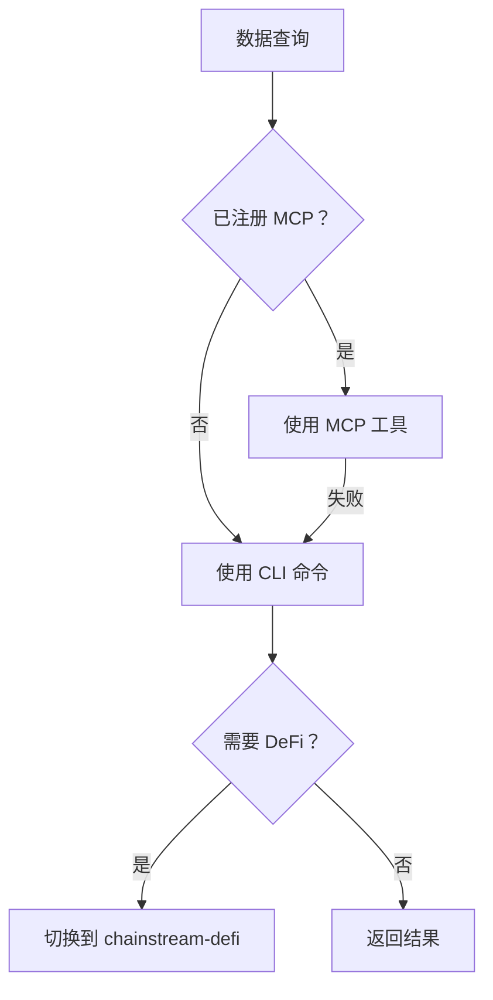
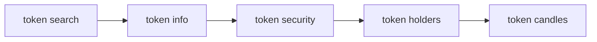
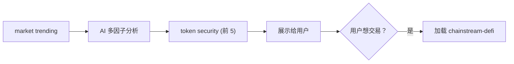
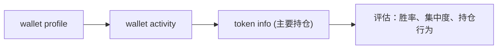

## 概述

`chainstream-data` skill 提供 Solana、BSC 和 Ethereum 上的只讀鏈上資料能力，涵蓋代幣分析、市場排行、錢包畫像和 WebSocket 流。

- **模式**：Tool（只讀，無需簽名）
- **MCP Server**：`https://mcp.chainstream.io/mcp`（17 個工具）
- **CLI**：`npx @chainstream-io/cli`
- **API 基礎 URL**：`https://api.chainstream.io`

## 整合路徑

Skill 使用決策樹路由到正確的執行通道：



## 通道矩陣

| 操作 | MCP 工具 | CLI 命令 | SDK 方法 |
|------|----------|----------|----------|
| 搜尋代幣 | `tokens_search` | `token search` | `client.token.search` |
| 分析代幣 | `tokens_analyze` | `token info` | `client.token.getToken` |
| 安全檢查 | `tokens_analyze` | `token security` | `client.token.getSecurity` |
| 前 N 大持有人 | `tokens_analyze` | `token holders` | `client.token.getHolders` |
| 價格歷史（K 線） | `tokens_price_history` | `token candles` | `client.token.getCandles` |
| 流動性池 | `tokens_discover` | `token pools` | `client.token.getPools` |
| 熱門代幣 | `market_trending` | `market trending` | `client.ranking.*` |
| 新上線代幣 | `market_trending` | `market new` | `client.ranking.*` |
| 最近交易 | `trades_recent` | `market trades` | `client.trade.*` |
| 錢包畫像 | `wallets_profile` | `wallet profile` | `client.wallet.*` |
| 錢包 PnL | `wallets_profile` | `wallet pnl` | `client.wallet.*` |
| 代幣餘額 | `wallets_profile` | `wallet holdings` | `client.wallet.*` |
| 轉賬歷史 | `wallets_activity` | `wallet activity` | `client.wallet.*` |
| DEX 報價 | `dex_quote` | `dex route` | `client.dex.quote` |

## AI 工作流

### 代幣研究

完整的代幣分析流程 — 推薦任何代幣前必須執行安全檢查。



<Tabs>
  <Tab title="CLI">
    ```bash
    npx @chainstream-io/cli token search --keyword PUMP --chain sol
    npx @chainstream-io/cli token info --chain sol --address <addr>
    npx @chainstream-io/cli token security --chain sol --address <addr>
    npx @chainstream-io/cli token holders --chain sol --address <addr>
    npx @chainstream-io/cli token candles --chain sol --address <addr> --resolution 1h
    ```
  </Tab>
  <Tab title="MCP">
    ```
    tokens_search { "query": "PUMP", "chain": "solana" }
    tokens_analyze { "chain": "solana", "address": "<addr>" }
    tokens_price_history { "chain": "solana", "address": "<addr>", "resolution": "1h" }
    ```
  </Tab>
</Tabs>

### 市場發現

發現熱門代幣，進行多因子分析，然後對候選代幣做安全檢查。



<Tabs>
  <Tab title="CLI">
    ```bash
    npx @chainstream-io/cli market trending --chain sol --duration 1h --limit 50
    # AI 分析：聪明钱信号、成交量、动量、安全性
    npx @chainstream-io/cli token security --chain sol --address <candidate_1>
    npx @chainstream-io/cli token security --chain sol --address <candidate_2>
    ```
  </Tab>
  <Tab title="MCP">
    ```
    market_trending { "chain": "solana", "duration": "1h", "limit": 50 }
    tokens_analyze { "chain": "solana", "address": "<candidate>" }
    ```
  </Tab>
</Tabs>

### 錢包畫像

分析錢包的表現、持倉和交易行為。



<Tabs>
  <Tab title="CLI">
    ```bash
    npx @chainstream-io/cli wallet profile --chain sol --address <wallet>
    npx @chainstream-io/cli wallet activity --chain sol --address <wallet>
    npx @chainstream-io/cli token info --chain sol --address <top_holding>
    ```
  </Tab>
  <Tab title="MCP">
    ```
    wallets_profile { "chain": "solana", "address": "<wallet>" }
    wallets_activity { "chain": "solana", "address": "<wallet>" }
    ```
  </Tab>
</Tabs>

## 安全規則

<Warning>
這些規則由 Skill 強制執行，確保資料準確性和負責任的 AI 行為。
</Warning>

| 規則 | 原因 |
|------|------|
| 不得用訓練資料回答價格問題 | 加密貨幣價格在幾秒內就會過時 — 必須實時 API 呼叫 |
| 推薦代幣前必須執行 `token security` | ChainStream 風險模型覆蓋蜜罐、Rug Pull 和集中度訊號 |
| 不得向 MCP 傳遞 `format: "detailed"`（除非使用者要求） | 返回 4-10 倍資料，浪費上下文視窗 |
| `/multi` 端點不超過 50 個地址 | API 硬限制 |
| 不得用公鏈 RPC 替代 | 結果不同且缺少 ChainStream 特有的增強資料 |

## 錯誤恢復

| 錯誤 | 恢復方式 |
|------|----------|
| 401 / "Not authenticated" | 配置 API Key 或執行 `chainstream login` |
| 402 / "Payment required" | 按照 [x402 支付流程](/zh-Hant/docs/platform/billing-payments/x402-payments) 操作 |
| 429 / 速率限制 | 等待 1 秒，指數退避 |
| 5xx / 伺服器錯誤 | 2 秒後重試一次 |

## 相關文件

<CardGroup cols={2}>
  <Card title="chainstream-defi" icon="right-left" href="/zh-Hant/docs/ai-agents/agent-skills/chainstream-defi">
    研究後執行交易
  </Card>
  <Card title="CLI 命令" icon="terminal" href="/zh-Hant/api-reference/cli-commands/overview">
    完整 CLI 命令參考
  </Card>
</CardGroup>
