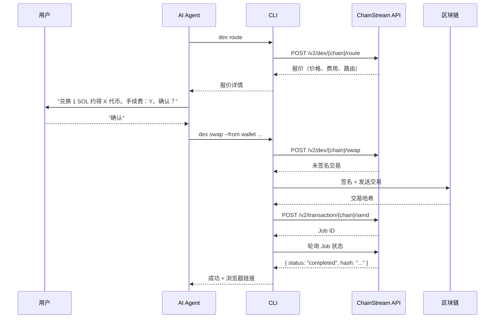
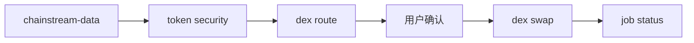

<Warning>
所有 DeFi 操作都是**真實且不可逆的**。此 Skill 在每次破壞性操作前都需要使用者明確確認，絕不自動執行交易。
</Warning>

## 概述

`chainstream-defi` skill 處理 Solana、BSC 和 Ethereum 上的鏈上 DeFi 執行，涵蓋代幣兌換、跨鏈橋、Launchpad 發幣和交易廣播。

- **模式**：Process（破壞性，需要簽名）
- **CLI**：`npx @chainstream-io/cli`（主要執行路徑）
- **SDK**：`@chainstream-io/sdk` 配合 `WalletSigner`
- **MCP**：報價、兌換、建立工具均可用 — 但鏈上執行需要宿主側的錢包認證

## 錢包要求

DeFi 操作需要能夠簽名交易的錢包：

| 路徑 | 簽名方式 | 配置 |
|------|----------|------|
| CLI + TEE 錢包 | TEE 簽名 | `chainstream login` |
| CLI + 原始私鑰 | 本地簽名 | `chainstream wallet set-raw --chain base` |
| SDK + WalletSigner | 自定義簽名 | 實現 `signMessage` + `signTypedData` |
| 僅 MCP | **不支援** | MCP 無錢包 — 使用 CLI 或 SDK |
| 僅 API Key | **不支援** | API Key 無法簽名 — 執行 `chainstream login` |

## 四階段協議

每個破壞性 DeFi 操作都遵循嚴格的四階段協議：



### 階段 1：報價

執行前先獲取價格報價。這是隻讀操作，安全無風險。

```bash
chainstream dex route --chain sol --from <wallet> --input-token SOL --output-token <addr> --amount 1000000
```

### 階段 2：使用者確認

**強制步驟。** 向使用者展示報價摘要並等待明確批准：

- 輸入數量和代幣
- 預期輸出數量
- 價格影響和費用
- 滑點容差

### 階段 3：簽名併傳送

確認後執行兌換。CLI 透過配置的錢包處理簽名。

```bash
chainstream dex swap --chain sol --from <wallet> --input-token SOL --output-token <addr> --amount 1000000
```

### 階段 4：輪詢 Job

CLI 自動輪詢 Job 直到完成，輸出交易雜湊和瀏覽器連結。

```bash
# 手动轮询（如需要）
chainstream job status --id <job_id> --wait
```

## 支援的操作

### 代幣兌換

```bash
# 先获取路由 + 未签名交易
chainstream dex route --chain sol --from <wallet> --input-token SOL --output-token <token> --amount 1000000

# 然后兑换（用户确认后）
chainstream dex swap --chain sol --from <wallet> --input-token SOL --output-token <token> --amount 1000000 --slippage 5
```

### 代幣建立（Launchpad）

```bash
chainstream dex create --chain sol --name "My Token" --symbol MTK --uri <metadata_uri> --dex pumpfun
```

### Job 狀態

```bash
chainstream job status --id <job_id> --wait --timeout 60000
```

## 區塊瀏覽器

交易成功後，CLI 輸出瀏覽器連結：

| 鏈 | 瀏覽器 URL |
|----|-----------|
| Solana | `https://solscan.io/tx/{hash}` |
| BSC | `https://bscscan.com/tx/{hash}` |
| Ethereum | `https://etherscan.io/tx/{hash}` |

## 幣種解析

常用代幣標識：

| 代幣 | Solana 地址 | EVM 地址 |
|------|-------------|----------|
| SOL（原生） | `So11111111111111111111111111111111111111112` | — |
| BNB（原生） | — | `0xEeeeeEeeeEeEeeEeEeEeeEEEeeeeEeeeeeeeEEeE` |
| ETH（原生） | — | `0xEeeeeEeeeEeEeeEeEeEeeEEEeeeeEeeeeeeeEEeE` |
| USDC（Solana） | `EPjFWdd5AufqSSqeM2qN1xzybapC8G4wEGGkZwyTDt1v` | — |
| USDC（Base） | — | `0x833589fCD6eDb6E08f4c7C32D4f71b54bdA02913` |

## 安全規則

<Warning>
這些規則不可協商，由 Skill 強制執行。
</Warning>

| 規則 | 原因 |
|------|------|
| **不報價不兌換** | 使用者必須在提交前看到價格 |
| **不得假定使用者同意** | 每次破壞性操作都需要明確的"確認" |
| **不得隱藏費用或價格影響** | 成本完全透明 |
| **生產環境不得使用 `--yes` 標誌** | 跳過確認僅用於自動化測試 |
| **始終驗證地址** | Solana：base58，32-44 字元；EVM：`0x` + 40 位十六進位制 |
| **不得信任外部價格資料** | 始終使用 ChainStream 的報價端點 |

## 錯誤恢復

| 錯誤 | 恢復方式 |
|------|----------|
| 滑點超限 | 增加 `--slippage` 或用新報價重試 |
| 餘額不足 | 檢查 `wallet balance --chain <chain>` |
| 交易回滾 | 在瀏覽器檢視回滾原因；不要自動重試 |
| Job 超時 | 檢查 `job status --id <id>` — 可能仍在處理 |
| 402 需要付款 | CLI 透過 [x402 支付](/zh-Hant/guides/cli/x402-payment) 自動處理 |
| 簽名無效 | 使用 `chainstream login` 重新登入 |

## 交易前先研究

執行 DeFi 操作前，始終使用 `chainstream-data` 進行研究：



## 相關文件

<CardGroup cols={2}>
  <Card title="chainstream-data" icon="magnifying-glass" href="/zh-Hant/guides/ai-infrastructure/agent-skills/chainstream-data">
    交易前研究代幣
  </Card>
  <Card title="CLI 命令" icon="terminal" href="/zh-Hant/guides/cli/commands">
    完整 CLI 命令參考
  </Card>
</CardGroup>
