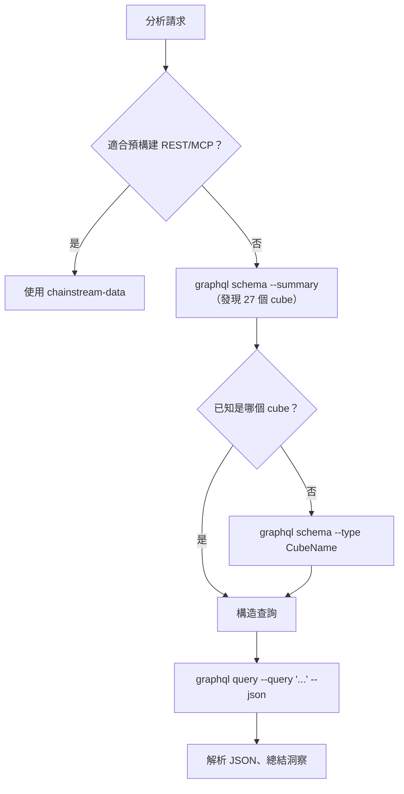

## 概述

`chainstream-graphql` skill 為 AI 代理提供類 SQL 的靈活能力，透過 GraphQL 訪問 ChainStream 的鏈上資料倉儲。當預構建的 REST/MCP 端點表達力不夠時，這就是正確的選擇 —— 跨 cube JOIN、自定義聚合、多條件過濾、自定義時間序列解析度，或者僅 GraphQL 才暴露的資料（如 PolyMarket 預測市場 cube）。

- **模式**：Tool（只讀，無需簽名）
- **端點**：`https://graphql.chainstream.io/graphql`（透過 APISIX 路由）
- **CLI**：`npx @chainstream-io/cli graphql`
- **鑑權**：API Key 走 `X-API-KEY`，或 SIWX 錢包令牌
- **付費**：與 REST 共享同一套 API Key / 訂閱池（x402 / MPP 由 CLI 自動處理）
- **覆蓋**：3 個鏈組共 27 個 cube —— `Solana`、`EVM(network: eth | bsc | polygon)`、`Trading`

## 何時使用

與 `chainstream-data` 的選擇決策表：

| 場景 | 使用 | 原因 |
|------|------|------|
| 標準代幣搜尋、市場熱榜、錢包畫像 | `chainstream-data` | 預構建的 REST / MCP 端點，更簡單 |
| 跨 cube JOIN（交易+轉賬、池+事件） | **chainstream-graphql** | `joinXxx` 支援 |
| 自定義聚合（count / sum / avg 帶 `groupBy`） | **chainstream-graphql** | 指標 + 維度分組 |
| 多條件過濾（巢狀、`any` 實現 OR） | **chainstream-graphql** | 完整過濾運算子 |
| 自定義解析度 / 桶化的時間序列 | **chainstream-graphql** | 時間區間桶化 |
| 預測市場資料（Polygon 上的 PolyMarket） | **chainstream-graphql** | `PredictionTrades / Managements / Settlements` cube |

## 整合路徑



## 通道矩陣

GraphQL 是一個透過不同呼叫方訪問的單一介面：

| 操作 | CLI 命令 | SDK 方法 |
|------|----------|----------|
| 列出所有 cube（摘要） | `graphql schema --summary` | N/A —— 發現用 CLI |
| 鑽取某個 cube | `graphql schema --type <CubeName>` | N/A |
| 完整 schema 參考 | `graphql schema --full` | N/A |
| 強制重新整理快取的 schema | `graphql schema --summary --refresh` | N/A |
| 內聯查詢 | `graphql query --query '<gql>'` | `client.graphql.query(gql)` |
| 從檔案查詢 | `graphql query --file ./q.graphql` | `client.graphql.query(fs.readFileSync(...))` |
| 帶變數查詢 | `graphql query --query '...' --var '{"k":"v"}'` | `client.graphql.query(gql, vars)` |
| 機讀輸出 | 追加 `--json` | 原生 JSON 返回 |

## AI 工作流

### 發現 Schema

如果代理還不確定要用哪個 cube，始終從這裡開始。

```bash
npx @chainstream-io/cli graphql schema --summary
npx @chainstream-io/cli graphql schema --type DEXTrades
```

`--summary` 按鏈組（EVM / Solana / Trading）返回所有 27 個 cube 的緊湊目錄，包含頂層欄位和描述。`--type` 展開某個 cube 的欄位樹以便構造查詢。

### 構造並執行查詢

Schema 使用**鏈組包裝器**作為頂層入口：

<Tabs>
  <Tab title="Solana">
    ```graphql
    query {
      Solana {
        DEXTrades(
          limit: { count: 25 }
          orderBy: { descending: Block_Time }
        ) {
          Block { Time }
          Trade {
            Buy  { Currency { MintAddress } Amount PriceInUSD }
            Sell { Currency { MintAddress } Amount }
            Dex  { ProtocolName }
          }
        }
      }
    }
    ```
  </Tab>
  <Tab title="EVM">
    ```graphql
    query {
      EVM(network: eth) {
        DEXTrades(
          limit: { count: 25 }
          orderBy: { descending: Block_Time }
          where: { Trade: { Buy: { Amount: { gt: "0" } } } }
        ) {
          Block { Time }
          Trade { Buy { Currency { Symbol } Amount } Sell { Currency { Symbol } Amount } }
        }
      }
    }
    ```
  </Tab>
  <Tab title="Trading">
    ```graphql
    query {
      Trading {
        Pairs(
          tokenAddress: { is: "So11111111111111111111111111111111111111112" }
          limit: { count: 24 }
        ) {
          TimeMinute
          Price { Open High Low Close }
        }
      }
    }
    ```
  </Tab>
</Tabs>

從 CLI 執行：

```bash
npx @chainstream-io/cli graphql query --file ./query.graphql --json
```

或內聯：

```bash
npx @chainstream-io/cli graphql query \
  --query 'query { Solana { DEXTrades(limit:{count:5}) { Block { Time } } } }' \
  --json
```

## 查詢構造速查

- **鏈組包裝器**：頂層必需。`Solana`、`EVM(network: ...)` 或 `Trading`。
- **`network`**：僅 `EVM` 接受。取值：`eth`、`bsc`、`polygon`。
- **`limit`**：`{ count: N, offset: M }`。預設 25。
- **`orderBy`**：`{ descending: Field }` / `{ ascending: Field }`。計算欄位用 `{ descendingByField: "field_name" }`。
- **`where`**：`{ Group: { Field: { operator: value } } }`。OR 條件透過 `any: [{...}, {...}]`。
- **DateTime 格式**：`"YYYY-MM-DD HH:MM:SS"` —— **無 `T`、無 `Z`**（ClickHouse 約束）。
- **DateTime 過濾**：`since`、`till`、`after`、`before` —— DateTime 欄位上**永不使用 `gt` / `lt`**。
- **`joinXxx`**：LEFT JOIN 到相關 cube。優先於多次查詢。
- **`dataset`** 包裝器引數：`realtime`、`archive`、`combined`（預設）。
- **`aggregates`** 包裝器引數：`yes`、`no`、`only`。

## 鏈組與 Cube

| 鏈組 | 包裝器 | Cube |
|------|--------|------|
| **Solana** | `Solana { ... }` | DEXTrades、DEXTradeByTokens、Transfers、BalanceUpdates、Blocks、Transactions、DEXPools、Instructions、InstructionBalanceUpdates、Rewards、DEXOrders、TokenSupplyUpdates |
| **EVM** | `EVM(network: eth\|bsc\|polygon) { ... }` | DEXTrades、DEXTradeByTokens、Transfers、BalanceUpdates、Blocks、Transactions、DEXPoolEvents、Events、Calls、MinerRewards、DEXPoolSlippages、TokenHolders、TransactionBalances、Uncles、PredictionTrades\*、PredictionManagements\*、PredictionSettlements\* |
| **Trading** | `Trading { ... }` | Pairs、Tokens、Currencies、Trades |

\* 預測類 cube 僅在 `polygon` 網路可用。

## 安全規則

<Warning>
以下規則由 skill 強制執行，確保查詢正確、避免浪費配額。
</Warning>

| 規則 | 原因 |
|------|------|
| 永不使用扁平 `CubeName(network: sol)` —— 始終在鏈組裡包裝 | 伺服器拒絕未包裝的查詢 |
| 永不瞎猜欄位名 —— 先跑 `graphql schema --type <cube>` | 省掉"欄位不存在"的往返 |
| 永不用 ISO-8601 `"2026-03-31T00:00:00Z"` —— 改用 `"2026-03-31 00:00:00"` | ClickHouse DateTime 格式 |
| 永不在 DateTime 上用 `gt` / `lt` —— 用 `since` / `after` / `before` / `till` | DateTime 過濾是命名式的 |
| 當 `joinXxx` 能合併時，永不拆成多個查詢 | 一次付費請求而不是多次 |
| 永不自動選擇付費方案 —— 始終讓使用者選 | 計費知情同意 |

## 錯誤恢復

| 錯誤 | 恢復 |
|------|------|
| 401 / "未認證" | `config auth` —— 未登入則跑 `login`（自動授予 nano 試用，50K CU）。然後重試。 |
| 402 / "需要付費" | `plan status`；無活躍訂閱則 `wallet pricing` → `plan purchase --plan <choice>`。參考 [x402 支付](/zh-Hant/docs/platform/billing-payments/x402-payments)。 |
| `GraphQL error: field X does not exist` | 對照 `graphql schema --type <cube>` 重新核查欄位。 |
| 429 | 等待 1 秒，指數退避。 |
| 5xx | 2 秒後重試一次。 |

## 相關

<CardGroup cols={2}>
  <Card title="chainstream-data" icon="magnifying-glass" href="/zh-Hant/docs/ai-agents/agent-skills/chainstream-data">
    代幣、市場、錢包等標準 REST/MCP 查詢
  </Card>
  <Card title="chainstream-defi" icon="right-left" href="/zh-Hant/docs/ai-agents/agent-skills/chainstream-defi">
    分析後執行交易 —— 換幣、建立代幣
  </Card>
  <Card title="GraphQL 訪問方式" icon="diagram-project" href="/zh-Hant/docs/access-methods/graphql">
    端點參考、鑑權、schema 概覽
  </Card>
  <Card title="CLI `graphql` 子命令" icon="terminal" href="/zh-Hant/docs/access-methods/cli#graphql-subcommand">
    `chainstream graphql schema` 和 `query` 參考
  </Card>
</CardGroup>
