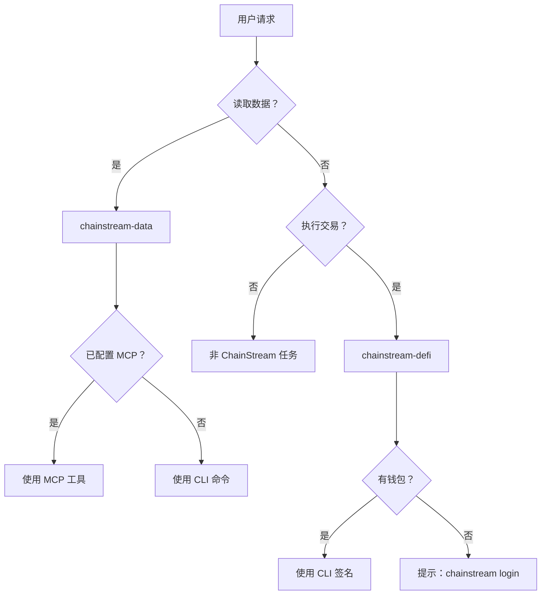

## 什麼是 Agent Skills

Agent Skills 是結構化的指令包（`SKILL.md` 檔案），用於教 AI 程式設計助手如何使用 ChainStream 的鏈上資料和 DeFi 能力。與原始 API 文件不同，Skills 提供了**決策樹、工作流、安全規則和錯誤恢復** — AI Agent 自主執行所需的一切。

<CardGroup cols={2}>
  <Card title="chainstream-data" icon="magnifying-glass" color="#4D9CFF">
    **Tool 模式** — 只讀鏈上資料：代幣分析、市場趨勢、錢包畫像、WebSocket 流
  </Card>
  <Card title="chainstream-defi" icon="right-left" color="#9333EA">
    **Process 模式** — 不可逆 DeFi 執行：兌換、跨鏈橋、Launchpad、交易廣播
  </Card>
</CardGroup>

## Skills vs MCP vs SDK

| 層級 | 定義 | 適用場景 |
|------|------|----------|
| **Agent Skills** | 高層 AI 指令集（SKILL.md），含決策樹、工作流和安全規則 | AI 程式設計助手（Cursor、Claude Code、Codex） |
| **MCP Server** | Model Context Protocol — 17 個可被 AI 模型呼叫的工具 | AI 聊天助手（Claude Desktop、ChatGPT） |
| **CLI** | 命令列工具，內建錢包和 x402 支付 | 指令碼、CI/CD、需要 DeFi 的 AI Agent |
| **SDK** | TypeScript/Python/Go/Rust 客戶端庫 | 自定義應用 |

Skills 處於**最高抽象層** — 內部引用 MCP 工具和 CLI 命令，將 AI Agent 路由到每個任務的正確工具。

## 路由決策樹

## Skill 對比

| 方面 | chainstream-data | chainstream-defi |
|------|-----------------|-----------------|
| 模式 | Tool（只讀） | Process（執行） |
| 風險等級 | 低 | 高（不可逆） |
| 需要錢包 | 否（API Key 即可） | 是（需要簽名） |
| MCP 支援 | 完整（17 個工具） | 工具可用，但執行需宿主側錢包 |
| 使用者確認 | 不需要 | **每次交易前強制確認** |
| 典型操作 | 搜尋、分析、追蹤、流式 | 兌換、橋接、建立、廣播 |

## 共享資源

兩個 Skill 共享通用參考文件：

| 資源 | 內容 |
|------|------|
| **認證** | 四種認證路徑（API Key、錢包登入、原始私鑰、Tempo MPP） |
| **x402 支付** | x402 和 MPP 支付協議、套餐選擇流程 |
| **錯誤處理** | HTTP 狀態碼、重試策略、DeFi 專屬錯誤 |
| **鏈** | 支援鏈矩陣、原生代幣地址、區塊瀏覽器 |

## 支援的平臺

Skills 適用於任何支援 `SKILL.md` 檔案的 AI 程式設計助手：

| 平臺 | 安裝方式 |
|------|----------|
| Cursor | 透過 `.cursor-plugin/` 自動發現 |
| Claude Code | `/plugin install chainstream` |
| Codex | Clone + 符號連結 |
| OpenCode | Clone + 符號連結 |
| Gemini CLI | `gemini extensions install` |

詳見[安裝指南](/zh-Hant/docs/ai-agents/agent-skills/installation)。

## 下一步

<CardGroup cols={2}>
  <Card title="安裝" icon="download" href="/zh-Hant/docs/ai-agents/agent-skills/installation">
    在你的平臺上配置 Skills
  </Card>
  <Card title="chainstream-data" icon="magnifying-glass" href="/zh-Hant/docs/ai-agents/agent-skills/chainstream-data">
    資料查詢與分析
  </Card>
  <Card title="chainstream-defi" icon="right-left" href="/zh-Hant/docs/ai-agents/agent-skills/chainstream-defi">
    DeFi 執行工作流
  </Card>
  <Card title="MCP Server" icon="plug" href="/zh-Hant/docs/ai-agents/mcp-server/introduction">
    底層 MCP 協議
  </Card>
</CardGroup>
