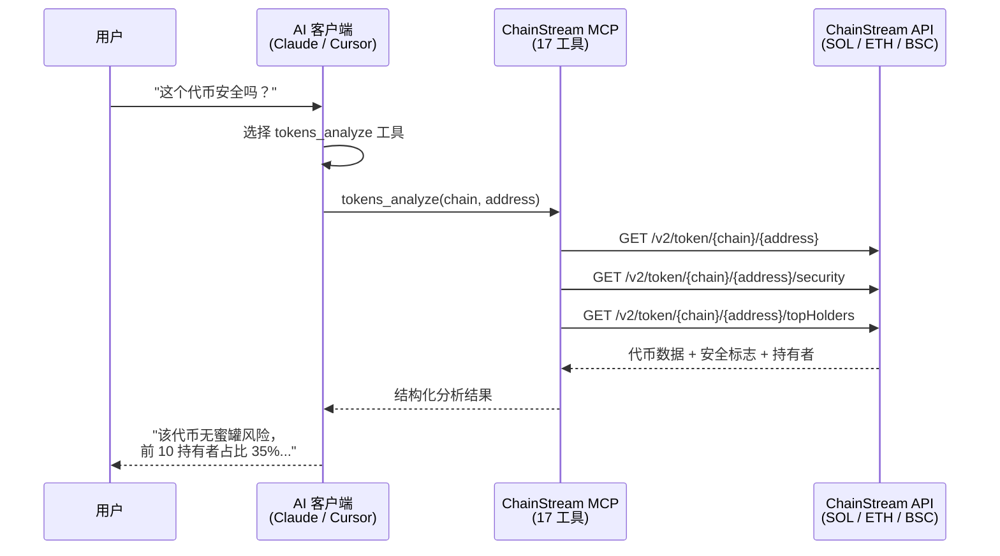

## MCP 是什麼

**MCP (Model Context Protocol)** 是由 Anthropic 提出的開放協議，旨在標準化 AI 應用與外部資料來源的連線方式。

<Info>
簡單來說，MCP 讓 AI 能夠：
- 發現可用的工具和資料來源
- 呼叫外部工具執行操作
- 理解返回的結構化資料
</Info>

### 傳統方式 vs MCP

| 方式 | 流程 |
|------|------|
| **傳統方式** | 使用者 → 編寫程式碼 → 呼叫 API → 解析資料 → 輸入 AI → 獲得回答 |
| **MCP 方式** | 使用者 → 自然語言提問 → AI 自動呼叫工具 → 獲得回答 |

### 核心概念

| 概念 | 說明 |
|------|------|
| **MCP Server** | 提供工具和資料的服務端，如 ChainStream MCP Server |
| **MCP Client** | 使用工具的客戶端，如 Claude Desktop、Cursor |
| **Tools** | 可被 AI 呼叫的功能，如查詢餘額、分析錢包 |
| **Resources** | 可被 AI 訪問的資料資源 |

---

## 為什麼 MCP 很重要

### AI Agent 需要"手和眼"

AI 大模型擁有強大的推理能力，但它們：

- ❌ 無法直接訪問實時資料
- ❌ 無法執行外部操作
- ❌ 知識存在截止日期

MCP 解決了這個問題，讓 AI 能夠：

- ✅ 實時獲取鏈上資料
- ✅ 呼叫專業工具進行分析
- ✅ 與外部世界互動

<Note>
**類比理解**

MCP 之於 AI，就像：
- **眼睛** → 讓 AI 看到實時資料
- **手** → 讓 AI 執行操作
- **工具** → 讓 AI 使用專業能力
</Note>

---

## ChainStream MCP 能力

ChainStream MCP Server 將區塊鏈資料和分析能力以 MCP 協議暴露給 AI 應用。

**MCP 端點**：`https://mcp.chainstream.io/mcp`

### 能力矩陣

ChainStream MCP Server 支援 API Reference 中所有的 REST API 和 WebSocket 訂閱功能：

<Tabs>
  <Tab title="Token API">
    | 功能 | 說明 |
    |------|------|
    | 代幣搜尋 | 按名稱/符號搜尋代幣 |
    | 代幣資訊 | 獲取代幣基本資訊和後設資料 |
    | 代幣價格 | 實時價格和歷史價格 |
    | 代幣統計 | 交易量、市值等統計資料 |
    | 持有者分析 | 持有者分佈和 Top 持有者 |
    | K 線資料 | 各週期 OHLCV 資料 |
    | 市場資料 | 流動性、交易對資訊 |
    | 安全檢查 | 代幣合約安全分析 |
    | 建立資訊 | 代幣建立者和時間 |
    | Mint/Burn 歷史 | 代幣鑄造和銷燬記錄 |
    | 流動性快照 | 歷史流動性資料 |
  </Tab>
  
  <Tab title="Wallet API">
    | 功能 | 說明 |
    |------|------|
    | 餘額查詢 | 錢包代幣餘額 |
    | PnL 計算 | 盈虧分析 |
    | 錢包統計 | 交易次數、活躍度等 |
    | 餘額更新歷史 | 餘額變化記錄 |
  </Tab>
  
  <Tab title="Trade API">
    | 功能 | 說明 |
    |------|------|
    | 交易歷史 | 獲取交易記錄 |
    | 交易活動 | 實時交易活動 |
    | 頂級交易者 | Top Traders 排名 |
  </Tab>
  
  <Tab title="DEX API">
    | 功能 | 說明 |
    |------|------|
    | 報價查詢 | 獲取交易報價 |
    | 路由計算 | 最優交易路徑 |
    | 交換執行 | 構建交換交易 |
    | DEX 列表 | 支援的 DEX 資訊 |
  </Tab>
  
  <Tab title="Ranking API">
    | 功能 | 說明 |
    |------|------|
    | 熱門代幣 | 按時間段排名 |
    | 新代幣 | 最新上線代幣 |
    | 即將畢業 | Bonding Curve 接近畢業 |
    | 已畢業 | 已遷移到 DEX |
  </Tab>
  
  <Tab title="WebSocket">
    | 訂閱型別 | 說明 |
    |----------|------|
    | 代幣 K 線 | 實時 K 線更新 |
    | 代幣統計 | 實時統計資料 |
    | 代幣持有者 | 持有者變化 |
    | 新代幣 | 新代幣建立通知 |
    | 錢包餘額 | 實時餘額更新 |
    | 錢包交易 | 實時交易通知 |
    | 流動性池 | 池子餘額變化 |
  </Tab>
</Tabs>

### 支援的區塊鏈

| 鏈 | 標識 | 型別 | 狀態 |
|---|------|------|------|
| Solana | `sol` | L1 | ✅ |
| Ethereum | `eth` | L1 | ✅ |
| BSC | `bsc` | L1 | ✅ |

<Note>
在所有 MCP 工具引數中使用小寫鏈識別符號：`sol`、`eth`、`bsc`。
</Note>

---

## 支援的平臺

### Claude Desktop

官方支援的 MCP 客戶端，提供最完整的功能支援。

| 特性 | 支援狀態 |
|------|----------|
| 工具呼叫 | ✅ |
| 多輪對話 | ✅ |
| 流式響應 | ✅ |

```json
// claude_desktop_config.json
{
  "mcpServers": {
    "chainstream": {
      "url": "https://mcp.chainstream.io/mcp",
      "headers": {
        "X-API-KEY": "your-api-key"
      }
    }
  }
}
```

### Cursor IDE

開發者友好的 AI 程式設計助手，支援 MCP 整合。

| 特性 | 支援狀態 |
|------|----------|
| 工具呼叫 | ✅ |
| 程式碼上下文 | ✅ |

```json
// .cursor/mcp.json
{
  "mcpServers": {
    "chainstream": {
      "url": "https://mcp.chainstream.io/mcp",
      "headers": {
        "X-API-KEY": "your-api-key"
      }
    }
  }
}
```

### 自定義 Agent

任何遵循 MCP 協議的客戶端都可以接入。

```javascript
import { Client } from '@modelcontextprotocol/sdk/client/index.js';
import { StreamableHTTPClientTransport } from '@modelcontextprotocol/sdk/client/streamableHttp.js';

const transport = new StreamableHTTPClientTransport(
  new URL('https://mcp.chainstream.io/mcp'),
  {
    requestInit: {
      headers: {
        'X-API-KEY': process.env.CHAINSTREAM_API_KEY
      }
    }
  }
);

const client = new Client({
  name: 'my-agent',
  version: '1.0.0'
});

await client.connect(transport);

// 列出可用工具
const { tools } = await client.listTools();

// 调用工具
const result = await client.callTool({
  name: 'wallets_profile',
  arguments: {
    address: '0x...',
    chain: 'eth'
  }
});
```

---

## 典型使用場景

### 場景 1：AI 研究助手

**需求**：使用 AI 分析特定錢包的交易行為

<Steps>
  <Step title="使用者提問">
    分析地址 `0xd8dA6BF26964aF9D7eEd9e03E53415D37aA96045` 的交易風格
  </Step>
  <Step title="AI 呼叫工具">
    呼叫 `wallets_profile` 工具
  </Step>
  <Step title="AI 返回分析">
    基於分析，該地址（Vitalik）的特徵如下：
    - 錢包年齡：超過 5 年
    - 主要持倉：ETH、各類 ERC-20 Token
    - 交易風格：長期持有為主，偶有捐贈和專案支援
    - 活躍協議：Uniswap、ENS、Gitcoin
    - 標籤：核心開發者、公益捐贈者
  </Step>
</Steps>

### 場景 2：Smart Money 追蹤

**需求**：追蹤 Smart Money 的大額交易

<Steps>
  <Step title="使用者提問">
    最近 24 小時有哪些 Smart Money 在買入 ARB？
  </Step>
  <Step title="AI 呼叫工具">
    呼叫 `market_trending` 工具
  </Step>
  <Step title="AI 返回結果">
    過去 24 小時，以下 Smart Money 地址買入了 ARB：

    1. `0xabc...123` (標籤: whale, defi_expert)
       - 買入數量：500,000 ARB
       - 買入金額：$450,000
       - 時間：2 小時前

    2. `0xdef...456` (標籤: institution)
       - 買入數量：200,000 ARB
       - 買入金額：$180,000
       - 時間：5 小時前

    整體趨勢：Smart Money 對 ARB 呈淨買入狀態
  </Step>
</Steps>

### 場景 3：代幣安全分析

**需求**：分析某代幣的安全性

<Steps>
  <Step title="使用者提問">
    幫我檢查這個代幣 `0x...` 是否安全
  </Step>
  <Step title="AI 呼叫工具">
    呼叫 `tokens_analyze` 工具
  </Step>
  <Step title="AI 返回結果">
    該代幣安全檢查結果：

    | 檢查項 | 結果 |
    |--------|------|
    | 合約已驗證 | ✅ |
    | 無惡意函式 | ✅ |
    | 流動性鎖定 | ✅ |
    | 持有者分散 | ⚠️ Top 10 持有 45% |
    | 交易稅 | 買入 1% / 賣出 1% |
    
    風險等級：中等（注意持有者集中度）
  </Step>
</Steps>

---

## 技術架構



### 連線方式

| 方式 | 端點 | 適用場景 |
|------|------|----------|
| **雲端** | `https://mcp.chainstream.io/mcp` | 零安裝，始終最新 |
| **npm stdio** | `npx @chainstream-io/mcp` | 本地 IDE 整合（Claude Desktop、Cursor） |

---

## 與傳統 API 的區別

| 特性 | 傳統 API | MCP |
|------|----------|-----|
| 呼叫方式 | HTTP REST | 協議標準化 |
| 目標使用者 | 開發者 | AI 模型 |
| 引數處理 | 手動構建 | AI 自動推斷 |
| 錯誤處理 | 返回狀態碼 | 語義化錯誤 |
| 上下文 | 無狀態 | 可保持會話上下文 |

---

## 認證方式

ChainStream MCP Server 透過 **API Key** 認證。在 [ChainStream Dashboard](https://www.chainstream.io/dashboard) 獲取 Key，然後根據傳輸方式配置：

| 傳輸方式 | 如何傳遞 API Key |
|----------|-----------------|
| **npm 包**（stdio） | `CHAINSTREAM_API_KEY` 環境變數或 `--api-key` CLI 引數 |
| **雲端端點** | `X-API-KEY` 請求頭 |

```bash
# Stdio：设置环境变量
export CHAINSTREAM_API_KEY=your-key
chainstream-mcp

# Stdio：或使用 CLI 参数
chainstream-mcp --api-key your-key
```

<Note>
API Key 除非你在 Dashboard 設定了過期時間，否則不會過期。無需重新整理 Token。
</Note>

---

## 安全模型

<AccordionGroup>
  <Accordion title="認證機制" icon="key">
    所有連線方式均透過 API Key 認證。npm 包從環境變數讀取 `CHAINSTREAM_API_KEY`。雲端端點接受 `X-API-KEY` 請求頭。
  </Accordion>
  
  <Accordion title="工具安全" icon="lock">
    工具按風險等級分類：
    - **只讀工具**：代幣搜尋、錢包畫像、市場資料 — 預設安全
    - **交易工具**（`dex_swap`、`dex_create_token`、`transaction_send`）：標記為高風險，MCP 客戶端應要求使用者明確確認
  </Accordion>
  
  <Accordion title="審計日誌" icon="file-lines">
    所有工具呼叫都有完整記錄，可在 Dashboard 檢視。
  </Accordion>
</AccordionGroup>

---

## 下一步

<CardGroup cols={2}>
  <Card title="配置指南" icon="gear" href="/zh-Hant/guides/ai-infrastructure/mcp-server/setup-guide">
    5 分鐘完成 MCP Server 配置
  </Card>
  <Card title="工具目錄" icon="wrench" href="/zh-Hant/guides/ai-infrastructure/mcp-server/tools-catalog">
    檢視所有可用工具詳情
  </Card>
</CardGroup>
