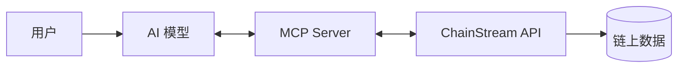

## 概述

ChainStream 提供專為 AI 應用設計的基礎設施，讓 AI Agent 能夠直接查詢鏈上資料、分析市場資訊、甚至執行交易操作。

<CardGroup cols={2}>
  <Card title="MCP Server" icon="robot" color="#9333EA" href="/zh-Hant/guides/ai-infrastructure/mcp-server/introduction">
    Model Context Protocol 服務，讓 AI 模型直接呼叫 ChainStream API
  </Card>
  <Card title="Agent Skills" icon="brain" color="#4D9CFF" href="/zh-Hant/guides/ai-infrastructure/agent-skills/introduction">
    結構化 AI 能力包（SKILL.md），支援 Cursor、Claude Code、Codex 等
  </Card>
  <Card title="CLI" icon="terminal" color="#10B981" href="/zh-Hant/guides/cli/overview">
    命令列工具，內建錢包和 x402 支付，用於資料查詢和 DeFi 執行
  </Card>
  <Card title="x402 支付" icon="credit-card" color="#F59E0B" href="/zh-Hant/guides/cli/x402-payment">
    HTTP 原生微支付 — AI Agent 使用 USDC 付費，無需註冊賬戶
  </Card>
</CardGroup>

## 為什麼 AI 需要鏈上資料

傳統 AI 模型（如 ChatGPT、Claude）的知識截止於訓練時間，無法獲取實時鏈上資訊。ChainStream AI 基礎設施解決了這個問題：

<AccordionGroup>
  <Accordion title="實時資料訪問" icon="bolt">
    AI 可以獲取最新的：
    - 代幣價格和交易量
    - 錢包餘額和持倉
    - DEX 流動性和交易
    - 市場排行榜資料
  </Accordion>
  
  <Accordion title="鏈上分析能力" icon="chart-mixed">
    AI 可以進行：
    - 代幣安全檢查
    - 錢包 PnL 計算
    - Smart Money 追蹤
    - 風險評估
  </Accordion>
  
  <Accordion title="交易執行" icon="right-left">
    AI 可以幫助使用者：
    - 查詢最優交易路由
    - 估算 Gas 費用
    - 構建交易（需使用者確認）
  </Accordion>
</AccordionGroup>

## MCP (Model Context Protocol)

MCP 是一個開放協議，允許 AI 模型與外部資料來源和工具互動。ChainStream 提供 MCP Server 實現，支援主流 AI 模型。

### 工作流程

1. 使用者向 AI 提問（如"查詢 SOL 的當前價格"）
2. AI 識別需要呼叫 ChainStream 工具
3. 透過 MCP 協議呼叫 ChainStream API
4. 獲取資料後，AI 整理並回複使用者

### 支援的模型

| 模型 | 支援狀態 | 說明 |
|------|----------|------|
| Claude | 原生支援 | Anthropic 官方 MCP 支援 |
| GPT-4 | 透過 Function Calling | OpenAI 函式呼叫 |
| Cursor AI | 原生支援 | IDE 內建 MCP |
| 其他 | 適配中 | 聯絡我們瞭解詳情 |

## 使用場景

<Tabs>
  <Tab title="投資研究助手">
    讓 AI 幫你分析代幣：
    
    **使用者提問**：
    > "幫我分析一下 BONK 代幣，包括價格走勢、持有者分佈和安全風險"
    
    **AI 能力**：
    - 查詢實時價格和歷史 K 線
    - 獲取持有者資料和集中度
    - 執行安全檢查
    - 綜合分析並給出建議
  </Tab>
  
  <Tab title="錢包管理助手">
    讓 AI 幫你管理錢包：
    
    **使用者提問**：
    > "檢視我錢包裡所有代幣的當前價值和最近的盈虧情況"
    
    **AI 能力**：
    - 查詢錢包餘額
    - 計算各代幣價值
    - 分析持倉 PnL
    - 生成持倉報告
  </Tab>
  
  <Tab title="交易助手">
    讓 AI 幫你交易（需確認）：
    
    **使用者提問**：
    > "我想用 1 SOL 買入 BONK，幫我查詢最佳路由"
    
    **AI 能力**：
    - 獲取多 DEX 報價
    - 比較滑點和費用
    - 推薦最優路由
    - 展示交易詳情（使用者確認後執行）
  </Tab>
</Tabs>

## 快速開始

### 安裝配置

<Steps>
  <Step title="獲取 API 憑據">
    在 [ChainStream Dashboard](https://www.chainstream.io/dashboard) 獲取 API 金鑰
  </Step>
  
  <Step title="配置 MCP Server">
    根據你使用的 AI 模型/平臺，配置 ChainStream MCP Server
  </Step>
  
  <Step title="開始使用">
    在對話中直接詢問鏈上資料相關問題
  </Step>
</Steps>

詳細配置請參考 [MCP 配置指南](/zh-Hant/guides/ai-infrastructure/mcp-server/setup-guide)

## 安全考慮

<Warning>
AI 執行的交易操作需要使用者明確確認。ChainStream MCP Server 預設不會自動執行任何涉及資金的操作。
</Warning>

<CardGroup cols={2}>
  <Card title="只讀優先" icon="eye">
    大部分工具是隻讀的資料查詢，不涉及資金操作
  </Card>
  
  <Card title="交易確認" icon="shield-check">
    任何交易操作都需要使用者確認私鑰簽名
  </Card>
  
  <Card title="許可權控制" icon="lock">
    可透過 API Scope 限制工具的訪問許可權
  </Card>
  
  <Card title="審計日誌" icon="file-lines">
    所有 API 呼叫都有完整的審計記錄
  </Card>
</CardGroup>

## 下一步

<CardGroup cols={2}>
  <Card title="MCP 介紹" icon="robot" href="/zh-Hant/guides/ai-infrastructure/mcp-server/introduction">
    深入瞭解 MCP 協議
  </Card>
  <Card title="Agent Skills" icon="brain" href="/zh-Hant/guides/ai-infrastructure/agent-skills/introduction">
    在 Cursor、Claude Code 等平臺安裝 Skills
  </Card>
  <Card title="CLI 概覽" icon="terminal" href="/zh-Hant/guides/cli/overview">
    透過命令列查詢資料和執行 DeFi
  </Card>
  <Card title="工具目錄" icon="wrench" href="/zh-Hant/guides/ai-infrastructure/mcp-server/tools-catalog">
    檢視所有可用 MCP 工具
  </Card>
</CardGroup>
