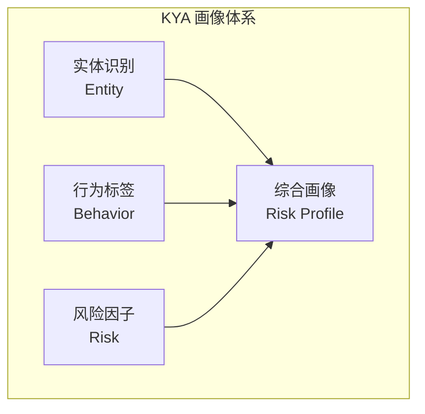
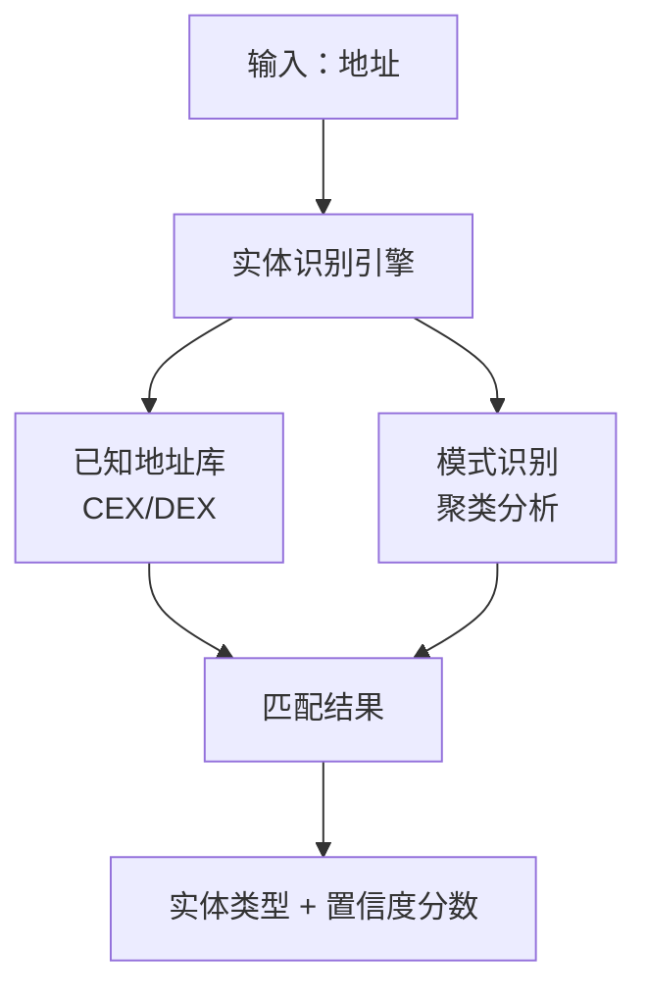
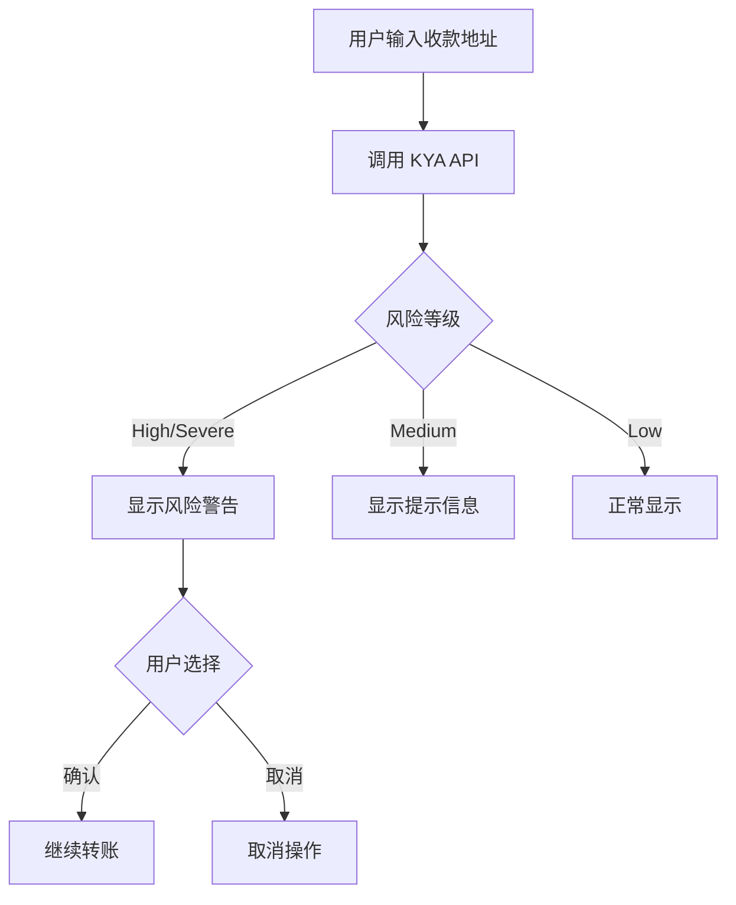
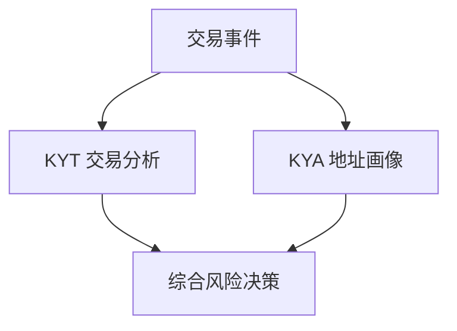

## KYA 是什麼

**KYA (Know Your Address)** 是對加密貨幣地址進行整體畫像和風險評估的機制。

<Info>
**核心定義**

KYA = 地址畫像

基於地址的歷史行為、關聯網路、標籤資訊，構建完整的風險畫像。
</Info>

## 與 KYT 的區別

| 維度 | KYT | KYA |
|------|-----|-----|
| 分析物件 | 單筆交易 | 地址整體 |
| 時間維度 | 實時快照 | 歷史累積 |
| 核心問題 | 這筆交易安全嗎？ | 這個地址可信嗎？ |
| 更新頻率 | 每筆交易觸發 | 定期/按需更新 |
| 資料深度 | 交易級別 | 畫像級別 |

---

## 畫像維度

KYA 從三個核心維度構建地址畫像：



---

## 實體識別

識別地址背後的實體型別：

### 實體分類

| 類別 | 說明 | 風險權重 | 識別方法 |
|------|------|----------|----------|
| CEX | 中心化交易所 | 低 | 已知熱錢包地址、充值地址模式 |
| DEX | 去中心化交易所 | 低-中 | 智慧合約識別、路由器地址 |
| 個人 | 普通使用者地址 | 中 | 行為模式分析、餘額特徵 |
| 合約 | 智慧合約 | 視情況 | 鏈上程式碼驗證 |
| 已知犯罪 | 確認的犯罪地址 | 極高 | 執法通報、制裁名單 |

### 實體識別流程



### 置信度等級

| 等級 | 置信度 | 說明 | 應用建議 |
|------|--------|------|----------|
| **確認** | &gt;95% | 官方確認或執法通報 | 可直接使用 |
| **高置信** | 80-95% | 強特徵匹配 | 建議使用 |
| **中置信** | 50-80% | 部分特徵匹配 | 參考使用 |
| **低置信** | &lt;50% | 推測 | 僅供參考 |

---

## 行為標籤

基於地址的鏈上行為特徵，系統自動打上相應標籤。

<Tabs>
  <Tab title="角色標籤">
    反映地址在鏈上生態中的角色定位：
    
    | 標籤 | 定義 | 風險含義 |
    |------|------|----------|
    | `whale` | 大額持倉地址 (&gt;$1M) | 市場影響力大 |
    | `trader` | 高頻交易行為 | 正常活躍 |
    | `holder` | 長期持有不動 | 低風險 |
    | `bot` | 程式化交易特徵 | 需關注 |
    | `smart_money` | 聰明錢 | 專業交易者 |
  </Tab>
  
  <Tab title="行為標籤">
    反映地址的具體行為模式：
    
    | 標籤 | 定義 | 風險含義 |
    |------|------|----------|
    | `mixer_user` | 使用過混幣服務 | 高風險 |
    | `bridge_user` | 跨鏈橋使用者 | 中等風險 |
    | `defi_active` | DeFi 協議互動頻繁 | 正常 |
    | `nft_trader` | NFT 交易活躍 | 正常 |
    | `new_address` | 新建立地址 | 需觀察 |
  </Tab>
  
  <Tab title="實體標籤">
    已識別的歸屬實體：
    
    | 標籤 | 說明 |
    |------|------|
    | `exchange:binance` | Binance 交易所 |
    | `exchange:coinbase` | Coinbase 交易所 |
    | `defi:uniswap` | Uniswap 協議 |
    | `bridge:multichain` | 跨鏈橋 |
    | `sanctions` | 受制裁地址 |
  </Tab>
</Tabs>

### 標籤組合風險

某些標籤組合會放大風險訊號：

<Warning>
**高風險組合示例**

`mixer_user` + `high_value` + `new_address`

**風險等級**：HIGH

**原因**：新地址收到混幣器大額資金，符合洗錢模式
</Warning>

<Check>
**低風險組合示例**

`whale` + `holder` + `exchange:binance`

**風險等級**：LOW

**原因**：交易所關聯的長期持有大戶，屬於正常行為
</Check>

---

## 風險因子

量化風險評估的核心指標：

### 核心風險因子

| 因子 | 說明 | 計算方式 |
|------|------|----------|
| 黑名單關聯度 | 與黑名單地址的關聯程度 | 直接/間接暴露比例 |
| 異常行為指數 | 偏離正常行為的程度 | 統計異常檢測 |
| 匿名服務使用 | 混幣器/隱私協議使用 | 互動歷史 |
| 地理風險 | 高風險司法管轄區關聯 | IP/交易所關聯 |
| 時間異常 | 異常時間模式 | 交易時間分析 |

---

## 應用場景

### 1. 交易對手方盡調

<Steps>
  <Step title="獲取對手方地址">
    收集 OTC 交易對手方提供的錢包地址
  </Step>
  <Step title="註冊地址">
    ```bash
    POST https://api.chainstream.io/v1/kyt/address
    Authorization: Bearer <access_token>
    Content-Type: application/json

    {
      "address": "0x1234567890abcdef1234567890abcdef12345678"
    }
    ```
  </Step>
  <Step title="獲取風險評估">
    ```bash
    GET https://api.chainstream.io/v1/kyt/addresses/{address}/risk
    Authorization: Bearer <access_token>
    ```
  </Step>
  <Step title="決定是否交易">
    - `Severe/High` → 拒絕交易
    - `Medium` → 額外 KYC 要求
    - `Low` → 正常進行
  </Step>
</Steps>

### 2. 批次地址篩查

定期篩查存量使用者地址：

```javascript
async function batchScreenAddresses(addresses) {
  const results = [];
  
  for (const address of addresses) {
    // 1. 注册地址
    await fetch('https://api.chainstream.io/v1/kyt/address', {
      method: 'POST',
      headers: {
        'Authorization': `Bearer ${accessToken}`,
        'Content-Type': 'application/json'
      },
      body: JSON.stringify({ address })
    });
    
    // 2. 获取风险评估
    const riskResponse = await fetch(
      `https://api.chainstream.io/v1/kyt/addresses/${address}/risk`,
      { headers: { 'Authorization': `Bearer ${accessToken}` } }
    );
    const risk = await riskResponse.json();
    
    results.push({
      address,
      risk: risk.risk,
      addressType: risk.addressType
    });
  }
  
  return results;
}
```

**業務流程**：
1. 匯出使用者地址列表
2. 批次註冊並查詢風險
3. 篩選高風險地址
4. 觸發後續處理

### 3. 實時風險提示

錢包使用者轉賬前提示：



---

## 資料要素

### 輸入資料

| 欄位 | 必填 | 說明 |
|------|------|------|
| address | ✅ | 待查詢地址 |

### 輸出資料

```json
{
  "address": "0x0038AC785dfB6C82b2c9A7B3B6854e08a10cb9f1",
  "risk": "Low",
  "riskReason": null,
  "addressType": "PRIVATE_WALLET",
  "cluster": null,
  "addressIdentifications": [],
  "exposures": [
    {
      "category": "sanctions",
      "value": 0.0
    }
  ],
  "triggers": [],
  "status": "COMPLETE"
}
```

### 響應欄位說明

| 欄位 | 型別 | 說明 |
|------|------|------|
| address | string | 查詢的地址 |
| risk | string | 風險等級：`Severe`, `High`, `Medium`, `Low` |
| riskReason | string | 風險原因（可為空） |
| addressType | string | 地址型別：`PRIVATE_WALLET`, `EXCHANGE`, `CONTRACT` 等 |
| cluster | string | 關聯叢集名稱（可為空） |
| addressIdentifications | array | 地址識別標籤列表 |
| exposures | array | 風險暴露列表 |
| triggers | array | 觸發的風險規則 |
| status | string | 分析狀態：`COMPLETE`, `PENDING` |

---

## 與 KYT 的協同

KYA 和 KYT 在實際業務中需要配合使用：

### 協同模式



### 決策矩陣

| KYT結果 | KYA結果 | 綜合決策 |
|---------|---------|----------|
| SEVERE | 任意 | 立即凍結 |
| HIGH | HIGH/SEVERE | 凍結待審 |
| HIGH | LOW/MEDIUM | 人工稽核 |
| MEDIUM | HIGH/SEVERE | 人工稽核 |
| MEDIUM | MEDIUM | 增強監控 |
| LOW | LOW | 自動放行 |
| LOW | HIGH | 標記監控 |

---

## 最佳實踐

### 1. 快取策略

KYA 結果可以適度快取：

| 風險等級 | 建議快取時間 | 原因 |
|----------|--------------|------|
| SEVERE | 不快取 | 可能有更新 |
| HIGH | 1小時 | 需要較新資料 |
| MEDIUM | 6小時 | 平衡效能 |
| LOW | 24小時 | 低風險穩定 |

### 2. 增量更新

對於存量地址監控：

<Note>
**推薦方案**

1. 首次全量查詢建立基線
2. 每日增量更新 HIGH 以上地址
3. 每週增量更新 MEDIUM 地址
4. 每月全量重新整理
</Note>

### 3. 閾值調優

根據業務場景調整判定閾值：

| 場景 | 建議調整 |
|------|----------|
| 高淨值客戶 | 適當提高 MEDIUM 閾值 |
| 新使用者 | 嚴格使用預設閾值 |
| 批次篩查 | 可略微放寬避免過多誤報 |

---

## 下一步

<CardGroup cols={2}>
  <Card title="合規整合指南" icon="plug" href="/zh-Hant/docs/compliance/integration-guide">
    開始接入 KYA
  </Card>
  <Card title="KYT 核心概念" icon="magnifying-glass-dollar" href="/zh-Hant/docs/compliance/kyt-concepts">
    瞭解交易維度風控
  </Card>
  <Card title="API 認證" icon="key" href="/zh-Hant/docs/platform/authentication/api-keys-oauth">
    瞭解認證方式
  </Card>
  <Card title="KYA API 參考" icon="code" href="/zh-Hant/api-reference/endpoint/kyt/v1/kyt-address-post">
    檢視介面文件
  </Card>
</CardGroup>
