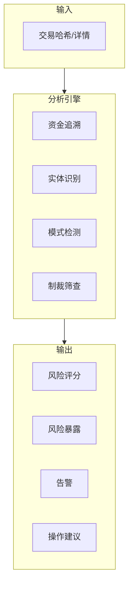
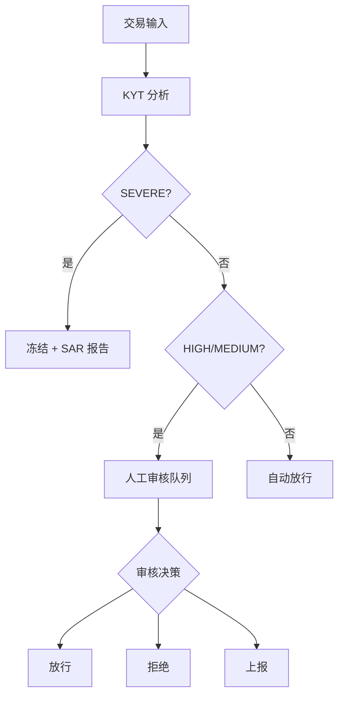

## 什麼是 KYT

**KYT (Know Your Transaction)** 是針對單筆加密貨幣交易的風險識別機制，對每一筆鏈上交易進行實時分析，判斷其風險等級並給出處置建議。

<Info>
**核心問題**：這筆交易安全嗎？

KYT 幫助你在處理每一筆交易前，快速識別其風險等級和關聯的風險實體。
</Info>

## 與傳統金融對比

| 維度 | 傳統金融 | 加密貨幣 KYT |
|------|----------|--------------|
| **監控方式** | 銀行交易監控 | 鏈上交易分析 |
| **資料基礎** | 基於賬戶歷史 | 基於地址關聯 |
| **處理時效** | T+1 批次處理 | 實時/準實時 |
| **規則引擎** | 人工規則為主 | 演算法+標籤驅動 |

## 工作原理



### 分析流程

1. **資金追溯**：向前/向後追溯資金的來源和去向
2. **實體識別**：識別交易涉及的已知實體（交易所、協議、標記地址）
3. **模式檢測**：識別可疑的交易模式（拆分、混淆、layering）
4. **制裁篩查**：與制裁名單進行匹配

---

## 風險等級定義

ChainStream 採用四級風險分類體系：

| 等級 | 標識 | 定義 | 典型觸發條件 |
|------|------|------|--------------|
| **SEVERE** | 🔴 | 已知犯罪關聯 | 制裁名單地址、已確認駭客地址、暗網市場 |
| **HIGH** | 🟠 | 高風險模式 | 混幣器輸出、詐騙關聯、未授權賭博 |
| **MEDIUM** | 🟡 | 需關注 | 高風險交易所、隱私幣兌換、異常模式 |
| **LOW** | 🟢 | 正常 | 已知合規實體、普通使用者行為 |

### 等級詳解

<AccordionGroup>
  <Accordion title="SEVERE（嚴重）" icon="circle-exclamation">
    - **定義**：與已確認的犯罪活動直接關聯
    - **資料來源**：OFAC 制裁名單、執法通報、確認的駭客事件
    - **誤判率**：極低（&lt;0.1%）
    - **建議操作**：立即凍結，上報監管
  </Accordion>
  
  <Accordion title="HIGH（高風險）" icon="triangle-exclamation">
    - **定義**：具有高風險特徵但未確認犯罪
    - **資料來源**：混幣器識別、詐騙地址聚類、行為模式分析
    - **誤判率**：低（&lt;5%）
    - **建議操作**：人工稽核，延遲處理
  </Accordion>
  
  <Accordion title="MEDIUM（中等）" icon="circle-info">
    - **定義**：存在風險訊號但需進一步評估
    - **資料來源**：關聯分析、行為異常檢測
    - **誤判率**：中等（5-15%）
    - **建議操作**：增強監控，可放行
  </Accordion>
  
  <Accordion title="LOW（低風險）" icon="circle-check">
    - **定義**：無明顯風險特徵
    - **資料來源**：正常交易模式、已知合規實體
    - **建議操作**：正常處理
  </Accordion>
</AccordionGroup>

---

## 建議操作對映

根據風險等級，系統給出標準化操作建議：

| 風險等級 | 建議操作 | 自動化程度 | SLA |
|----------|----------|------------|-----|
| **SEVERE** | 凍結 (Freeze) | 自動執行 | 即時 |
| **HIGH** | 人工稽核 (Manual Review) | 需人工確認 | 4 小時 |
| **MEDIUM** | 增強監控 (Enhanced Monitoring) | 半自動 | 24 小時 |
| **LOW** | 放行 (Pass) | 自動執行 | 即時 |

### 操作流程



---

## 暴露型別

ChainStream 區分兩種風險暴露方式：

<Tabs>
  <Tab title="直接暴露 (Direct)">
    **定義**：交易直接與風險地址發生互動
    
    ```
    风险地址 ──────────────> 目标地址
             直接转账
             
    暴露类型：DIRECT
    风险传导：100%
    ```
    
    **特徵**：
    - 一跳關聯
    - 風險確定性高
    - 通常觸發即時響應
    
    **示例場景**：
    - 從已知駭客地址收款
    - 向制裁名單地址付款
    - 直接從混幣器輸出接收
    
    ```json
    {
      "type": "DIRECT",
      "category": "SANCTIONS",
      "entity": "OFAC Sanctioned Address",
      "percentage": 100
    }
    ```
  </Tab>
  
  <Tab title="間接暴露 (Indirect)">
    **定義**：透過 N 跳關聯與風險地址產生關聯
    
    ```
    风险地址 ──> 中间地址1 ──> 中间地址2 ──> 目标地址
             N 跳关联
             
    暴露类型：INDIRECT
    风险传导：衰减计算
    ```
    
    **特徵**：
    - 多跳關聯（通常 2-5 跳）
    - 風險隨距離衰減
    - 需要綜合評估
    
    **衰減模型**：
    
    `风险得分 = 基础风险 × (衰减系数 ^ 跳数)`
    
    示例：基礎風險 100，衰減係數 0.5，3 跳後得分 = 100 × 0.5³ = 12.5
    
    ```json
    {
      "type": "INDIRECT",
      "category": "MIXER",
      "entity": "Tornado Cash",
      "percentage": 12.5,
      "hops": 3
    }
    ```
  </Tab>
</Tabs>

### 暴露型別處理建議

| 場景 | Direct 處理 | Indirect 處理 |
|------|-------------|---------------|
| SEVERE 來源 | 立即凍結 | 2 跳內凍結，3 跳+ 人工稽核 |
| HIGH 來源 | 人工稽核 | 標記監控 |
| MEDIUM 來源 | 正常處理 | 忽略 |

---

## 業務流程

### 標準 KYT 流程

<Steps>
  <Step title="註冊交易">
    提交交易資訊到 KYT API
    ```bash
    POST https://api.chainstream.io/v1/kyt/transfer
    Authorization: Bearer <access_token>
    Content-Type: application/json

    {
      "network": "ethereum",
      "asset": "ETH",
      "transferReference": "0x1234...abcd:0xRecipientAddress",
      "direction": "received"
    }
    ```
  </Step>
  <Step title="等待分析">
    透過輪詢等待分析完成（通常 30 秒內）
  </Step>
  <Step title="查詢結果">
    獲取風險評估結果
    ```bash
    GET https://api.chainstream.io/v1/kyt/transfers/{externalId}/summary
    Authorization: Bearer <access_token>
    ```
  </Step>
  <Step title="執行決策">
    根據風險等級和建議操作執行業務邏輯
  </Step>
</Steps>

### 處理時效

| 階段 | 目標時間 | SLA 承諾 |
|------|----------|----------|
| 交易註冊 | &lt;100ms | 99.9% |
| 風險分析 | &lt;30s | 95% |
| 結果返回 | &lt;30s | 95% |
| 端到端 | &lt;1min | 90% |

<Note>
有效交易 30 秒內完成分析，複雜關聯可能需要更長時間。
</Note>

---

## 資料要素

### 輸入資料（註冊轉賬）

| 欄位 | 必填 | 說明 |
|------|------|------|
| `network` | ✅ | 網路：`bitcoin`, `ethereum`, `Solana` |
| `asset` | ✅ | 資產型別：`BTC`, `ETH`, `SOL` 等 |
| `transferReference` | ✅ | 轉賬參考（交易雜湊:地址） |
| `direction` | ✅ | 方向：`sent`（傳送）或 `received`（接收） |

### 輸入資料（註冊提現）

| 欄位 | 必填 | 說明 |
|------|------|------|
| `network` | ✅ | 網路：`bitcoin`, `ethereum`, `Solana` |
| `asset` | ✅ | 資產型別 |
| `address` | ✅ | 提現目標地址 |
| `assetAmount` | ✅ | 資產數量 |
| `attemptTimestamp` | ✅ | 嘗試時間戳 |
| `assetPrice` | 可選 | 資產價格 |

### 輸出資料

```json
{
  "externalId": "393905a7-bb96-394b-9e20-3645298c1079",
  "asset": "ETH",
  "network": "ethereum",
  "transferReference": "0x1234...abcd:0xAddress",
  "direction": "received",
  "tx": "0x1234...abcd",
  "outputAddress": "0xAddress",
  "assetAmount": "1.5",
  "usdAmount": "3000.00",
  "timestamp": "2024-01-15T10:30:00.000Z",
  "updatedAt": "2024-01-15T10:30:15.000Z"
}
```

### 響應欄位說明

| 欄位 | 型別 | 說明 |
|------|------|------|
| externalId | string | 轉賬 ID（UUID），用於後續查詢 |
| asset | string | 資產型別 |
| network | string | 區塊鏈網路 |
| transferReference | string | 轉賬參考 |
| direction | string | 轉賬方向 |
| tx | string | 交易雜湊 |
| outputAddress | string | 輸出地址 |
| assetAmount | string | 資產數量 |
| usdAmount | string | USD 金額 |
| timestamp | string | 交易時間戳 |
| updatedAt | string | 更新時間 |

---

## API 使用

### 註冊充值交易（Transfer）

```bash
POST https://api.chainstream.io/v1/kyt/transfer
Authorization: Bearer <access_token>
Content-Type: application/json

{
  "network": "ethereum",
  "asset": "ETH",
  "transferReference": "0x9f318afbad2a183f97750bc51a75b582ad8f9e9c:0x17A16QmavnUfCW11DAApi",
  "direction": "received"
}
```

### 註冊提現交易（Withdrawal）

```bash
POST https://api.chainstream.io/v1/kyt/withdrawal
Authorization: Bearer <access_token>
Content-Type: application/json

{
  "network": "Solana",
  "asset": "SOL",
  "address": "D1Mc6j9xQWgR1o1Z7yU5nVVXFQiAYx7FG9AW1aVfwrUM",
  "assetAmount": "5",
  "attemptTimestamp": "2024-01-15T10:30:00.000Z"
}
```

### 獲取評估詳情

```bash
# 获取转账摘要
GET https://api.chainstream.io/v1/kyt/transfers/{externalId}/summary

# 获取直接风险暴露
GET https://api.chainstream.io/v1/kyt/transfers/{externalId}/exposures/direct

# 获取风险告警
GET https://api.chainstream.io/v1/kyt/transfers/{externalId}/alerts

# 获取网络识别
GET https://api.chainstream.io/v1/kyt/transfers/{externalId}/network-identifications
```

### 提現相關查詢

```bash
# 获取提现摘要
GET https://api.chainstream.io/v1/kyt/withdrawal/{withdrawalId}/summary

# 获取提现直接暴露
GET https://api.chainstream.io/v1/kyt/withdrawal/{withdrawalId}/exposures/direct

# 获取提现告警
GET https://api.chainstream.io/v1/kyt/withdrawal/{withdrawalId}/alerts

# 获取欺诈评估
GET https://api.chainstream.io/v1/kyt/withdrawal/{withdrawalId}/fraud-assessment
```

---

## 最佳實踐

<AccordionGroup>
  <Accordion title="風險閾值配置" icon="sliders">
    根據業務風險偏好調整閾值：
    
    | 業務型別 | SEVERE 閾值 | HIGH 閾值 | 建議 |
    |----------|-------------|-----------|------|
    | 持牌 CEX | 預設 | 預設 | 嚴格模式 |
    | 錢包服務 | 預設 | 提高 10% | 平衡模式 |
    | DeFi 協議 | 預設 | 提高 20% | 寬鬆模式 |
  </Accordion>
  
  <Accordion title="誤報處理" icon="flag">
    建立誤報反饋機制：
    
    1. 記錄所有人工推翻的案例
    2. 定期分析誤報模式
    3. 向 ChainStream 提交誤報反饋
    4. 調整本地閾值配置
  </Accordion>
  
  <Accordion title="審計留痕" icon="file-lines">
    確保合規審計要求：
    
    - 儲存所有 KYT 請求和響應
    - 記錄人工決策及理由
    - 保留至少 5 年（視監管要求）
    - 支援匯出標準格式報告
  </Accordion>
  
  <Accordion title="持續監控" icon="rotate">
    風險狀態可能變化（如地址後續被制裁），建議：
    
    - 定期重新評估歷史交易
    - 監控關聯地址的新活動
    - 建立風險狀態變更的告警機制
  </Accordion>
</AccordionGroup>

---

## 相關資源

<CardGroup cols={2}>
  <Card title="KYA 核心概念" icon="user-shield" href="/zh-Hant/docs/compliance/kya-concepts">
    瞭解地址維度風控
  </Card>
  <Card title="合規整合指南" icon="plug" href="/zh-Hant/docs/compliance/integration-guide">
    開始接入 KYT
  </Card>
  <Card title="API 認證" icon="key" href="/zh-Hant/docs/platform/authentication/api-keys-oauth">
    瞭解認證方式
  </Card>
  <Card title="KYT API 參考" icon="code" href="/zh-Hant/api-reference/endpoint/data/kyt/v2/kyt-transfer-post">
    檢視介面文件
  </Card>
</CardGroup>
