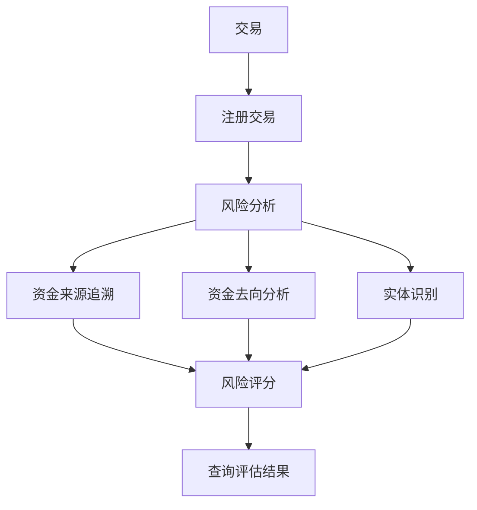

## 概述

隨著加密貨幣的主流化，合規要求日益嚴格。ChainStream 提供完整的安全與合規解決方案，幫助企業滿足監管要求、識別風險交易、保護使用者資產。

<CardGroup cols={2}>
  <Card title="KYT - 瞭解你的交易" icon="magnifying-glass-dollar" color="#4D9CFF">
    實時分析交易的資金來源和去向，識別高風險關聯
  </Card>
  <Card title="KYA - 瞭解你的地址" icon="user-shield" color="#16A34A">
    評估錢包地址的風險等級和關聯實體
  </Card>
</CardGroup>

## 為什麼需要鏈上合規

<AccordionGroup>
  <Accordion title="監管要求" icon="gavel">
    全球主要司法管轄區（美國、歐盟、新加坡、香港等）對加密貨幣交易所和服務商有明確的 AML/CFT 合規要求，包括：
    - 交易監控
    - 可疑活動報告 (SAR)
    - 制裁篩查
    - 記錄儲存
  </Accordion>
  
  <Accordion title="風險控制" icon="shield-halved">
    識別和阻止：
    - 駭客攻擊關聯資金
    - 勒索軟體支付
    - 混幣器和隱私協議關聯
    - 詐騙和釣魚地址
  </Accordion>
  
  <Accordion title="使用者保護" icon="user-shield">
    - 防止使用者與高風險地址互動
    - 提供代幣安全檢查
    - 識別蜜罐和 Rug Pull
  </Accordion>
</AccordionGroup>

## ChainStream 合規能力

### KYT (Know Your Transaction)

針對**單筆交易**進行風險評估：



**核心功能**：
- 交易風險評分
- 資金來源/去向追溯
- 關聯實體識別
- 風險告警生成

詳見 [KYT 核心概念](/zh-Hant/guides/data-concepts/kyt-concepts)

### KYA (Know Your Address)

針對**錢包地址**進行風險評估：

**核心功能**：
- 地址風險評級
- 歷史行為分析
- 關聯實體識別
- 標籤分類

詳見 [KYA 核心概念](/zh-Hant/guides/data-concepts/kya-concepts)

## 覆蓋範圍

### 支援的鏈

| 鏈 | KYT | KYA | 說明 |
|----|-----|-----|------|
| Ethereum | 完整支援 | 完整支援 | 包含 ERC-20 |
| BSC | 完整支援 | 完整支援 | 包含 BEP-20 |
| Polygon | 完整支援 | 完整支援 | |
| Arbitrum | 完整支援 | 完整支援 | |
| Solana | 完整支援 | 完整支援 | SPL 代幣 |
| Tron | 完整支援 | 完整支援 | TRC-20 |
| Bitcoin | 部分支援 | 部分支援 | 主網 |

### 風險類別

ChainStream 可識別以下風險類別：

| 類別 | 說明 | 風險等級 |
|------|------|----------|
| Sanctions | 受制裁實體/地址 | 嚴重 |
| Darknet | 暗網市場關聯 | 嚴重 |
| Ransomware | 勒索軟體關聯 | 嚴重 |
| Hacking | 駭客攻擊關聯 | 嚴重 |
| Fraud | 詐騙/釣魚關聯 | 高 |
| Mixer | 混幣器/隱私協議 | 高 |
| Gambling | 賭博平臺 | 中 |
| High Risk Exchange | 高風險交易所 | 中 |

## 整合方式

KYT/KYA 採用**註冊 + 查詢**的兩步模式：先註冊交易或地址，系統完成風險分析後，再查詢評估結果。

<Tabs>
  <Tab title="交易風險評估 (KYT)">
    **步驟 1：註冊交易**
    
    ```bash
    POST /v1/kyt/transfer
    {
      "network": "ethereum",
      "asset": "ETH",
      "transferReference": "your-unique-reference",
      "direction": "received",
      "transferTimestamp": "2024-01-15T10:30:00Z",
      "txHash": "0x...",
      "outputAddress": "0x..."
    }
    ```
    
    **步驟 2：查詢評估結果**
    
    ```bash
    # 获取风险摘要
    GET /v1/kyt/transfers/{transferId}/summary
    
    # 获取风险告警
    GET /v1/kyt/transfers/{transferId}/alerts
    
    # 获取直接风险暴露
    GET /v1/kyt/transfers/{transferId}/exposures/direct
    ```
  </Tab>
  
  <Tab title="地址風險評估 (KYA)">
    **步驟 1：註冊地址**
    
    ```bash
    POST /v1/kyt/address
    {
      "network": "ethereum",
      "address": "0x...",
      "asset": "ETH"
    }
    ```
    
    **步驟 2：查詢風險評級**
    
    ```bash
    GET /v1/kyt/addresses/{address}/risk
    ```
  </Tab>
  
  <Tab title="整合示例">
    將 KYT 整合到充值流程中：
    
    ```javascript
    import { ChainStreamClient } from '@chainstream-io/sdk';
    
    const client = new ChainStreamClient(process.env.CHAINSTREAM_ACCESS_TOKEN);
    
    async function processDeposit(txHash, toAddress) {
      // 步骤 1：注册交易
      const transfer = await client.kyt.registerTransfer({
        network: 'ethereum',
        asset: 'ETH',
        transferReference: `deposit-${txHash}`,
        direction: 'received',
        transferTimestamp: new Date().toISOString(),
        txHash: txHash,
        outputAddress: toAddress
      });
      
      // 步骤 2：查询风险摘要
      const summary = await client.kyt.getTransferSummary(transfer.transferId);
      
      // 步骤 3：根据风险等级决策
      if (summary.rating === 'highRisk' || summary.rating === 'severe') {
        // 获取详细告警信息
        const alerts = await client.kyt.getTransferAlerts(transfer.transferId);
        await flagForReview(txHash, alerts);
        return { status: 'pending_review', alerts };
      }
      
      return { status: 'approved', rating: summary.rating };
    }
    ```
  </Tab>
</Tabs>

## 使用場景

<CardGroup cols={2}>
  <Card title="交易所充值監控" icon="arrow-down-to-arc">
    在使用者充值時評估資金來源風險，阻止問題資金入金
  </Card>
  
  <Card title="提款前檢查" icon="arrow-up-from-arc">
    在使用者提款前評估目標地址風險，防止資金流向制裁實體
  </Card>
  
  <Card title="錢包風險篩查" icon="wallet">
    在使用者註冊或 KYC 時檢查其錢包歷史風險
  </Card>
  
  <Card title="合規報告" icon="file-lines">
    生成符合監管要求的交易監控報告
  </Card>
</CardGroup>

## 下一步

<CardGroup cols={3}>
  <Card title="KYT 概念" icon="magnifying-glass-dollar" href="/zh-Hant/guides/data-concepts/kyt-concepts">
    深入瞭解交易風險評估
  </Card>
  <Card title="KYA 概念" icon="user-shield" href="/zh-Hant/guides/data-concepts/kya-concepts">
    深入瞭解地址風險評估
  </Card>
  <Card title="整合指南" icon="plug" href="/zh-Hant/guides/data-concepts/compliance-integration">
    瞭解如何整合合規 API
  </Card>
</CardGroup>
