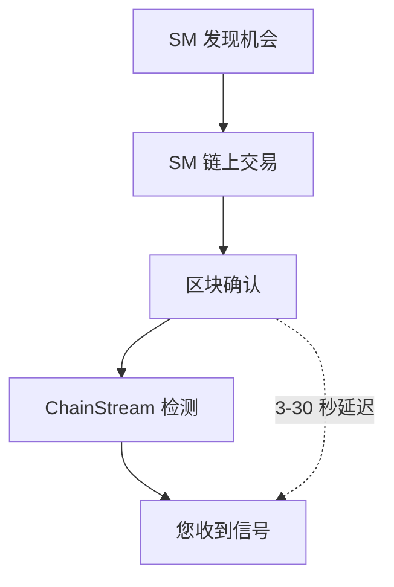

ChainStream 的 Smart Money 功能幫助開發者追蹤和分析"聰明錢"——即在加密市場中持續獲得超額收益的地址。本文件詳細說明 Smart Money 的識別方法論和資料更新機制。

---

## 什麼是 Smart Money

### 定義

Smart Money（聰明錢）指在加密市場中展現出以下特徵的地址：

- 持續跑贏市場基準收益
- 較早進入優質專案
- 較高的交易勝率
- 專業的風險管理能力

### Smart Money 型別

| 型別 | 說明 | 典型特徵 |
|:--|:--|:--|
| 機構投資者 | 專業投資機構、基金 | 大額交易、長期持有、分散投資 |
| 專業交易員 | 全職加密貨幣交易者 | 高頻交易、技術分析、多策略 |
| 早期投資者 | 專案早期參與者 | 一級市場參與、長期鎖倉 |
| KOL/影響力錢包 | 行業知名人士 | 社群影響力、資訊優勢 |

### 與普通地址的區別

| 維度 | Smart Money | 普通地址 |
|:--|:--|:--|
| 收益率 | 持續正收益，跑贏大盤 | 收益波動大，常虧損 |
| 入場時機 | 早期發現，低位買入 | 追漲殺跌，高位接盤 |
| 交易勝率 | &gt; 60% | &lt; 50% |
| 持倉管理 | 有明確的止盈止損策略 | 隨意買賣，無紀律 |
| 資金規模 | 通常 &gt; $100K | 分佈廣泛 |

---

## 識別方法論

### 資料來源

ChainStream 分析以下鏈上資料：

- 所有 DEX 交易記錄
- Token 持倉變化
- 資金流向軌跡
- 交易時間分佈
- Gas 費用模式

### 候選池篩選方法

ChainStream 採用基於新 Launch Token 表現的反向追蹤方法來構建 Smart Money 候選池：

#### 篩選流程

<Steps>
  <Step title="Token 表現篩選">
    從過去 60 天內所有新 Launch 的 Token 中，按照市值漲幅/交易量等指標篩選出表現最好的 Top 1000 個 Token
  </Step>
  <Step title="早期參與者識別">
    針對上述 Token，識別出在專案早期（Launch 後 24 小時內）買入的地址
  </Step>
  <Step title="地址去噪處理">
    排除以下型別地址：
    - DEV/專案方地址（透過交易模式識別）
    - 做市商地址（透過高頻對敲交易識別）
    - CEX 熱錢包地址（透過已知地址庫匹配）
    - Sybil 攻擊地址（透過關聯分析識別）
  </Step>
  <Step title="頻次統計與排序">
    統計每個地址在 Top 1000 Token 中的早期買入次數，取頻次最高的 Top 200 地址作為 Smart Money 候選池
  </Step>
</Steps>

### 動態滾動更新機制

為保持 Smart Money 資料的時效性和準確性，ChainStream 實現了每週滾動更新的權重衰減機制：

| 配置項 | 值 |
|:--|:--|
| 更新週期 | 每週一 UTC 00:00 |
| 視窗大小 | 60 天（約 8 周） |
| 滾動方式 | 每週移除最早一週資料，納入最新一週資料 |

#### 權重衰減模型

| 資料週期 | 權重 |
|:--|:--|
| 最近 1 周 | 100% |
| 2 周前 | 85% |
| 3 周前 | 70% |
| 4 周前 | 55% |
| 5-8 周前 | 40% |

<Warning>
滾動更新意味著 Smart Money 列表會動態變化。歷史上的 Smart Money 地址如果近期表現不佳，會逐步移出候選池。
</Warning>

---

## 資料更新週期

### 實時更新

| 資料型別 | 更新延遲 |
|:--|:--|
| 新交易檢測 | &lt; 1 分鐘 |
| 持倉變化 | &lt; 5 分鐘 |

### 定期更新

| 資料型別 | 更新週期 |
|:--|:--|
| Smart Money 列表 | 每週一 UTC 00:00 |
| 評分重算 | 每 24 小時 |
| 全量重評估 | 每 30 天 |

---

## 使用場景

<CardGroup cols={2}>
  <Card title="跟單交易" icon="copy">
    監控 Smart Money 買入訊號，輔助交易決策。
  </Card>
  <Card title="專案發現" icon="magnifying-glass">
    分析 Smart Money 關注的新專案：
    - 多個 Smart Money 同時買入
    - 持續增持而非快進快出
  </Card>
  <Card title="市場情緒" icon="chart-mixed">
    透過 Smart Money 行為判斷市場情緒：
    - 大量買入：看漲訊號
    - 集中賣出：看跌訊號
  </Card>
  <Card title="風險預警" icon="triangle-exclamation">
    監控異常資金流動：
    - 巨鯨大額轉賬
    - 專案方地址異動
  </Card>
</CardGroup>

---

## 使用注意事項

<Warning>
Smart Money 訊號僅供參考，不構成投資建議。
</Warning>

### 正確使用方式

- 作為研究起點，發現值得關注的 Token
- 結合基本面分析，做出獨立判斷
- 理解訊號延遲，鏈上交易需要確認時間
- 關注多個訊號共振，提高準確率

### 錯誤使用方式

- 盲目跟單，不做任何研究
- 忽視交易成本（Gas、滑點）
- 忽視市場環境和宏觀因素
- 過度依賴單一訊號來源

---

## 侷限性說明

### 1. 資訊延遲

### 2. 反向操作風險

- 部分 SM 可能意識到被追蹤，故意反向操作
- 大額買入可能是為了出貨製造假象

### 3. 市場容量限制

- 跟隨 SM 買入會推高價格
- 小市值 Token 容量有限，跟單效果遞減

### 4. 歷史不代表未來

- 過去的高收益不保證未來表現
- 市場環境變化可能導致策略失效

---

## 下一步

<CardGroup cols={2}>
  <Card title="Smart Money 追蹤器教程" icon="user-secret" href="/zh-Hant/docs/tutorials/smart-money-tracker">
    端到端教程：構建 SM 追蹤系統。
  </Card>
  <Card title="實時資料流" icon="bolt" href="/zh-Hant/docs/access-methods/websocket">
    實時消費 Smart Money 流的 WebSocket 與 Kafka 通道。
  </Card>
  <Card title="Wallets 錢包" icon="wallet" href="/zh-Hant/docs/data-products/wallets">
    Smart Money 的底層資料產品。
  </Card>
  <Card title="Trades 交易" icon="right-left" href="/zh-Hant/docs/data-products/trades">
    篩選到 Smart Money 的成交流。
  </Card>
</CardGroup>
