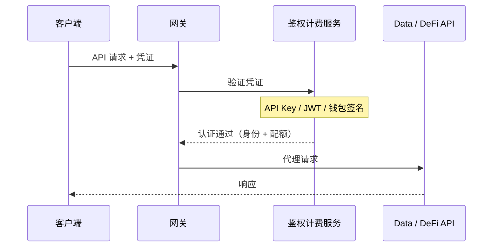

## 架構

所有 API 請求都經過**閘道器**，閘道器在轉發到後端服務之前驗證憑證。閘道器將認證和配額檢查委託給內部的**鑑權計費服務**，確保每個請求在一次跳轉中完成驗證。



當認證失敗時，閘道器直接返回錯誤（401 Unauthorized，或在啟用 x402 時返回 402 Payment Required），不會觸達後端。

---

## 三種認證方式

ChainStream 支援 **三種** 憑證型別，按以下順序評估：

| 優先順序 | 方式 | 請求頭 | 適用場景 |
|--------|------|--------|----------|
| 1 | **錢包簽名 (SIWX)** | `Authorization: SIWX <token>` | 擁有鏈上錢包的 AI Agent（x402 訂閱使用者） |
| 2 | **API Key** | `X-API-KEY: <key>` | 應用、指令碼、CLI、MCP Server |
| 3 | **JWT Bearer Token** | `Authorization: Bearer <jwt>` | 使用 OAuth 2.0 Client Credentials 的 Dashboard 應用 |

<Info>
如果沒有找到有效憑證且啟用了 x402，閘道器將返回 **HTTP 402 Payment Required**，並指向 `/x402/purchase`。這使 AI Agent 能夠自動購買訂閱。
</Info>

---

## 方式一：API Key（推薦）

最簡單的認證方式。在 Dashboard 建立 API Key，透過 `X-API-KEY` 請求頭傳遞。

### 獲取 API Key

<Steps>
  <Step title="登入 Dashboard">
    訪問 [ChainStream Dashboard](https://www.chainstream.io/dashboard) 並登入
  </Step>
  <Step title="進入應用管理">
    在側邊欄找到"Applications"
  </Step>
  <Step title="建立新應用">
    點選"Create New App"生成你的 API Key
  </Step>
</Steps>

### 使用 API Key

<Tabs>
  <Tab title="cURL">
```bash
curl https://api.chainstream.io/v2/token/sol/So11111111111111111111111111111111111111112 \
  -H "X-API-KEY: your_api_key"
```
  </Tab>
  <Tab title="SDK">
```typescript
import { ChainStreamClient } from "@chainstream-io/sdk";

const cs = new ChainStreamClient({
  apiKey: "your_api_key",
});

const token = await cs.token.getToken("So11111111111111111111111111111111111111112", "solana");
```
  </Tab>
  <Tab title="CLI">
```bash
chainstream config set --key apiKey --value your_api_key
chainstream token info --chain sol --address So11111111111111111111111111111111111111112
```
  </Tab>
  <Tab title="MCP Server">
```bash
export CHAINSTREAM_API_KEY=your_api_key
npx @chainstream-io/mcp
```
  </Tab>
</Tabs>

### 工作原理

1. 閘道器提取 `X-API-KEY` 請求頭
2. 鑑權服務在資料庫中驗證該 Key
3. 驗證透過後，請求攜帶關聯的組織和許可權上下文轉發到後端
4. Key 必須為 `active` 狀態且未過期

<Warning>
請妥善保管你的 API Key。切勿將其提交到程式碼倉庫。如果洩露，請立即在 Dashboard 中撤銷。
</Warning>

---

## 方式二：JWT Bearer Token（OAuth 2.0）

適用於使用 OAuth 2.0 Client Credentials 流程的應用。用 Client ID 和 Client Secret 換取 JWT 訪問令牌。

### 生成 Access Token

<Tabs>
  <Tab title="cURL">
```bash
curl -X POST "https://dex.asia.auth.chainstream.io/oauth/token" \
  -H "Content-Type: application/json" \
  -d '{
    "client_id": "YOUR_CLIENT_ID",
    "client_secret": "YOUR_CLIENT_SECRET",
    "audience": "https://api.dex.chainstream.io",
    "grant_type": "client_credentials"
  }'
```
  </Tab>
  <Tab title="JavaScript">
```javascript
const response = await fetch('https://dex.asia.auth.chainstream.io/oauth/token', {
  method: 'POST',
  headers: { 'Content-Type': 'application/json' },
  body: JSON.stringify({
    client_id: 'YOUR_CLIENT_ID',
    client_secret: 'YOUR_CLIENT_SECRET',
    audience: 'https://api.dex.chainstream.io',
    grant_type: 'client_credentials'
  })
});

const { access_token } = await response.json();
```
  </Tab>
  <Tab title="Python">
```python
import requests

response = requests.post(
    'https://dex.asia.auth.chainstream.io/oauth/token',
    json={
        'client_id': 'YOUR_CLIENT_ID',
        'client_secret': 'YOUR_CLIENT_SECRET',
        'audience': 'https://api.dex.chainstream.io',
        'grant_type': 'client_credentials'
    }
)

access_token = response.json()['access_token']
```
  </Tab>
</Tabs>

### 使用 Token

```bash
curl https://api.chainstream.io/v2/token/sol/So11111111111111111111111111111111111111112 \
  -H "Authorization: Bearer YOUR_ACCESS_TOKEN"
```

### 工作原理

1. 閘道器提取 `Authorization: Bearer <jwt>` 請求頭
2. 鑑權服務驗證 JWT 簽名、簽發者和受眾
3. 從 token 中的 `client_id` 解析到組織，用於配額跟蹤

### Token 詳情

- **有效期**：預設 24 小時
- **演算法**：RS256
- **Issuer**：`https://dex.asia.auth.chainstream.io/`
- **Audience**：`https://api.dex.chainstream.io`

### Scope 許可權

某些端點需要特定的 scope：

| Scope | 說明 | 適用端點 |
|-------|------|----------|
| `webhook.read` | Webhook 讀取許可權 | 查詢 Webhook 配置 |
| `webhook.write` | Webhook 寫入許可權 | 建立/修改/刪除 Webhook |
| `kyt.read` | KYT 讀取許可權 | 查詢風險評估結果 |
| `kyt.write` | KYT 寫入許可權 | 提交交易/地址進行風險評估 |

```javascript
const response = await auth0Client.oauth.clientCredentialsGrant({
  audience: 'https://api.dex.chainstream.io',
  scope: 'webhook.read webhook.write kyt.read kyt.write'
});
```

<Note>
如果不指定 scope，token 可以訪問所有通用 API 端點。僅在訪問 Webhook 和 KYT 端點時需要 scope。
</Note>

---

## 方式三：錢包簽名 (SIWX)

適用於擁有鏈上錢包並透過 [x402 支付](/zh-Hant/docs/platform/billing-payments/x402-payments) 購買了訂閱的 AI Agent。使用 **Sign-In with X (SIWX)** 標準（EVM 為 EIP-4361，Solana 為等效協議）。

### 工作原理

1. Agent 構造標準的簽名登入訊息，包含 domain、address、nonce 和過期時間
2. Agent 用錢包私鑰簽名訊息
3. 簽名後的 token 以 `Authorization: SIWX base64(message).signature` 傳送
4. 鑑權服務驗證簽名並檢查是否存在有效的 x402 訂閱
5. 如果存在有效且未過期的訂閱，認證成功

### Token 格式

```
Authorization: SIWX base64(message).signature
```

訊息遵循 EIP-4361 格式：

```
api.chainstream.io wants you to sign in with your Ethereum account:
0xYourWalletAddress

Sign in to ChainStream API

URI: https://api.chainstream.io
Version: 1
Chain ID: 8453
Nonce: abc123
Issued At: 2026-03-26T10:00:00Z
Expiration Time: 2026-03-27T10:00:00Z
```

### 支援的鏈

| 鏈 | 地址格式 | 簽名型別 |
|----|---------|---------|
| EVM（Base、Ethereum） | `0x` 字首，40 位十六進位制 | EIP-191 personal_sign |
| Solana | Base58 編碼，32-44 字元 | Ed25519 |

### SDK 用法

```typescript
const cs = new ChainStreamClient({
  auth: {
    type: "siwx",
    address: "0xYourWalletAddress",
    signMessage: async (message: string) => {
      return await wallet.signMessage(message);
    },
  },
});
```

<Note>
SIWX 認證需要有效的 x402 訂閱。如果訂閱已過期，請求將被拒絕。參見 [x402 支付](/zh-Hant/docs/platform/billing-payments/x402-payments) 瞭解如何購買訂閱。
</Note>

---

## WebSocket 認證

WebSocket 連線使用相同的三種認證方式。閘道器會：

1. 檢測 WebSocket 升級請求
2. 在允許握手之前驗證憑證
3. 跟蹤會話用於用量計量
4. 斷開連線時上報使用指標（傳輸位元組數、持續時間）

WebSocket token 也可以作為查詢引數傳遞：

```
wss://realtime-dex.chainstream.io/connection/websocket?token=YOUR_ACCESS_TOKEN
```

---

## 認證優先順序

當單個請求中存在多種憑證時，按以下順序評估：

1. **SIWX** — 如果 `Authorization` 頭以 `SIWX ` 開頭且配置了 x402
2. **API Key** — 如果存在 `X-API-KEY` 頭
3. **JWT Bearer** — 如果 `Authorization` 頭以 `Bearer ` 開頭
4. **402 Payment Required** — 如果沒有憑證匹配且啟用了 x402

第一個成功匹配的方式生效，後續方式不再評估。

---

## API 端點

| 服務 | URL |
|------|-----|
| 主網 API | `https://api.chainstream.io/` |
| WebSocket | `wss://realtime-dex.chainstream.io/connection/websocket` |
| Auth 服務（OAuth） | `https://dex.asia.auth.chainstream.io/` |
| x402 定價 | `https://api.chainstream.io/x402/pricing` |
| x402 購買 | `https://api.chainstream.io/x402/purchase` |

---

## 選擇認證方式

<CardGroup cols={3}>
  <Card title="API Key" icon="key" color="#4D9CFF">
    **適用於**：應用、指令碼、CLI、MCP Server

    最簡單的設定。在 Dashboard 建立，作為請求頭傳遞。無需重新整理 token。
  </Card>
  <Card title="JWT Bearer" icon="shield-check" color="#9333EA">
    **適用於**：Dashboard 應用、服務端對服務端

    標準 OAuth 2.0 流程。支援 scope 許可權控制。Token 有效期 24 小時。
  </Card>
  <Card title="SIWX 錢包" icon="wallet" color="#16A34A">
    **適用於**：擁有鏈上錢包的 AI Agent

    基於錢包的原生認證，透過 x402 訂閱。無需管理 API Key。
  </Card>
</CardGroup>

---

## 常見問題

<AccordionGroup>
  <Accordion title="應該使用哪種方式？">
    **API Key** 適用於大多數場景。設定最簡單，相容所有 ChainStream 產品（SDK、CLI、MCP Server）。如果需要 OAuth 2.0 整合和 scope 許可權控制，使用 **JWT**。如果你在構建擁有自己錢包的 AI Agent 並希望透過 x402 付費，使用 **SIWX**。
  </Accordion>
  <Accordion title="Token 過期了怎麼辦？">
    JWT：使用 Client ID 和 Client Secret 重新生成 token。SIWX：用新的過期時間重新簽名訊息。API Key 除非你在 Dashboard 設定了過期日期，否則不會過期。
  </Accordion>
  <Accordion title="可以同時使用多種認證方式嗎？">
    每個請求只評估一種方式。如果同時傳送 `X-API-KEY` 和 `Authorization: Bearer`，API Key 優先（優先順序：SIWX > API Key > JWT）。
  </Accordion>
  <Accordion title="什麼是 402 Payment Required 響應？">
    當沒有找到有效憑證且啟用了 x402 時，閘道器返回 HTTP 402 並附帶購買訂閱的指引（`/x402/purchase`）。這使 AI Agent 能夠自動購買訪問許可權。參見 [x402 支付](/zh-Hant/docs/platform/billing-payments/x402-payments)。
  </Accordion>
  <Accordion title="如何撤銷憑證？">
    **API Key**：在 Dashboard 刪除應用，Key 立即失效。**JWT**：在 Dashboard 撤銷 Client ID/Secret。**SIWX**：訂閱自然過期，無需手動撤銷。
  </Accordion>
</AccordionGroup>
