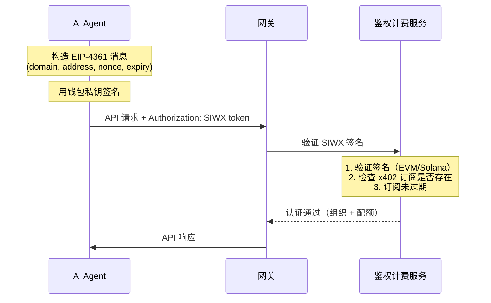

Sign-In with X (SIWX) 允許你在每個 API 請求中透過錢包簽名進行認證 — 無需 API Key 或 OAuth Token。這是為**擁有鏈上錢包並透過 [x402 支付](/zh-Hant/docs/platform/billing-payments/x402-payments) 購買了訂閱的 AI Agent** 設計的。

<Info>
SIWX 替代了 API Key。你不需要傳 `X-API-KEY`，而是在每個請求中傳 `Authorization: SIWX <token>`。閘道器實時驗證簽名並檢查是否有有效的 x402 訂閱。
</Info>

## 工作原理

與傳統的 challenge/response 流程不同，SIWX 是**無狀態且自包含的**。客戶端在本地構造並簽名訊息，然後附加到每個請求上。



### 分步說明

1. **構造 EIP-4361 訊息**，包含錢包地址、domain、nonce 和過期時間
2. **用錢包私鑰簽名訊息**
3. **編碼為 SIWX token**：`base64(message).signature`
4. **附加到每個 API 請求**：`Authorization: SIWX <token>`
5. 閘道器驗證簽名並檢查該錢包是否有有效的 x402 訂閱
6. 驗證透過後，請求正常處理（等同於 API Key 認證）

## Token 格式

```
Authorization: SIWX base64(message).signature
```

訊息遵循 EIP-4361 標準：

```
api.chainstream.io wants you to sign in with your Ethereum account:
0xYourWalletAddress

Sign in to ChainStream API

URI: https://api.chainstream.io
Version: 1
Chain ID: 8453
Nonce: abc123def456
Issued At: 2026-03-26T10:00:00Z
Expiration Time: 2026-03-27T10:00:00Z
```

### 必填欄位

| 欄位 | 說明 |
|---|---|
| Domain | 必須為 `api.chainstream.io` |
| Address | 你的錢包地址（EVM `0x...` 或 Solana base58） |
| URI | `https://api.chainstream.io` |
| Version | `1` |
| Nonce | 隨機字串（客戶端生成，用於防重放） |
| Issued At | ISO 8601 時間戳 |
| Expiration Time | ISO 8601 時間戳（超過此時間 token 將被拒絕） |

<Note>
過期時間由客戶端設定。你可以簽署有效期為幾分鐘、幾小時或幾天的訊息。更長的有效期意味著更少的重籤，但更短的有效期更安全。
</Note>

## 支援的鏈

| 鏈 | 地址格式 | 簽名驗證方式 |
|---|---|---|
| EVM（Base、Ethereum） | `0x` 字首，40 位十六進位制 | EIP-191 `personal_sign` 恢復 |
| Solana | Base58 編碼，32-44 字元 | Ed25519 簽名驗證 |

## 前提條件

SIWX 認證需要與錢包地址關聯的**有效 x402 訂閱**。沒有訂閱時，閘道器會拒絕請求並返回錯誤。

獲取訂閱：

```bash
# 通过 CLI（自动）
chainstream login
chainstream token info --chain sol --address So11111111111111111111111111111111111111112
# → 402 触发套餐选择 → x402 支付 → API Key 已保存

# 或通过直接 x402 购买
curl https://api.chainstream.io/x402/purchase?plan=nano
# → 按 x402 支付流程操作
```

詳見 [x402 支付](/zh-Hant/docs/platform/billing-payments/x402-payments)。

## 使用示例

### cURL

```bash
# 1. 构造并签名消息（使用你偏好的工具）
# 2. Base64 编码消息并附加签名
TOKEN="base64EncodedMessage.signatureHex"

# 3. 在任何 API 调用中使用
curl https://api.chainstream.io/v2/token/sol/So11111111111111111111111111111111111111112 \
  -H "Authorization: SIWX $TOKEN"
```

### SDK

```typescript
import { ChainStreamClient } from "@chainstream-io/sdk";

const cs = new ChainStreamClient({
  auth: {
    type: "siwx",
    address: "0xYourWalletAddress",
    signMessage: async (message: string) => {
      return await wallet.signMessage(message);
    },
  },
});

const token = await cs.token.getToken("So11111111111111111111111111111111111111112", "sol");
```

### CLI

使用錢包登入後，CLI 會自動使用 SIWX：

```bash
chainstream login
chainstream token info --chain sol --address So11111111111111111111111111111111111111112
```

## SIWX 與 API Key 對比

| | SIWX | API Key |
|---|---|---|
| **請求頭** | `Authorization: SIWX <token>` | `X-API-KEY: <key>` |
| **憑證管理** | 無需儲存 Key — 按需簽名 | 需要儲存和保護 Key |
| **前提條件** | 錢包 + x402 訂閱 | Dashboard 賬號 |
| **適用場景** | 擁有錢包的 AI Agent | 應用、指令碼、MCP |
| **Token 過期** | 由客戶端設定（每條訊息） | 在 Dashboard 設定（或永不過期） |

## 安全注意事項

- **無狀態**：沒有服務端會話。每個請求獨立驗證。
- **過期控制**：客戶端透過 `Expiration Time` 欄位控制 token 有效期。過期 token 會被拒絕。
- **域名繫結**：訊息包含 `api.chainstream.io` 作為域名。為其他域名的簽名會被拒絕。
- **無私鑰洩露**：錢包只簽署明文訊息 — 私鑰永遠不會被傳輸。
- **訂閱檢查**：即使簽名有效，如果錢包沒有有效的 x402 訂閱，請求也會被拒絕。
