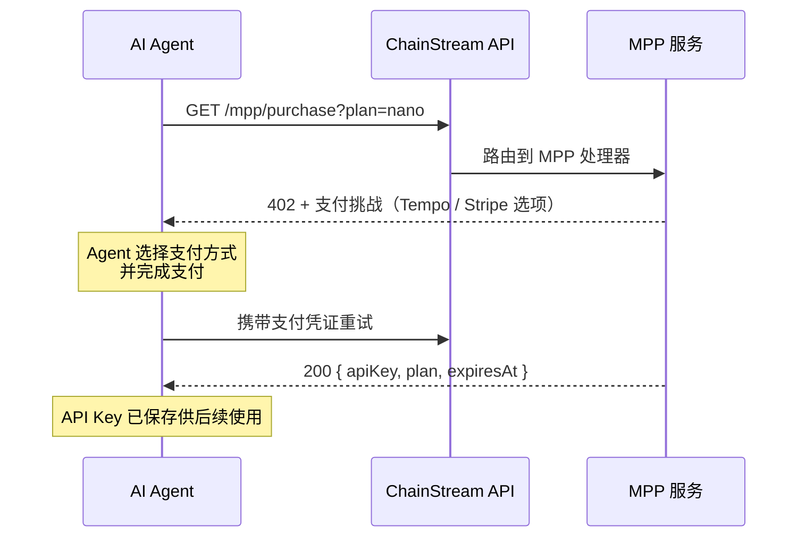

MPP（Machine Payment Protocol）是為 AI Agent 和自動化系統設計的支付協議。它是 x402 的超集，在統一的流程中同時支援 **Tempo 穩定幣支付**和 **Stripe 信用卡支付**。

<Info>
與僅支援鏈上 USDC 的 x402 不同，MPP 額外支援 Tempo 網路穩定幣和傳統信用卡支付。
</Info>

## 工作原理



### 詳細流程

1. **Agent 呼叫** `GET /mpp/purchase?plan=<plan>`，不帶支付憑證
2. **MPP 服務返回 402**，附帶 `WWW-Authenticate: Payment` 挑戰，包含金額、貨幣和收款方
3. **Agent 使用 Tempo Wallet 或 Stripe 簽署支付**
4. **Agent 攜帶 `Authorization: Payment` 憑證重試**購買請求
5. **MPP 服務驗證支付**，建立訂閱，返回 API Key

## 支援的支付方式

| 方式 | 網路 | 貨幣 | Gas 費 | 適用場景 |
|------|------|------|--------|----------|
| **Tempo** | Tempo（鏈 ID 4217） | USDC.e (ERC-20) | **免費**（gas 用穩定幣支付） | AI Agent，無需 ETH |
| **Stripe** | 傳統支付 | USD（信用卡） | 不適用 | 有信用卡的 Agent，無需加密貨幣 |

<Tip>
Tempo 支付不需要原生 gas 代幣 — gas 直接用穩定幣支付。這使其非常適合只持有穩定幣的 AI Agent。
</Tip>

## API 端點

| 端點 | 方法 | 說明 |
|------|------|------|
| `/mpp/purchase?plan=<plan>` | GET / POST | 透過 MPP 購買訂閱 |
| `/mpp/pricing` | GET | 列出可用套餐和支付方式 |
| `/mpp/health` | GET | 健康檢查 |

### 定價響應

```bash
curl https://api.chainstream.io/mpp/pricing
```

```json
{
  "plans": [
    { "name": "nano", "priceUsd": 5, "quotaTotal": 500000, "durationDays": 30 },
    { "name": "starter", "priceUsd": 199, "quotaTotal": 10000000, "durationDays": 30 }
  ],
  "currency": "USD",
  "paymentMethods": ["tempo", "stripe"],
  "note": "Prices in USD. Pay via MPP (Tempo stablecoin or Stripe card)."
}
```

### 購買響應（成功）

```json
{
  "status": "ok",
  "plan": "nano",
  "expiresAt": "2026-04-25T12:00:00.000Z",
  "apiKey": "cs_live_..."
}
```

## CLI 使用

ChainStream CLI 在自動購買流程中支援 MPP 作為支付選項：

```bash
chainstream token info --chain sol --address So11111111111111111111111111111111111111112
# → 402 → 套餐选择 → 选择 "MPP Tempo" → 支付 → API Key 已保存
```

對於沒有 ChainStream 錢包的 Agent，CLI 會列印 Tempo 命令：

```bash
tempo request "https://api.chainstream.io/mpp/purchase?plan=nano"
```

## 手動整合（Tempo Wallet）

### 安裝

安裝 Tempo Wallet CLI 並登入（首次需透過瀏覽器進行 passkey 認證）：

```bash
curl -fsSL https://tempo.xyz/install | bash
tempo wallet login
```

<Note>
Tempo Wallet 使用 passkey (WebAuthn) 認證。首次設定需要瀏覽器互動。之後會話持久化，Agent 操作無需再次瀏覽器互動。
</Note>

### 購買

```bash
# 查看余额
tempo wallet balance

# 购买套餐（自动处理 402 → 签名 → 重试）
tempo request "https://api.chainstream.io/mpp/purchase?plan=nano"
```

Tempo CLI 自動處理 `WWW-Authenticate: Payment` 挑戰，簽署交易，並在成功後返回 API Key。

### 相容的錢包

Tempo 相容 EVM（鏈 ID 4217）。任何在 Tempo 上持有 USDC.e 的錢包都可以使用：

- **Tempo Wallet CLI**（`tempo request`）— 推薦，passkey 認證，內建 MPP 支援
- 任何 EVM 錢包（MetaMask、Coinbase CDP、Privy）— 新增 Tempo 為自定義網路

## MPP 與 x402 對比

| | MPP | x402 |
|---|---|---|
| **支付方式** | Tempo 穩定幣 + Stripe 信用卡 | 僅鏈上 USDC |
| **網路** | Tempo（鏈 ID 4217）+ Stripe | Base (EVM) + Solana |
| **Gas 費** | 免費（Tempo）/ 不適用（Stripe） | 免費（facilitator 代付） |
| **是否必須加密錢包** | 否（有 Stripe 選項） | 是 |
| **購買端點** | `/mpp/purchase` | `/x402/purchase` |
| **協議** | MPP（HTTP 402） | x402 協議 |
| **適用場景** | 沒有加密錢包的 Agent | 在 Base/Solana 上有 USDC 的 Agent |

## 下一步

<CardGroup cols={2}>
  <Card title="x402 支付協議" icon="money-bill-wave" href="/zh-Hant/docs/platform/billing-payments/x402-payments">
    透過 x402 協議進行鏈上 USDC 支付
  </Card>
  <Card title="計費與配額" icon="receipt" href="/zh-Hant/docs/platform/billing-payments/plans-and-units">
    瞭解 CU 消耗和套餐詳情
  </Card>
</CardGroup>
