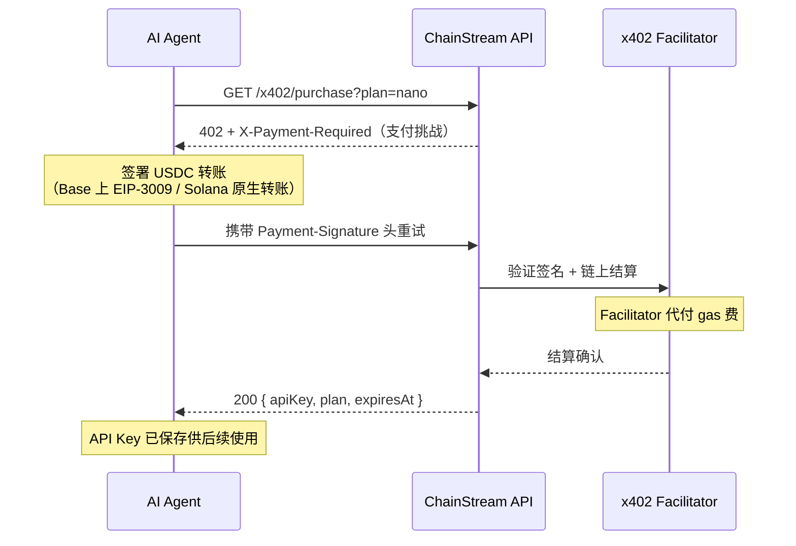

x402 是基於 HTTP 402 Payment Required 狀態碼的支付協議。它實現了機器對機器的 API 微支付，無需手動計費、信用卡或訂閱管理。使用 USDC 按需付費，即時獲得 API 訪問許可權。

## 工作原理



### 詳細流程

1. **客戶端傳送請求**到 ChainStream API，沒有 API Key 或 Key 已過期。

2. **閘道器返回 HTTP 402**，訊息指向 `/x402/purchase`。

3. **客戶端呼叫 `GET /x402/purchase?plan=<plan>`**（不帶支付頭）。伺服器返回 HTTP 402 及 x402 支付要求：

   | 響應頭 | 說明 |
   |---|---|
   | `X-Payment-Required` | Base64 編碼的 JSON 支付詳情 |
   | `Payment-Required` | 相同值（相容 x402 客戶端） |

   解碼後的 JSON 遵循 x402 v2 協議：

   ```json
   {
     "x402Version": 2,
     "resource": {
       "url": "/x402/purchase?plan=nano",
       "description": "ChainStream API access: nano plan"
     },
     "accepts": [
       {
         "scheme": "exact",
         "network": "eip155:8453",
         "asset": "0x833589fCD6eDb6E08f4c7C32D4f71b54bdA02913",
         "amount": "5000000",
         "payTo": "0xRecipientAddress",
         "maxTimeoutSeconds": 60
       },
       {
         "scheme": "exact",
         "network": "solana:5eykt4UsFv8P8NJdTREpY1vzqKqZKvdp",
         "asset": "EPjFWdd5AufqSSqeM2qN1xzybapC8G4wEGGkZwyTDt1v",
         "amount": "5000000",
         "payTo": "SolanaRecipientAddress",
         "maxTimeoutSeconds": 60
       }
     ]
   }
   ```

4. **客戶端使用 `@x402` SDK 簽署 USDC 轉賬**，並攜帶支付證明重試 `GET /x402/purchase?plan=<plan>`：

   | 請求頭 | 說明 |
   |---|---|
   | `Payment-Signature` | Base64 編碼的簽名支付載荷 |

5. **伺服器驗證並結算支付**，返回訂閱詳情：

   ```json
   {
     "status": "ok",
     "plan": "nano",
     "chain": "evm",
     "address": "0xPayerAddress",
     "expiresAt": "2026-04-25T12:00:00.000Z",
     "txHash": "0xabc123...",
     "apiKey": "cs_live_..."
   }
   ```

   客戶端儲存 `apiKey` 用於後續所有 API 呼叫。

## CLI 整合

ChainStream CLI 透過 `callWithAutoPayment` 自動處理 x402 支付。當任何命令遇到 402 時，CLI 會引導你完成套餐選擇和支付。

### 自動流程

當 CLI 遇到 402 響應時，會：

1. 從 `/x402/pricing` 獲取可用套餐並顯示選擇表格
2. 提示你選擇套餐
3. 詢問支付方式：**x402**（Base/Solana USDC）或 **MPP**（Tempo USDC.e）
4. 如果選 x402：透過 `@x402/fetch` 簽名併傳送支付，將返回的 API Key 儲存到配置
5. 如果選 MPP：列印 `tempo request` 命令供手動購買
6. 使用新 API Key 重試原始命令

```bash
$ chainstream token info --chain sol --address So11111111111111111111111111111111111111112

[chainstream] No active subscription. Available plans:

   #  Plan       Price    Quota           Duration
   ── ────────── ──────── ──────────────── ────────
   1  nano       $5             500,000 CU  30 days
   2  starter    $199        10,000,000 CU  30 days
   3  pro        $699        50,000,000 CU  30 days

Select plan (1-3): 1

[chainstream] Choose payment method:
  1. x402 (USDC on Base/Solana)
  2. MPP Tempo (USDC.e on Tempo)

Select method (1-2): 1

[chainstream] Purchasing nano plan via x402...
[chainstream] Subscription activated: nano (expires: 2026-04-25T12:00:00.000Z)
[chainstream] API Key saved to config.
```

<Note>
如果你只有 API Key（沒有錢包），CLI 會跳過 x402 並列印 MPP 購買指引。
</Note>

### 錢包設定

CLI 需要一個有餘額的錢包來進行 x402 支付：

```bash
# 创建 ChainStream TEE 钱包（推荐）
chainstream login

# 或导入原始私钥（仅用于开发/测试）
chainstream wallet set-raw --chain base
```

## 手動整合

對於自定義整合，可以使用 `@x402` 包族實現 x402 流程。

### 依賴

```bash
npm install @x402/core @x402/evm @x402/svm @x402/fetch
```

| 包 | 用途 |
|---|---|
| `@x402/core` | 協議型別、頭解析、驗證邏輯 |
| `@x402/evm` | EVM 支付執行（基於 viem） |
| `@x402/svm` | Solana 支付執行（基於 @solana/kit） |
| `@x402/fetch` | 即插即用的 `fetch` 封裝，自動處理 402 |

### 使用 @x402/fetch（推薦）

最簡單的整合方式 — 用 x402 支援封裝標準 `fetch`：

```typescript
import { createX402Fetch } from "@x402/fetch";
import { createWalletClient, http } from "viem";
import { base } from "viem/chains";
import { privateKeyToAccount } from "viem/accounts";

const account = privateKeyToAccount(process.env.PRIVATE_KEY as `0x${string}`);
const walletClient = createWalletClient({
  account,
  chain: base,
  transport: http(),
});

const x402Fetch = createX402Fetch({
  evm: { walletClient },
  autoApprove: true,
  maxAmount: "10.00",
});

const response = await x402Fetch(
  "https://api.chainstream.io/v2/token/eth/0x1234abcd"
);

const data = await response.json();
console.log(data);
```

### 手動流程（高階）

完全控制支付流程：

```typescript
import { parsePaymentHeaders, createPaymentProof } from "@x402/core";
import { sendPayment } from "@x402/evm";

// 1. 發起初始請求（無認證、無支付）
const response = await fetch("https://api.chainstream.io/v2/token/eth/0x1234abcd");

if (response.status === 402) {
  // 2. 从响应头解析支付详情
  const payment = parsePaymentHeaders(response.headers);
  console.log(`需要支付: ${payment.amount} USDC on ${payment.chain}`);

  // 3. 发送 USDC 支付
  const txHash = await sendPayment({
    walletClient,
    to: payment.address,
    amount: payment.amount,
    token: payment.token,
    memo: payment.memo,
  });

  // 4. 携带支付签名重试
  const retryResponse = await fetch(
    "https://api.chainstream.io/x402/purchase?plan=nano",
    {
      headers: {
        "Payment-Signature": paymentSignature,
      },
    }
  );

  // 5. 从响应中提取 API Key
  const result = await retryResponse.json();
  console.log("后续使用的 API Key:", result.apiKey);
  console.log("过期时间:", result.expiresAt);
}
```

## 支援的支付鏈

| 鏈 | 代幣 | 確認時間 |
|---|---|---|
| Base | USDC | 約 2 秒 |
| Solana | USDC | 約 400ms |

## 零 Gas 費

ChainStream 運營自有的 **x402 facilitator**，代替 Agent 提交鏈上支付交易。這意味著：

- **無需 Gas 費** — facilitator 代付所有 gas 費用（Base ETH / Solana SOL）
- **Agent 錢包只需持有 USDC** — 無需持有原生代幣支付 gas
- Agent 簽署 USDC 轉賬授權；facilitator 負責廣播交易並支付執行費用

這消除了 AI Agent 最大的摩擦點：在多條鏈上獲取和管理原生 gas 代幣。

## 安全注意事項

- **支付上限**：使用 `@x402/fetch` 時始終設定 `maxAmount` 以防止意外扣費。
- **驗證**：facilitator 在結算前會在鏈上驗證簽名支付。無效簽名會被拒絕。
- **冪等性**：如果支付已結算但響應失敗（網路錯誤），可以重新提交相同的 `Payment-Signature`。支付只會被消費一次。
- **合規**：付款方地址在結算前會進行合規篩查。受制裁地址會被拒絕。
