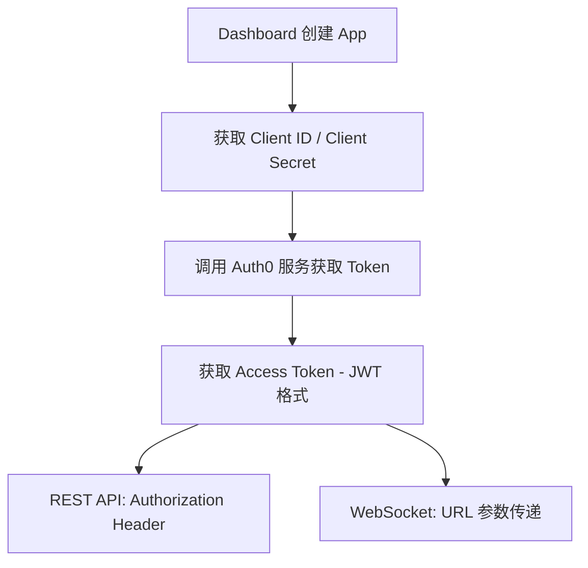

ChainStream 採用多層安全機制保護 API 訪問。本文件介紹 API 安全最佳實踐、常見威脅防護及安全配置指南。

<Info>
**最後更新:** 2026 年 2 月 | **版本:** v2.0
</Info>

---

## 認證安全

### Access Token 機制

ChainStream 使用基於 OAuth 2.0 的認證機制，透過 Client ID 和 Client Secret 生成 JWT Access Token 進行 API 認證。

**認證流程：**



**憑據規範**

| 專案 | 規範 |
|:--|:--|
| Client ID | 應用唯一識別符號 |
| Client Secret | 64 位隨機字元 |
| Access Token | JWT 格式，包含過期時間和許可權範圍 |
| Token 有效期 | 24 小時 |

### Access Token 獲取

<CodeGroup>
```javascript JavaScript
import { AuthenticationClient } from 'auth0';

const auth0Client = new AuthenticationClient({
  domain: 'dex.asia.auth.chainstream.io',
  clientId: process.env.CHAINSTREAM_CLIENT_ID,
  clientSecret: process.env.CHAINSTREAM_CLIENT_SECRET
});

const { data } = await auth0Client.oauth.clientCredentialsGrant({
  audience: 'https://api.dex.chainstream.io'
});

const accessToken = data.access_token;
```

```python Python
from auth0.authentication import GetToken

get_token = GetToken(
    'dex.asia.auth.chainstream.io',
    os.environ['CHAINSTREAM_CLIENT_ID'],
    client_secret=os.environ['CHAINSTREAM_CLIENT_SECRET']
)

token = get_token.client_credentials(
    audience='https://api.dex.chainstream.io'
)

access_token = token['access_token']
```
</CodeGroup>

### 憑據安全

**儲存要求**

<Warning>
Client Secret 是訪問 ChainStream 服務的核心憑證，洩露可能導致服務濫用和費用損失。
</Warning>

| 儲存方式 | 安全等級 | 說明 |
|:--|:--|:--|
| 環境變數 | ✅ 推薦 | 不進入版本控制 |
| 金鑰管理服務 | ✅ 最佳 | AWS Secrets Manager, HashiCorp Vault 等 |
| 配置檔案 | ⚠️ 注意 | 必須加入 .gitignore |
| 程式碼硬編碼 | ❌ 禁止 | 極易洩露 |

### 程式碼示例

<CodeGroup>
```javascript JavaScript
// ❌ 危险：硬编码凭据
const clientId = "your_client_id";
const clientSecret = "your_secret";

// ❌ 危险：提交到版本控制
// config.json: { "client_id": "...", "client_secret": "..." }

// ✅ 安全：使用环境变量
const clientId = process.env.CHAINSTREAM_CLIENT_ID;
const clientSecret = process.env.CHAINSTREAM_CLIENT_SECRET;

// ✅ 安全：使用密钥管理服务
const credentials = await secretsManager.getSecret('chainstream-credentials');
```

```python Python
import os

# ❌ 危险：硬编码
client_id = "your_client_id"
client_secret = "your_secret"

# ✅ 安全：使用环境变量
client_id = os.environ.get('CHAINSTREAM_CLIENT_ID')
client_secret = os.environ.get('CHAINSTREAM_CLIENT_SECRET')

# ✅ 安全：使用密钥管理服务 (AWS Secrets Manager 示例)
import boto3
client = boto3.client('secretsmanager')
credentials = client.get_secret_value(SecretId='chainstream-credentials')['SecretString']
```

```go Go
// ❌ 危险：硬编码
clientID := "your_client_id"
clientSecret := "your_secret"

// ✅ 安全：使用环境变量
clientID := os.Getenv("CHAINSTREAM_CLIENT_ID")
clientSecret := os.Getenv("CHAINSTREAM_CLIENT_SECRET")
```
</CodeGroup>

### 多 App 管理

建議為不同環境和服務建立獨立的 App：

| 用途 | App 名稱建議 | 說明 |
|:--|:--|:--|
| 生產環境 | `prod-main` | 生產業務使用 |
| 測試環境 | `test-dev` | 開發測試使用 |
| CI/CD | `ci-pipeline` | 自動化測試使用 |
| 監控服務 | `monitoring` | 監控告警使用 |

---

## 傳輸安全

### TLS 要求

| 專案 | 要求 |
|:--|:--|
| 最低版本 | TLS 1.2 |
| 推薦版本 | TLS 1.3 |
| 證書驗證 | 必須啟用 |
| 不支援 | HTTP、TLS 1.0/1.1 |

### 證書驗證

<Warning>
生產環境中絕不跳過證書驗證，這會使您的應用暴露於中間人攻擊風險。
</Warning>

<CodeGroup>
```javascript JavaScript
// ❌ 危险：跳过证书验证
process.env.NODE_TLS_REJECT_UNAUTHORIZED = '0';

// ✅ 安全：正常证书验证（默认行为）
const response = await fetch('https://api.chainstream.io/v1/...');
```

```python Python
import requests

# ❌ 危险：跳过证书验证
requests.get(url, verify=False)

# ✅ 安全：正常证书验证（默认行为）
requests.get(url)
```

```bash cURL
# ❌ 危险：跳过证书验证
curl -k https://api.chainstream.io/v1/...

# ✅ 安全：正常证书验证（默认行为）
curl https://api.chainstream.io/v1/...
```
</CodeGroup>

---

## Webhook 安全

Webhook 訊息透過簽名機制確保訊息來源的可靠性。

### 簽名驗證

當您收到 Webhook 訊息時，需要使用 Webhook Secret 驗證簽名，確認訊息來自 ChainStream 且未被篡改。

| 專案 | 說明 |
|:--|:--|
| 演算法 | HMAC-SHA256 |
| 金鑰 | Webhook Secret（在 Dashboard 配置） |
| 簽名頭 | `X-Webhook-Signature` |

### 驗證示例

<CodeGroup>
```javascript JavaScript
const crypto = require('crypto');

function verifyWebhookSignature(payload, signature, secret) {
  const expectedSignature = crypto
    .createHmac('sha256', secret)
    .update(JSON.stringify(payload))
    .digest('hex');
  
  return crypto.timingSafeEqual(
    Buffer.from(signature),
    Buffer.from(expectedSignature)
  );
}

// Express 中间件示例
app.post('/webhook', (req, res) => {
  const signature = req.headers['x-webhook-signature'];
  const isValid = verifyWebhookSignature(
    req.body,
    signature,
    process.env.WEBHOOK_SECRET
  );
  
  if (!isValid) {
    return res.status(401).send('Invalid signature');
  }
  
  // 处理 webhook 消息
  console.log('Received webhook:', req.body);
  res.status(200).send('OK');
});
```

```python Python
import hmac
import hashlib
import json

def verify_webhook_signature(payload, signature, secret):
    expected_signature = hmac.new(
        secret.encode(),
        json.dumps(payload).encode(),
        hashlib.sha256
    ).hexdigest()
    
    return hmac.compare_digest(signature, expected_signature)

# Flask 示例
@app.route('/webhook', methods=['POST'])
def webhook():
    signature = request.headers.get('X-Webhook-Signature')
    is_valid = verify_webhook_signature(
        request.json,
        signature,
        os.environ['WEBHOOK_SECRET']
    )
    
    if not is_valid:
        return 'Invalid signature', 401
    
    # 处理 webhook 消息
    print('Received webhook:', request.json)
    return 'OK', 200
```
</CodeGroup>

### Webhook Secret 輪換

如需輪換 Webhook Secret：

<Steps>
  <Step title="生成新 Secret">
    Dashboard → Webhooks → 選擇 Endpoint → 輪換 Secret
  </Step>
  <Step title="更新應用配置">
    在應用中更新為新的 Webhook Secret
  </Step>
  <Step title="驗證簽名">
    確認新 Secret 可以正確驗證簽名
  </Step>
</Steps>

---

## 使用量監控

### Metrics 面板

在 Dashboard 的 Metrics 面板中，可以檢視 API 和 WebSocket 的呼叫情況：

| 指標 | 說明 |
|:--|:--|
| 請求 IP | 請求來源 IP 地址 |
| User Agent | 請求的客戶端標識 |
| 響應碼 | HTTP 狀態碼 |
| 耗時 | 請求響應時間 |
| 消耗 Units | 本次請求消耗的用量單位 |
| 總計用量 | 累計消耗的用量 |

### 圖表資料

Metrics 面板提供多種時間維度的圖表：

- **小時維度** — 檢視最近 24 小時的呼叫趨勢
- **天維度** — 檢視最近 30 天的呼叫趨勢
- **月維度** — 檢視歷史月度統計

**檢視路徑：** Dashboard → Metrics

---

## 安全監控

<Note>
🚧 **Coming Soon** — 安全監控功能正在開發中，即將上線。
</Note>

上線後將支援：

- **異常檢測** — 自動檢測認證失敗激增、異常地理位置等
- **告警通知** — 郵件和 Webhook 告警
- **自動防護** — 臨時封禁、請求限流等

---

## IP 白名單

<Note>
🚧 **Coming Soon** — IP 白名單功能正在開發中，即將上線。
</Note>

上線後將支援：

- 單個 IP 配置（如 `203.0.113.50`）
- IP 段配置（如 `203.0.113.0/24`）
- 多 IP 配置（逗號分隔）

---

## 常見攻擊防護

### 中間人攻擊

**攻擊方式：** 攻擊者在客戶端和伺服器之間攔截通訊。

**防護措施：**

| 措施 | 說明 |
|:--|:--|
| 強制 HTTPS | 僅支援 TLS 1.2+ |
| 證書驗證 | 必須啟用證書驗證 |
| HSTS | 強制 HTTPS 連線 |

### 注入攻擊

**攻擊方式：** 攻擊者透過輸入惡意資料嘗試執行未授權操作。

**防護措施：**

| 措施 | 說明 |
|:--|:--|
| 輸入驗證 | 嚴格的引數型別檢查 |
| 引數化查詢 | 防止 SQL/NoSQL 注入 |
| 輸出編碼 | 防止 XSS |

### 憑據洩露響應

如果懷疑 Client Secret 已洩露，請立即執行以下步驟：

<Steps>
  <Step title="立即刪除 App">
    Dashboard → Apps → 選擇 App → 刪除
  </Step>
  <Step title="建立新 App">
    Dashboard → Apps → 建立新 App
  </Step>
  <Step title="更新應用配置">
    在所有使用該憑據的應用中更新為新 Client ID 和 Secret
  </Step>
  <Step title="檢查 Metrics">
    Dashboard → Metrics → 檢查是否有異常呼叫
  </Step>
  <Step title="審查安全實踐">
    檢查憑據洩露原因，改進安全措施
  </Step>
</Steps>

---

## 安全錯誤碼

### 認證相關

| 錯誤碼 | HTTP 狀態 | 說明 |
|:--|:--|:--|
| `UNAUTHORIZED` | 401 | 未提供認證資訊 |
| `EXPIRED_TOKEN` | 401 | Access Token 已過期 |
| `INVALID_TOKEN` | 401 | Access Token 無效 |
| `INVALID_CREDENTIALS` | 401 | Client ID 或 Secret 錯誤 |

### 訪問控制相關

| 錯誤碼 | HTTP 狀態 | 說明 |
|:--|:--|:--|
| `FORBIDDEN` | 403 | 無許可權訪問或用量不足 |
| `RATE_LIMITED` | 429 | 請求頻率超限 |
| `INSUFFICIENT_SCOPE` | 403 | Token 許可權不足 |

### Webhook 相關

| 錯誤碼 | 說明 |
|:--|:--|
| `INVALID_SIGNATURE` | Webhook 簽名驗證失敗 |
| `MISSING_SIGNATURE` | 缺少簽名頭 |

### 錯誤響應示例

```json
{
  "error": {
    "code": "EXPIRED_TOKEN",
    "message": "Access token has expired",
    "details": {
      "expired_at": "2024-01-15T10:30:00Z"
    }
  }
}
```

---

## 安全配置清單

### 基礎配置（必須）

- [ ] 使用 HTTPS 訪問 API
- [ ] Client ID 和 Client Secret 儲存在環境變數或金鑰管理服務
- [ ] 不在程式碼倉庫中提交憑據
- [ ] 生產/測試環境使用不同 App
- [ ] 正確驗證 Webhook 簽名

### 進階配置（推薦）

- [ ] 整合金鑰管理服務（AWS Secrets Manager / HashiCorp Vault）
- [ ] 定期檢查 Metrics 面板的呼叫情況
- [ ] 為不同服務建立獨立的 App

### 企業配置（可選）

- [ ] 整合 SIEM 系統進行日誌分析
- [ ] 制定安全事件響應流程

---

## 常見問題

<AccordionGroup>
  <Accordion title="Client Secret 洩露了怎麼辦？">
    立即登入 Dashboard 刪除該 App，建立新 App，然後更新所有使用該憑據的應用配置。詳見上方"憑據洩露響應"章節。
  </Accordion>

  <Accordion title="Access Token 過期了怎麼辦？">
    Access Token 有效期為 24 小時。建議：
    
    1. **快取 Token** — 在有效期內複用同一個 Token
    2. **提前重新整理** — 在過期前 1 小時左右重新整理 Token
    3. **錯誤重試** — 收到 401 錯誤時自動獲取新 Token
  </Accordion>

  <Accordion title="如何檢視 API 呼叫情況？">
    登入 Dashboard → Metrics，可以檢視請求 IP、響應碼、耗時、消耗的 Units 等資訊，以及時間維度的圖表資料。
  </Accordion>

  <Accordion title="Webhook 簽名驗證失敗如何排查？">
    常見原因：
    
    1. **Secret 不匹配** — 確認使用正確的 Webhook Secret
    2. **Payload 處理錯誤** — 確保使用原始的 JSON 字串進行簽名計算
    3. **簽名頭缺失** — 確認請求頭中包含 `X-Webhook-Signature`
  </Accordion>

  <Accordion title="是否支援建立多個 App？">
    支援。建議為不同環境（生產/測試）和不同服務建立獨立的 App，便於管理和問題排查。
  </Accordion>
</AccordionGroup>

---

## 相關文件

<CardGroup cols={2}>
  <Card title="認證" icon="key" href="/zh-Hant/docs/platform/authentication/api-keys-oauth">
    認證與憑據管理
  </Card>
  <Card title="資料隱私" icon="shield" href="/zh-Hant/docs/platform/security/data-privacy">
    資料隱私政策
  </Card>
  <Card title="錯誤碼" icon="circle-exclamation" href="/zh-Hant/docs/reference/error-codes">
    完整錯誤碼列表
  </Card>
  <Card title="Webhook 基礎" icon="webhook" href="/zh-Hant/docs/recipes/webhook-fundamentals">
    Webhook 配置與使用
  </Card>
</CardGroup>
