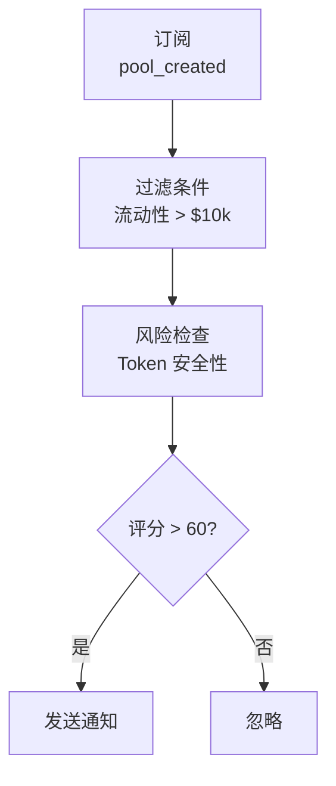

<Info>
ChainStream 目前支援 **Solana**（`sol`）、**Ethereum**（`eth`）和 **BSC**（`bsc`）。支援的 DEX 包括 Jupiter、Raydium、PumpFun、Moonshot、Candy（Solana）以及 KyberSwap（Ethereum/BSC）。以下部分示例引用了其他協議用於概念說明，請檢視[支援的鏈](/zh-Hant/guides/getting-started/supported-chains)瞭解當前覆蓋範圍。
</Info>

<Warning>
**Coming Soon** - 此功能正在開發中，敬請期待！
</Warning>

本文件介紹如何使用 ChainStream 監控 DeFi 協議活動，包括流動性變化、大額交易、收益追蹤和風險告警。

---

## 支援的 DeFi 協議

### DEX（去中心化交易所）

| 協議 | 鏈 | 支援功能 |
|------|-----|----------|
| **Jupiter** | Solana | 聚合交易 |
| **Raydium** | Solana | 交易、LP、池子資料 |
| **PumpFun** | Solana | 發射/bonding、交易 |
| **Moonshot** | Solana | 交易 |
| **Candy** | Solana | 交易 |
| **KyberSwap** | Ethereum、BSC | 交易、報價 |

### 其他 DeFi 方向

借貸、收益聚合器與流動性質押是 DeFi 中常見的監控物件。ChainStream 當前已索引的互換與 DEX 分析能力主要覆蓋上表中的協議，鏈為 **Solana**、**Ethereum**、**BSC**。在實現借貸或金庫類告警前，請結合 API 參考與[支援的鏈](/zh-Hant/guides/getting-started/supported-chains)確認實際可用能力。

---

## 監控維度

### 1. 流動性監控

#### 監控事件

| 事件 | 描述 | 重要性 |
|------|------|--------|
| `pool_created` | 新池子建立 | 發現新機會 |
| `liquidity_add` | 新增流動性 | 信心指標 |
| `liquidity_remove` | 移除流動性 | ⚠️ 撤池預警 |
| `pool_update` | 池子引數變更 | 協議治理 |

#### 關鍵指標

| 指標 | 描述 | 健康標準 |
|------|------|----------|
| TVL | 總鎖倉價值 | 穩定或增長 |
| TVL 變化率 | 24h/7d TVL 變化 | &gt; -10%/天 |
| LP 持有者數 | LP Token 持有者分佈 | 分散為佳 |
| 流動性深度 | ±2% 價格範圍內的流動性 | 深度越大越好 |

#### 撤池風險訊號

<Tabs>
  <Tab title="🔴 高風險">
    - 單筆撤池 &gt; 池子 30%
    - 24h 累計撤池 &gt; 50%
    - LP 集中在少數地址（&lt; 5 個）
  </Tab>
  <Tab title="🟡 中風險">
    - 單筆撤池 &gt; 池子 10%
    - LP 鎖定即將到期
    - 專案方地址開始撤池
  </Tab>
  <Tab title="🟢 低風險">
    - LP 廣泛分佈
    - LP 鎖定期 &gt; 6 個月
    - TVL 穩定增長
  </Tab>
</Tabs>

---

### 2. 交易監控

#### 實時交易流

透過 WebSocket 訂閱實時交易：

| 事件型別 | 描述 | 資料欄位 |
|----------|------|----------|
| `swap` | DEX 交易 | token_in, token_out, amount, price |
| `large_trade` | 大額交易 | threshold, trade_details |
| `arbitrage` | 套利交易 | profit, path |
| `mev` | MEV 相關交易 | type, extracted_value |

```typescript
// 订阅 DEX 交易流
ws.subscribe('defi_trades', {
  protocol: 'kyberswap',
  chain: 'eth',
  min_amount_usd: 10000
}, (trade) => {
  console.log(`${trade.type}: ${trade.token_in} → ${trade.token_out}`);
});
```

#### 交易分析維度

| 分析維度 | 指標 | 意義 |
|----------|------|------|
| 買賣壓力 | 買入量/賣出量比率 | &gt; 1 看漲 |
| 交易量趨勢 | 交易量移動平均 | 活躍度 |
| 大戶行為 | 大額交易佔比 | 市場影響 |
| 交易對熱度 | 交易頻率排名 | 市場關注度 |

---

### 3. 收益追蹤

#### 追蹤內容

| 收益型別 | 描述 | 計算方式 |
|----------|------|----------|
| **LP 挖礦** | 提供流動性獲得的交易費 | 交易費 × 份額佔比 |
| **借貸利息** | 存款/借款利息 | 本金 × APY |
| **質押獎勵** | 協議代幣獎勵 | 質押量 × 獎勵率 |
| **空投收益** | 協議空投 | 快照持倉 |

#### 收益指標

| 指標 | 描述 | 注意事項 |
|------|------|----------|
| **APY** | 年化收益率（含複利） | 實際收益參考 |
| **APR** | 年化收益率（不含複利） | 基礎收益 |
| **無常損失** | LP 相對於持有的損失 | 重要風險因素 |
| **淨收益** | 收益 - Gas - 無常損失 | 最終收益 |

#### 無常損失估算

<Info>
**無常損失公式**

```
无常损失 = 2 × √(价格比率) / (1 + 价格比率) - 1
```
</Info>

| 價格變化 | 無常損失 |
|----------|----------|
| ±10% | -0.11% |
| ±25% | -0.64% |
| ±50% | -2.02% |
| ±100% | -5.72% |
| ±200% | -13.4% |

---

### 4. 風險告警

#### 協議級風險

| 風險型別 | 描述 | 告警觸發 |
|----------|------|----------|
| **大額撤池** | 流動性大幅減少 | 單筆 &gt; 池子 5% |
| **TVL 驟降** | 協議 TVL 快速下降 | 1h 內下降 &gt; 20% |
| **閃電貸攻擊** | 檢測到閃電貸模式 | 自動檢測 |
| **治理攻擊** | 異常提案或投票 | 自動檢測 |
| **預言機異常** | 價格資料異常 | 偏離 &gt; 5% |

#### 頭寸級風險

| 風險型別 | 描述 | 告警觸發 |
|----------|------|----------|
| **清算風險** | 借貸頭寸接近清算 | 健康因子 &lt; 1.2 |
| **無常損失** | LP 無常損失擴大 | 損失 &gt; 5% |
| **收益下降** | APY 大幅下降 | 下降 &gt; 50% |

#### 告警配置示例

```json
{
  "alert_type": "liquidity_remove",
  "protocol": "kyberswap",
  "pool": "0x...",
  "threshold": {
    "type": "percentage",
    "value": 10
  },
  "notification": {
    "webhook": "https://your-server.com/webhook",
    "email": "alert@example.com"
  }
}
```

---

## 監控場景

### 場景 1：新池子發現

**目標**：第一時間發現新建的交易池



```typescript
ws.subscribe('pool_created', {
  chain: 'sol',
  min_liquidity_usd: 10000
}, async (pool) => {
  // 检查 Token 安全性
  const risk = await checkTokenRisk(pool.token_address);
  if (risk.score > 60) {
    notify(`新池子发现: ${pool.pair_name}, 流动性: $${pool.liquidity_usd}`);
  }
});
```

### 場景 2：撤池預警

**目標**：監控持倉池子的撤池風險

<Steps>
  <Step title="新增監控">
    新增目標池子到監控列表
  </Step>
  <Step title="設定閾值">
    設定撤池閾值（如單筆 &gt; 10%）
  </Step>
  <Step title="接收告警">
    接收實時告警
  </Step>
  <Step title="調整持倉">
    及時調整持倉
  </Step>
</Steps>

```typescript
ws.subscribe('liquidity_remove', {
  pool: '0x...',
  threshold_percentage: 10
}, (event) => {
  alert(`⚠️ 撤池预警: ${event.percentage}% 流动性被移除`);
});
```

### 場景 3：套利機會發現

**目標**：發現跨 DEX 價格差異

<Steps>
  <Step title="訂閱價格流">
    訂閱多個 DEX 的價格流
  </Step>
  <Step title="計算價差">
    計算價差百分比
  </Step>
  <Step title="成本評估">
    考慮 Gas 和滑點成本
  </Step>
  <Step title="傳送告警">
    當淨利潤 &gt; 閾值時告警
  </Step>
</Steps>

```typescript
// 监听多个 DEX 的价格
const prices = {};

ws.subscribe('token_price', { 
  token: 'SOL',
  dex: ['jupiter', 'raydium', 'pumpfun']
}, (data) => {
  prices[data.dex] = data.price;
  checkArbitrage(prices);
});

function checkArbitrage(prices) {
  const maxPrice = Math.max(...Object.values(prices));
  const minPrice = Math.min(...Object.values(prices));
  const spread = (maxPrice - minPrice) / minPrice;
  
  if (spread > 0.005) {  // 0.5% 价差
    notify(`套利机会: ${spread * 100}% 价差`);
  }
}
```

### 場景 4：清算監控

**目標**：監控借貸頭寸健康度

<Steps>
  <Step title="獲取頭寸">
    獲取目標地址的借貸頭寸
  </Step>
  <Step title="計算健康因子">
    計算實時健康因子
  </Step>
  <Step title="預警">
    當健康因子 &lt; 1.5 時預警
  </Step>
  <Step title="緊急告警">
    當健康因子 &lt; 1.2 時緊急告警
  </Step>
</Steps>

```typescript
async function monitorLiquidationRisk(address: string) {
  // 接入你方环境已开放的借贷 API（与 DEX 无关）
  const position = await getLendingPosition(address);

  if (position.health_factor < 1.2) {
    urgentAlert(`🚨 清算风险！健康因子: ${position.health_factor}`);
  } else if (position.health_factor < 1.5) {
    warnAlert(`⚠️ 健康因子较低: ${position.health_factor}`);
  }
}
```

---

## 資料延遲說明

| 資料型別 | 延遲 | 說明 |
|----------|------|------|
| 實時交易 | &lt; 3s | 區塊確認後推送 |
| TVL 資料 | &lt; 1min | 分鐘級更新 |
| APY 資料 | &lt; 5min | 基於最近交易計算 |
| 持有者資料 | &lt; 1h | 小時級快照 |

---

## API 端點

| 功能 | 端點 |
|------|------|
| 獲取協議 TVL | `GET /v1/defi/{protocol}/tvl` |
| 獲取池子資訊 | `GET /v1/defi/{protocol}/pools/{pool_id}` |
| 獲取使用者頭寸 | `GET /v1/defi/{protocol}/positions/{address}` |
| 獲取收益資料 | `GET /v1/defi/{protocol}/yields` |

---

## 相關文件

<CardGroup cols={2}>
  <Card title="套利掃描器" icon="magnifying-glass-dollar" href="/zh-Hant/playbooks/tutorials/build-arbitrage-scanner">
    實戰構建套利掃描工具
  </Card>
  <Card title="價格預警機器人" icon="bell" href="/zh-Hant/playbooks/tutorials/build-price-alert-bot">
    構建價格預警系統
  </Card>
</CardGroup>
