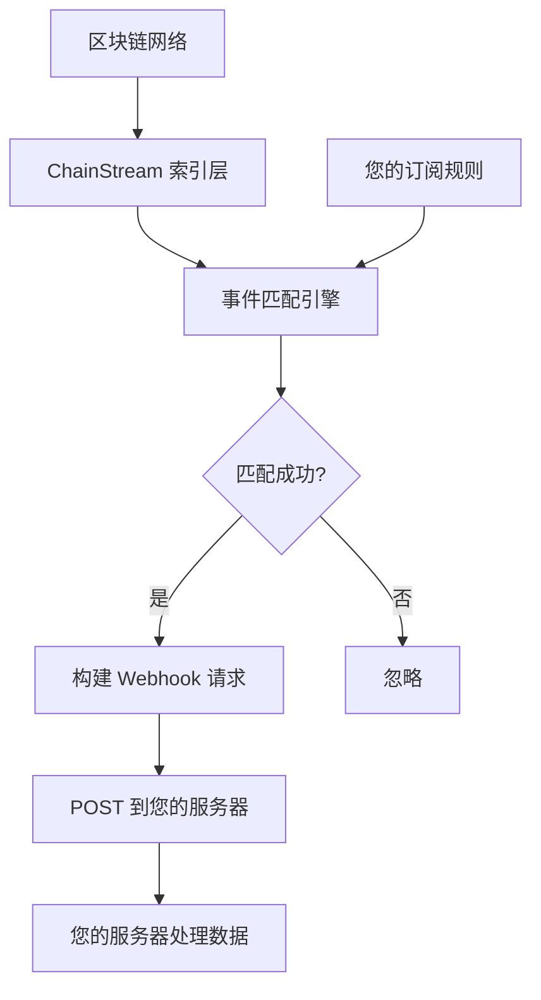
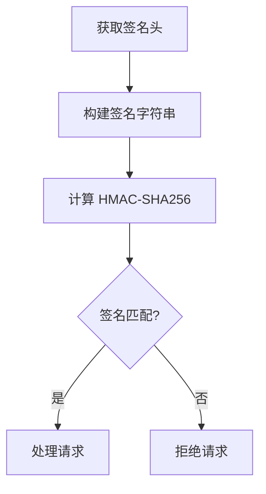

<Warning>
**Beta** — 此功能目前處於測試階段，API 可能會有變動。
</Warning>

本文件介紹 ChainStream Webhook 的工作原理、配置方法和最佳實踐，幫助您實現鏈上事件的實時推送。

<Note>
Webhook 功能對所有使用者開放。
</Note>

---

## 工作原理

### 資料流程



### 核心特性

| 特性 | 說明 |
|------|------|
| **實時推送** | 事件觸發後毫秒級推送 |
| **可靠投遞** | 失敗自動重試 |
| **簽名驗證** | HMAC 簽名防偽造 |
| **過濾規則** | 支援事件型別過濾 |

---

## 支援的事件型別

目前 Webhook 支援以下事件型別（channels）：

| Channel | 描述 | 典型用途 |
|---------|------|----------|
| `sol.token.created` | Solana 新代幣建立 | 新幣發現、早期機會 |
| `sol.token.migrated` | Solana 代幣畢業/遷移 | 追蹤從 Pump.fun 等平臺畢業的代幣 |

<Info>
更多事件型別正在開發中，敬請期待！
</Info>

---

## 建立 Webhook 端點

### API 端點

```bash
POST /v1/webhook/endpoint
Content-Type: application/json
Authorization: Bearer YOUR_ACCESS_TOKEN
```

### 請求引數

| 引數 | 型別 | 必填 | 描述 |
|------|------|------|------|
| `url` | string | 是 | Webhook 回撥 URL（必須是 HTTPS） |
| `channels` | array | 是 | 訂閱的事件型別列表 |
| `description` | string | 否 | 端點描述 |
| `disabled` | boolean | 否 | 是否禁用，預設 false |
| `filterTypes` | array | 否 | 過濾型別 |
| `metadata` | object | 否 | 自定義後設資料 |
| `rateLimit` | integer | 否 | 速率限制 |

### 請求示例

```json
{
  "url": "https://your-server.com/webhook",
  "channels": ["sol.token.created", "sol.token.migrated"],
  "description": "监控新代币和毕业代币"
}
```

### 響應示例

```json
{
  "id": "ep_abc123",
  "url": "https://your-server.com/webhook",
  "channels": ["sol.token.created", "sol.token.migrated"],
  "description": "监控新代币和毕业代币",
  "disabled": false
}
```

---

## Webhook 通知格式

Webhook 通知的資料結構與 WebSocket 推送一致。

### 新代幣建立 (sol.token.created)

```json
{
  "channel": "sol.token.created",
  "timestamp": 1706947200000,
  "data": {
    "a": "6p6xgHyF7AeE6TZkSmFsko444wqoP15icUSqi2jfGiPN",
    "n": "Example Token",
    "s": "EXT",
    "dec": 9,
    "cts": 1706947200000,
    "lf": {
      "pa": "6EF8rrecthR5Dkzon8Nwu78hRvfCKubJ14M5uBEwF6P",
      "pf": "pump_fun",
      "pn": "Pump.fun"
    }
  }
}
```

**欄位說明**：

| 欄位 | 描述 |
|------|------|
| `a` | 代幣地址 |
| `n` | 代幣名稱 |
| `s` | 代幣符號 |
| `dec` | 小數位數 |
| `cts` | 建立時間戳（毫秒） |
| `lf.pa` | 啟動平臺程式地址 |
| `lf.pf` | 協議家族 |
| `lf.pn` | 協議名稱 |

### 代幣畢業 (sol.token.migrated)

```json
{
  "channel": "sol.token.migrated",
  "timestamp": 1706947200000,
  "data": {
    "a": "6p6xgHyF7AeE6TZkSmFsko444wqoP15icUSqi2jfGiPN",
    "n": "Example Token",
    "s": "EXT",
    "cts": 1706947200000,
    "lf": {
      "pa": "6EF8rrecthR5Dkzon8Nwu78hRvfCKubJ14M5uBEwF6P",
      "pf": "pump_fun",
      "pn": "Pump.fun"
    },
    "mt": {
      "pa": "675kPX9MHTjS2zt1qfr1NYHuzeLXfQM9H24wFSUt1Mp8",
      "pf": "raydium",
      "pn": "Raydium"
    }
  }
}
```

**額外欄位**：

| 欄位 | 描述 |
|------|------|
| `mt.pa` | 遷移目標平臺程式地址 |
| `mt.pf` | 遷移目標協議家族 |
| `mt.pn` | 遷移目標協議名稱 |

---

## Webhook URL 要求

| 要求 | 說明 |
|------|------|
| ✅ HTTPS | 必須使用 HTTPS 協議 |
| ✅ 公網可訪問 | URL 必須可從公網訪問 |
| ✅ 2xx 響應 | 必須返回 2xx 狀態碼錶示成功 |
| ✅ 響應時間 | 應在 5 秒內響應 |
| ✅ 冪等處理 | 需要處理重複請求 |

---

## 安全驗證

### 獲取 Webhook 金鑰

建立端點後，透過以下 API 獲取金鑰：

```bash
GET /v1/webhook/endpoint/{id}/secret
```

**響應**：

```json
{
  "secret": "whsec_abcdXXX"
}
```

### 簽名驗證

每個 Webhook 請求都包含簽名頭，用於驗證請求來源：

```
X-Webhook-Signature: <signature>
X-Webhook-Timestamp: <timestamp>
```

### 驗證流程



### 程式碼示例

<Tabs>
  <Tab title="Node.js">
```javascript
const crypto = require('crypto');

function verifyWebhook(req, secret) {
  const signature = req.headers['x-webhook-signature'];
  const timestamp = req.headers['x-webhook-timestamp'];
  const body = JSON.stringify(req.body);
  
  // 检查时间戳（5分钟窗口）
  const now = Date.now();
  if (Math.abs(now - parseInt(timestamp)) > 300000) {
    return false;
  }
  
  // 计算签名
  const message = `${timestamp}.${body}`;
  const expectedSignature = crypto
    .createHmac('sha256', secret)
    .update(message)
    .digest('hex');
  
  // 安全比较
  return crypto.timingSafeEqual(
    Buffer.from(signature),
    Buffer.from(expectedSignature)
  );
}
```
  </Tab>
  <Tab title="Python">
```python
import hmac
import hashlib
import time

def verify_webhook(request, secret):
    signature = request.headers.get('X-Webhook-Signature')
    timestamp = request.headers.get('X-Webhook-Timestamp')
    body = request.get_data(as_text=True)
    
    # 检查时间戳（5分钟窗口）
    now = int(time.time() * 1000)
    if abs(now - int(timestamp)) > 300000:
        return False
    
    # 计算签名
    message = f"{timestamp}.{body}"
    expected_signature = hmac.new(
        secret.encode(),
        message.encode(),
        hashlib.sha256
    ).hexdigest()
    
    # 安全比较
    return hmac.compare_digest(signature, expected_signature)
```
  </Tab>
  <Tab title="Go">
```go
import (
    "crypto/hmac"
    "crypto/sha256"
    "encoding/hex"
    "strconv"
    "time"
)

func verifyWebhook(signature, timestamp, body, secret string) bool {
    // 检查时间戳
    ts, _ := strconv.ParseInt(timestamp, 10, 64)
    now := time.Now().UnixMilli()
    if abs(now-ts) > 300000 {
        return false
    }
    
    // 计算签名
    message := timestamp + "." + body
    mac := hmac.New(sha256.New, []byte(secret))
    mac.Write([]byte(message))
    expected := hex.EncodeToString(mac.Sum(nil))
    
    return hmac.Equal([]byte(signature), []byte(expected))
}
```
  </Tab>
</Tabs>

---

## 管理 Webhook 端點

### 獲取端點列表

```bash
GET /v1/webhook/endpoint
```

**查詢引數**：

| 引數 | 型別 | 描述 |
|------|------|------|
| `limit` | integer | 每頁數量（1-100，預設100） |
| `iterator` | string | 分頁迭代器 |
| `order` | string | 排序方式（ascending/descending） |

### 獲取端點詳情

```bash
GET /v1/webhook/endpoint/{id}
```

### 更新端點

```bash
PATCH /v1/webhook/endpoint
```

```json
{
  "endpointId": "ep_abc123",
  "channels": ["sol.token.created"],
  "description": "只监控新代币"
}
```

### 刪除端點

```bash
DELETE /v1/webhook/endpoint/{id}
```

### 輪換金鑰

```bash
POST /v1/webhook/endpoint/{id}/secret/rotate
```

---

## 最佳實踐

### ✅ 快速響應

```python
# 推荐：先响应，后处理
@app.route('/webhook', methods=['POST'])
def webhook():
    # 验证签名
    if not verify_webhook(request, SECRET):
        return "Invalid signature", 401
    
    # 放入队列异步处理
    queue.put(request.json)
    
    # 立即返回 200
    return "OK", 200
```

### ✅ 冪等性處理

每個事件包含唯一標識，請在服務端記錄已處理的事件：

```python
# 使用 Redis 记录已处理事件
def process_webhook(event):
    event_id = f"{event['channel']}:{event['data']['a']}:{event['timestamp']}"
    
    # 检查是否已处理
    if redis.exists(f"processed:{event_id}"):
        return {"status": "already_processed"}
    
    # 处理事件
    handle_event(event)
    
    # 标记为已处理（TTL 24小时）
    redis.setex(f"processed:{event_id}", 86400, "1")
    
    return {"status": "ok"}
```

### ✅ 安全性

<CardGroup cols={2}>
  <Card title="始終驗證簽名" icon="shield-check">
    驗證每個請求的簽名
  </Card>
  <Card title="使用 HTTPS" icon="lock">
    確保傳輸安全
  </Card>
  <Card title="定期輪換金鑰" icon="rotate">
    建議每 90 天輪換
  </Card>
  <Card title="保護敏感資料" icon="eye-slash">
    不在日誌中記錄敏感資料
  </Card>
</CardGroup>

### ✅ 可靠性

<CardGroup cols={2}>
  <Card title="實現冪等性" icon="repeat">
    處理重複請求
  </Card>
  <Card title="訊息佇列緩衝" icon="layer-group">
    使用佇列非同步處理
  </Card>
  <Card title="合理超時時間" icon="clock">
    避免長時間阻塞
  </Card>
  <Card title="完善日誌" icon="file-lines">
    記錄關鍵資訊便於排查
  </Card>
</CardGroup>

---

## 常見問題

<AccordionGroup>
  <Accordion title="Webhook 沒有收到請求？" icon="circle-question">
    **排查步驟**：

    1. **確認 URL 可訪問** — 從公網測試 URL 是否可達
    2. **檢查 HTTPS** — 必須使用有效的 SSL 證書
    3. **檢查端點狀態** — 確認 `disabled` 不是 `true`
    4. **檢查 channels** — 確認訂閱了正確的事件型別
  </Accordion>
  
  <Accordion title="收到重複事件怎麼辦？" icon="clone">
    這可能是重試機制導致的。請實現冪等性處理：

    1. 使用事件的唯一標識（channel + 代幣地址 + 時間戳）
    2. 收到請求時先檢查是否已處理
    3. 使用帶 TTL 的快取（如 Redis）儲存
  </Accordion>
  
  <Accordion title="如何測試 Webhook？" icon="flask">
    1. 使用 ngrok 暴露本地服務
    2. 建立 Webhook 端點指向 ngrok URL
    3. 等待真實事件觸發，或使用測試環境
    4. 檢視本地服務日誌
  </Accordion>
</AccordionGroup>

---

## API 端點彙總

| 功能 | 端點 |
|------|------|
| 獲取端點列表 | `GET /v1/webhook/endpoint` |
| 建立端點 | `POST /v1/webhook/endpoint` |
| 更新端點 | `PATCH /v1/webhook/endpoint` |
| 獲取端點詳情 | `GET /v1/webhook/endpoint/{id}` |
| 刪除端點 | `DELETE /v1/webhook/endpoint/{id}` |
| 獲取金鑰 | `GET /v1/webhook/endpoint/{id}/secret` |
| 輪換金鑰 | `POST /v1/webhook/endpoint/{id}/secret/rotate` |

---

## 相關文件

<CardGroup cols={2}>
  <Card title="WebSocket API" icon="plug" href="/zh-Hant/api-reference/endpoint/websocket/api">
    實時資料訂閱
  </Card>
  <Card title="Endpoint API 參考" icon="code" href="/zh-Hant/api-reference/endpoint/endpoint/v1/webhook-endpoint-post">
    完整 API 文件
  </Card>
</CardGroup>
