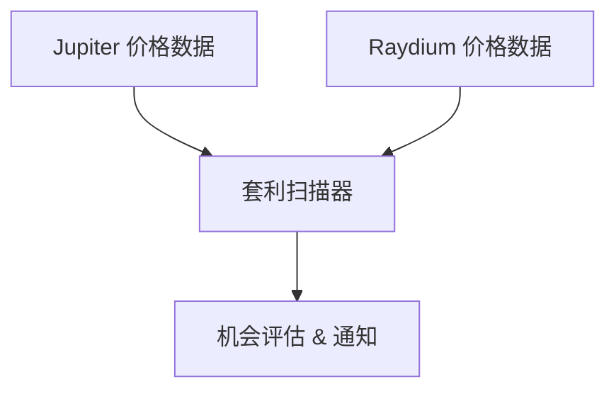

<Info>
ChainStream 目前支援 **Solana**（`sol`）、**Ethereum**（`eth`）和 **BSC**（`bsc`）。支援的 DEX 包括 Jupiter、Raydium、PumpFun、Moonshot、Candy（Solana）以及 KyberSwap（Ethereum/BSC）。以下部分程式碼示例引用了其他 DEX 用於概念說明，請檢視[支援的鏈](/zh-Hant/docs/supported-chains)瞭解當前覆蓋範圍。
</Info>

<Warning>
**Coming Soon** — 此功能正在開發中，尚未上線。
</Warning>

本教程將帶您構建一個跨 DEX 套利掃描器，實時發現不同交易所之間的價格差異，識別潛在套利機會。

<Info>
**預計時間**：45 分鐘  
**難度等級**：⭐⭐⭐ 中級
</Info>

---

## 目標

發現跨 DEX 的價格差異套利機會：



**功能清單**：
- ✅ 獲取多 DEX 交易對價格
- ✅ 計算價差百分比
- ✅ 評估可行性（考慮 Gas、滑點、深度）
- ✅ 風險提示（MEV、搶跑）

---

## 套利原理

### 跨 DEX 套利

同一代幣在不同 DEX 上可能存在價格差異：

```
例：Solana 上 SOL/USDC

Jupiter:  1 SOL = $140.00
Raydium:  1 SOL = $140.70

价差 = ($140.70 - $140.00) / $140.00 = 0.5%

套利路径：
Jupiter 买入 SOL → Raydium 卖出 SOL → 赚取差价
```

### 利潤公式

<Info>
**淨利潤 = 價差收益 - Gas費用 - 滑點損失**
</Info>

實際考慮：
- 兩筆交易的 Gas 費用
- 買入/賣出的滑點
- 流動性深度限制
- MEV 搶跑風險

---

## Step 1：獲取交易對

### 1.1 安裝依賴

```bash
npm install @chainstream-io/sdk dotenv
```

### 1.2 配置檔案

```javascript
// config.js
import 'dotenv/config';

export const CHAINSTREAM_ACCESS_TOKEN = process.env.CHAINSTREAM_ACCESS_TOKEN;

// 监控的 DEX（Solana：Jupiter、Raydium、PumpFun、Moonshot、Candy；EVM：eth/bsc 上 KyberSwap）
export const DEXES = ['jupiter', 'raydium', 'pumpfun', 'moonshot', 'candy'];

// 监控的交易对（当前覆盖下，多 DEX 价差对比在 Solana 上最典型）
export const TRADING_PAIRS = [
  { base: 'SOL', quote: 'USDC', chain: 'sol' },
  { base: 'SOL', quote: 'USDT', chain: 'sol' },
];

// 套利阈值
export const MIN_PROFIT_PERCENT = 0.3;   // 最小利润率
export const MIN_LIQUIDITY_USD = 50000;  // 最小流动性
```

### 1.3 獲取價格資料

```javascript
// scanner.js
import { ChainStreamClient } from '@chainstream-io/sdk';
import { CHAINSTREAM_ACCESS_TOKEN, DEXES } from './config.js';

export class PriceScanner {
  constructor() {
    this.client = new ChainStreamClient(CHAINSTREAM_ACCESS_TOKEN);
  }

  async getDexPrices(base, quote, chain) {
    // 获取交易对在各 DEX 的价格
    const prices = await this.client.dex.getPrices({
      base,
      quote,
      chain,
      dexes: DEXES
    });
    return prices;
  }
}
```

---

## Step 2：計算價差

```javascript
// evaluator.js
import { MIN_PROFIT_PERCENT, MIN_LIQUIDITY_USD } from './config.js';

export class ArbitrageEvaluator {

  findOpportunity(prices, pair) {
    // 过滤低流动性
    const validPrices = prices.filter(
      p => (p.liquidityUsd || 0) >= MIN_LIQUIDITY_USD
    );

    if (validPrices.length < 2) {
      return null;
    }

    // 找最低买入价和最高卖出价
    const sortedPrices = [...validPrices].sort((a, b) => a.price - b.price);
    const buyFrom = sortedPrices[0];   // 最低价 - 买入
    const sellTo = sortedPrices[sortedPrices.length - 1]; // 最高价 - 卖出

    // 计算价差
    const spread = (sellTo.price - buyFrom.price) / buyFrom.price * 100;

    // 估算成本
    const gasCostPercent = 0.1;  // 约 0.1%
    const slippagePercent = 0.2; // 约 0.2%
    const totalCost = gasCostPercent + slippagePercent;

    // 净利润
    const netProfit = spread - totalCost;

    if (netProfit < MIN_PROFIT_PERCENT) {
      return null;
    }

    return {
      pair: `${pair.base}/${pair.quote}`,
      buyDex: buyFrom.dex,
      buyPrice: buyFrom.price,
      sellDex: sellTo.dex,
      sellPrice: sellTo.price,
      spreadPercent: Number(spread.toFixed(3)),
      netProfitPercent: Number(netProfit.toFixed(3)),
      maxSizeUsd: Math.min(buyFrom.liquidityUsd, sellTo.liquidityUsd) * 0.02
    };
  }
}
```

---

## Step 3：評估可行性

### 風險評估

```javascript
// risk.js
export function assessRisk(opportunity) {
  const risks = [];

  // MEV 风险
  if (opportunity.netProfitPercent > 1.0) {
    risks.push('🔴 高利润易被 MEV 抢跑');
  }

  // 流动性风险
  if (opportunity.maxSizeUsd < 5000) {
    risks.push('🟡 可执行规模较小');
  }

  // 时效风险
  risks.push('⚠️ 价格数据有延迟');

  return {
    risks,
    executable: risks.filter(r => r.includes('🔴')).length === 0
  };
}
```

### 風險提示

<Warning>
**重要風險提示**：

1. **MEV 搶跑**：套利交易容易被 MEV 機器人搶跑
2. **價格延遲**：實際執行時價格可能已變化
3. **Gas 波動**：網路擁堵時成本可能大幅上漲
4. **滑點**：實際滑點可能高於預估

本工具僅用於發現機會，不構成投資建議。
</Warning>

---

## 完整程式碼

```javascript
// index.js
import { PriceScanner } from './scanner.js';
import { ArbitrageEvaluator } from './evaluator.js';
import { TRADING_PAIRS } from './config.js';

async function main() {
  const scanner = new PriceScanner();
  const evaluator = new ArbitrageEvaluator();

  console.log('🔍 套利扫描器启动...');

  while (true) {
    for (const pair of TRADING_PAIRS) {
      const prices = await scanner.getDexPrices(
        pair.base, 
        pair.quote, 
        pair.chain
      );

      const opp = evaluator.findOpportunity(prices, pair);

      if (opp) {
        console.log(`
🎯 发现套利机会！
   交易对: ${opp.pair}
   买入: ${opp.buyDex} @ $${opp.buyPrice}
   卖出: ${opp.sellDex} @ $${opp.sellPrice}
   价差: ${opp.spreadPercent}%
   净利润: ${opp.netProfitPercent}%
   最大规模: $${opp.maxSizeUsd.toLocaleString()}
        `);
      }
    }

    // 10秒扫描一次
    await new Promise(resolve => setTimeout(resolve, 10000));
  }
}

main();
```

---

## 擴充套件建議

<CardGroup cols={3}>
  <Card title="閃電貸整合" icon="bolt">
    使用閃電貸實現無本金套利
  </Card>
  <Card title="多鏈掃描" icon="layer-group">
    在 Solana 多 DEX 之外，增加 **eth** / **bsc** 的 KyberSwap 報價
  </Card>
  <Card title="自動執行" icon="robot">
    整合錢包實現自動交易（需謹慎）
  </Card>
</CardGroup>

---

## 相關文件

<CardGroup cols={2}>
  <Card title="DeFi 監控概述" icon="landmark" href="/zh-Hant/docs/recipes/defi-monitoring">
    瞭解 DeFi 監控維度
  </Card>
  <Card title="價格預警機器人" icon="bell" href="/zh-Hant/docs/tutorials/build-price-alert-bot">
    實時價格監控入門
  </Card>
</CardGroup>
