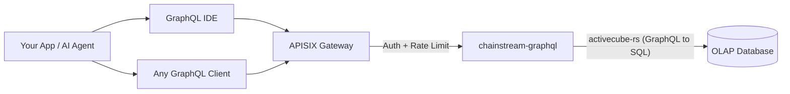

<Info>
ChainStream GraphQL 是一套 OLAP 分析 API，透過單一 GraphQL 端點暴露多鏈鏈上資料（Solana、Ethereum、BSC、Polygon）。按需查詢欄位、即時聚合、互動式探索 Schema —— 底層由高效能 OLAP 資料庫支撐。
</Info>

## 什麼是 ChainStream GraphQL

ChainStream GraphQL 為鏈上分析資料提供 **宣告式查詢介面**。無需呼叫大量固定形態的 REST 端點，只需編寫一條 GraphQL 查詢，即可精確指定所需資料、過濾條件與聚合方式。

服務基於 **activecube-rs**，根據 **Cube** 定義動態生成 GraphQL Schema —— 每個 Cube 代表一種分析資料模型（例如 DEX 成交、代幣轉賬、OHLC K 線）。查詢會被編譯為最佳化後的 SQL，並在高效能 OLAP 資料庫上執行。

---

## GraphQL 與 REST Data API

| | **GraphQL API** | **REST Data API** |
|:--|:--|:--|
| **查詢方式** | 宣告式 — 自定義形狀、過濾與聚合 | 命令式 — 固定端點與預定義引數 |
| **欄位選擇** | 客戶端只取需要的欄位 | 服務端返回固定響應結構 |
| **聚合** | 單次查詢內建 `count`、`sum`、`avg`、`min`、`max` | 僅預定義的聚合端點 |
| **端點** | 所有資料模型共用一個端點 | 每個資源一個端點 |
| **分頁** | 查詢引數中的 `limit` + `offset` | 查詢引數中的 `limit` + `offset` / 遊標 |
| **更適合** | 分析、大盤、靈活探索 | 簡單查詢、實時價格、錢包餘額 |
| **延遲** | 側重吞吐 | 側重低延遲單資源讀取 |

<Tip>
需要靈活分析查詢時（聚合成交、按時間段算 PnL、自建大盤）用 **GraphQL**；需要快速簡單查詢（當前代幣價格、錢包餘額）時用 **REST API**。
</Tip>

---

## 核心優勢

<CardGroup cols={3}>
  <Card title="單一端點" icon="bullseye">
    一個 URL 覆蓋 4 條鏈上的 25 個資料 Cube。無需端點爆炸 —— 只改查詢即可。
  </Card>
  <Card title="客戶端自選欄位" icon="filter">
    只請求需要的列。避免過度獲取與不足獲取 —— 適合頻寬受限的客戶端。
  </Card>
  <Card title="內建聚合" icon="chart-column">
    在查詢中直接計算 `count`、`sum`、`avg`、`min`、`max`，無需後置處理。
  </Card>
</CardGroup>

---

## 支援的鏈

| 網路 ID | 區塊鏈 | 鏈組 | 覆蓋範圍 |
|:--|:--|:--|:--|
| `eth` | Ethereum | EVM | 完整 DEX、轉賬、餘額變動、事件、追蹤、代幣統計 |
| `bsc` | BNB Chain (BSC) | EVM | 完整 DEX、轉賬、餘額變動、事件、追蹤、代幣統計 |
| `polygon` | Polygon | EVM | 預測市場（PredictionTrades/Managements/Settlements）。其他 Cube 部署中。 |
| `sol` | Solana | Solana | 完整 DEX、轉賬、指令、持幣者、OHLC、PnL |

<Note>
查詢按三個 **鏈組** 組織：**EVM**（需要 `network` 引數）、**Solana** 與 **Trading**（跨鏈 OHLC 與代幣統計）。詳見 [鏈組](/zh-Hant/graphql/schema/chain-groups)。
</Note>

---

## 可用資料 Cube

25 個 Cube 分佈在三個鏈組中，每個對應一種分析模型：

<AccordionGroup>
  <Accordion title="DEX 交易">
    - **DEXTrades** — 單筆 DEX 換幣事件，含買賣數量、價格與 DEX 協議資訊
    - **DEXTradeByTokens** — 按代幣索引的 DEX 成交，便於按代幣查詢
    - **DEXOrders** — DEX 訂單事件，含限價單 *（僅 Solana）*
  </Accordion>
  <Accordion title="池子與流動性">
    - **DEXPoolEvents** — DEX 池子加減流動性事件
    - **DEXPools** — DEX 池子快照，含當前儲備與後設資料
    - **DEXPoolSlippages** — 池子滑點資料 *（僅 EVM）*
    - **TokenSupplyUpdates** — 影響代幣供應的鑄造與銷燬事件
  </Accordion>
  <Accordion title="代幣與轉賬">
    - **Transfers** — 代幣轉賬事件，含收發方、數量與美元計價
    - **BalanceUpdates** — 按代幣的錢包餘額變動事件
    - **TokenHolders** — 代幣當前持幣列表與分佈
    - **WalletTokenPnL** — 錢包-代幣維度的 PnL
  </Accordion>
  <Accordion title="交易分析（跨鏈）">
    - **Pairs** — 可配置時間間隔的 OHLC K 線（舊稱 OHLC）
    - **Tokens** — 按代幣的聚合成交統計：成交量、成交筆數、獨立交易者（舊稱 TokenTradeStats）
  </Accordion>
  <Accordion title="鏈上基礎設施">
    - **Blocks** — 區塊級資料（時間戳、高度、礦工/驗證者）
    - **Transactions** — 交易級資料（雜湊、狀態、gas/手續費）
    - **TransactionBalances** — 單筆交易內的餘額變動
    - **Events** — 智慧合約事件日誌 *（僅 EVM）*
    - **Calls** — 內部呼叫追蹤 *（僅 EVM）*
    - **Instructions** — 指令級資料 *（僅 Solana）*
    - **InstructionBalanceUpdates** — 指令級餘額變動 *（僅 Solana）*
  </Accordion>
  <Accordion title="獎勵與網路">
    - **Rewards** — 驗證者/質押獎勵 *（僅 Solana）*
    - **MinerRewards** — 礦工/驗證者獎勵 *（僅 EVM）*
    - **Uncles** — 叔塊資料 *（僅 EVM）*
  </Accordion>
  <Accordion title="預測市場">
    - **PredictionTrades** — 預測市場成交事件 *（EVM — Polygon）*
    - **PredictionManagements** — 預測市場管理事件 *（EVM — Polygon）*
    - **PredictionSettlements** — 預測市場結算事件 *（EVM — Polygon）*
  </Accordion>
</AccordionGroup>

---

## 關鍵查詢引數

除常規過濾與分頁外，ChainStream GraphQL 在鏈組級別還支援兩個重要引數：

| 引數 | 取值 | 說明 |
|:--|:--|:--|
| **`dataset`** | `realtime`、`archive`、`combined`（預設） | 控制資料來源範圍 —— 僅近期、僅歷史或全量 |
| **`aggregates`** | `yes`、`no`、`only` | 是否使用預聚合表以加速分析查詢 |

<Tip>
用法與示例見 [Dataset 與 Aggregates](/zh-Hant/graphql/schema/dataset-aggregates)。
</Tip>

---

## 架構

<Info>
所有請求經 APISIX 閘道器做認證與限流。`chainstream-graphql` 將 GraphQL 編譯為最佳化 SQL，在 OLAP 分析庫上執行。
</Info>

---

## 下一步

<CardGroup cols={3}>
  <Card title="端點與認證" icon="key" href="/zh-Hant/graphql/getting-started/endpoints">
    配置端點 URL、認證頭與請求/響應格式。
  </Card>
  <Card title="第一條查詢" icon="play" href="/zh-Hant/graphql/getting-started/first-query">
    從 IDE 或 cURL 逐步執行第一條 GraphQL 查詢。
  </Card>
  <Card title="GraphQL IDE" icon="code" href="/zh-Hant/graphql/ide/introduction">
    使用帶自動補全、查詢模板與程式碼匯出的互動式 GraphQL IDE。
  </Card>
</CardGroup>
