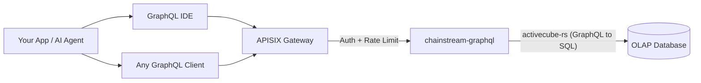

<Info>
ChainStream GraphQL 是一種 OLAP 分析型 API，透過單一 GraphQL 端點暴露多鏈鏈上資料（Solana、Ethereum、BSC、Polygon）。按需查詢欄位、即時聚合資料，並互動式探索 schema —— 底層由高效能 OLAP 資料庫驅動。
</Info>

## 什麼是 ChainStream GraphQL

ChainStream GraphQL 為鏈上分析資料提供**宣告式查詢介面**。無需呼叫大量固定響應形態的 REST 端點，你可以編寫一條 GraphQL 查詢，精確指定需要的資料、過濾方式與聚合方式。

服務基於 **activecube-rs** 構建，由 **Cube** 定義動態生成 GraphQL schema —— 每個 Cube 代表一種分析資料模型（例如 DEX 成交、代幣轉賬、OHLC K 線）。查詢會被編譯為最佳化後的 SQL，並在高效能 OLAP 資料庫上執行。

---

## GraphQL 與 REST Data API

| | **GraphQL API** | **REST Data API** |
|:--|:--|:--|
| **查詢方式** | 宣告式 —— 自定義形態、過濾與聚合 | 命令式 —— 固定端點與預定義引數 |
| **欄位選擇** | 客戶端只取所需欄位 | 服務端返回固定響應 schema |
| **聚合** | 單次查詢內建 `count`、`sum`、`avg`、`min`、`max` | 僅預定義的聚合端點 |
| **端點** | 單一端點覆蓋所有資料模型 | 每個資源一個端點 |
| **分頁** | 查詢引數中的 `limit` + `offset` | 查詢引數中的 `limit` + `offset` / 遊標 |
| **適用場景** | 分析、儀表盤、靈活探索 | 簡單查詢、實時價格、錢包餘額 |
| **延遲** | 側重吞吐最佳化 | 側重低延遲單資源讀取 |

<Tip>
當你需要靈活的分析查詢時 —— 聚合成交、按時間範圍計算 PnL、或構建自定義儀表盤 —— 請使用 **GraphQL**。當你需要快速、簡單的查詢（如當前代幣價格或錢包餘額）時，請使用 **REST API**。
</Tip>

---

## 核心優勢

<CardGroup cols={3}>
  <Card title="單一端點" icon="bullseye">
    一個 URL 覆蓋 4 條鏈上的 25 個資料 Cube。無需維護大量端點 —— 只需修改查詢。
  </Card>
  <Card title="客戶端自選欄位" icon="filter">
    只請求需要的列。避免過度獲取或獲取不足 —— 適合頻寬受限的客戶端。
  </Card>
  <Card title="內建聚合" icon="chart-column">
    在查詢中直接計算 `count`、`sum`、`avg`、`min`、`max`，無需事後處理。
  </Card>
</CardGroup>

---

## 支援的鏈

| Network ID | 區塊鏈 | Chain Group | 覆蓋範圍 |
|:--|:--|:--|:--|
| `eth` | Ethereum | EVM | 完整 DEX、轉賬、餘額更新、事件、呼叫追蹤、代幣統計 |
| `bsc` | BNB Chain (BSC) | EVM | 完整 DEX、轉賬、餘額更新、事件、呼叫追蹤、代幣統計 |
| `polygon` | Polygon | EVM | 完整 DEX、轉賬、餘額更新、預測市場 |
| `sol` | Solana | Solana | 完整 DEX、轉賬、指令、代幣持有者、OHLC、PnL |

<Note>
查詢按三個 **Chain Group** 組織：**EVM**（需傳 `network` 引數）、**Solana** 和 **Trading**（跨鏈 OHLC 與代幣統計）。詳見 [Chain Groups](/zh-Hant/graphql/schema/chain-groups)。
</Note>

---

## 可用的資料 Cube

共 25 個 Cube，分屬三個 Chain Group，每個對應一種分析模型：

<AccordionGroup>
  <Accordion title="DEX 交易">
    - **DEXTrades** —— 單筆 DEX 兌換事件，含買賣數量、價格與 DEX 協議資訊
    - **DEXTradeByTokens** —— 按代幣索引的 DEX 成交，便於高效的單代幣查詢
    - **DEXOrders** —— DEX 訂單事件，含限價單 *（僅 Solana）*
  </Accordion>
  <Accordion title="池子與流動性">
    - **DEXPoolEvents** —— DEX 池子的新增/移除流動性事件
    - **DEXPools** —— DEX 池子快照，含當前儲備與後設資料
    - **DEXPoolSlippages** —— 池子滑點資料 *（僅 EVM）*
    - **TokenSupplyUpdates** —— 影響代幣供應的鑄造與銷燬事件
  </Accordion>
  <Accordion title="代幣與轉賬">
    - **Transfers** —— 代幣轉賬事件，含傳送方、接收方、數量與 USD 價值
    - **BalanceUpdates** —— 按代幣的錢包餘額變動事件
    - **TokenHolders** —— 代幣當前持有者列表與分佈
    - **WalletTokenPnL** —— 按錢包-代幣對的 PnL
  </Accordion>
  <Accordion title="交易分析（跨鏈）">
    - **Pairs** —— 可配置時間間隔的 OHLC K 線資料
    - **Tokens** —— 按代幣聚合的成交統計：成交量、筆數、獨立交易者數
  </Accordion>
  <Accordion title="區塊鏈基礎設施">
    - **Blocks** —— 區塊級資料（時間戳、高度、礦工/驗證者）
    - **Transactions** —— 交易級資料（雜湊、狀態、Gas/手續費）
    - **TransactionBalances** —— 逐交易的餘額變動
    - **Events** —— 智慧合約事件日誌 *（僅 EVM）*
    - **Calls** —— 內部呼叫追蹤 *（僅 EVM）*
    - **Instructions** —— 指令級資料 *（僅 Solana）*
    - **InstructionBalanceUpdates** —— 指令級餘額變動 *（僅 Solana）*
  </Accordion>
  <Accordion title="獎勵與網路">
    - **Rewards** —— 驗證者/質押獎勵 *（僅 Solana）*
    - **MinerRewards** —— 礦工/驗證者獎勵 *（僅 EVM）*
    - **Uncles** —— 叔塊資料 *（僅 EVM）*
  </Accordion>
  <Accordion title="預測市場">
    - **PredictionTrades** —— 預測市場交易事件 *（EVM — Polygon）*
    - **PredictionManagements** —— 預測市場管理事件 *（EVM — Polygon）*
    - **PredictionSettlements** —— 預測市場結算事件 *（EVM — Polygon）*
  </Accordion>
</AccordionGroup>

---

## 關鍵查詢引數

除標準過濾與分頁外，ChainStream GraphQL 在 Chain Group 級別支援兩個強大引數：

| 引數 | 可選值 | 說明 |
|:--|:--|:--|
| **`dataset`** | `realtime`、`archive`、`combined`（預設） | 控制資料來源範圍 —— 僅近期資料、歷史資料、或全量 |
| **`aggregates`** | `yes`、`no`、`only` | 控制是否使用預聚合表以加速分析查詢 |

<Tip>
詳見 [Dataset 與 Aggregates](/zh-Hant/graphql/schema/dataset-aggregates) 瞭解用法與示例。
</Tip>

---

## 架構

<Info>
所有請求經 APISIX 閘道器進行認證與限流。`chainstream-graphql` 服務將 GraphQL 查詢編譯為最佳化 SQL，並在 OLAP 分析資料庫上執行。
</Info>

---

## 下一步

<CardGroup cols={3}>
  <Card title="端點與認證" icon="key" href="/zh-Hant/graphql/getting-started/endpoints">
    配置端點 URL、認證請求頭，並瞭解請求/響應格式。
  </Card>
  <Card title="首次查詢" icon="play" href="/zh-Hant/graphql/getting-started/first-query">
    分步執行第一條 GraphQL 查詢 —— 透過 IDE 或 cURL。
  </Card>
  <Card title="GraphQL IDE" icon="code" href="/zh-Hant/graphql/ide/introduction">
    使用帶自動補全、查詢模板與程式碼匯出的互動式 GraphQL IDE。
  </Card>
</CardGroup>
