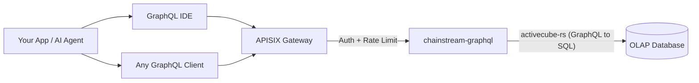

<Info>
ChainStream GraphQL 是 OLAP 分析型 API，透過單一 GraphQL endpoint 暴露多鏈鏈上資料（Solana、Ethereum、BSC、Polygon）。只查你需要的欄位、即時彙總，並可互動探索 schema——底層由高效能 OLAP 資料庫驅動。
</Info>

## 什麼是 ChainStream GraphQL

ChainStream GraphQL 為鏈上分析資料提供**宣告式查詢介面**。不必呼叫大量固定回傳形狀的 REST endpoint，改以單一 GraphQL 查詢指定要哪些資料、如何篩選、如何彙總。

服務建於 **activecube-rs**，會依 **Cube** 定義動態產生 GraphQL schema——每個 Cube 代表一種分析資料模型（例如 DEX 成交、代幣轉帳、OHLC K 線）。查詢會編譯為最佳化 SQL，並在高效能 OLAP 資料庫上執行。

---

## GraphQL 與 REST Data API

| | **GraphQL API** | **REST Data API** |
|:--|:--|:--|
| **查詢風格** | 宣告式——自訂形狀、篩選、彙總 | 命令式——固定 endpoint 與預設參數 |
| **欄位選取** | 客戶端只取需要的欄位 | 伺服器回傳固定 schema |
| **彙總** | 查詢內建 `count`、`sum`、`avg`、`min`、`max` | 僅預定義的彙總 endpoint |
| **Endpoint** | 單一 endpoint 涵蓋所有資料模型 | 每種資源一個 endpoint |
| **分頁** | 查詢引數中的 `limit` + `offset` | query 參數中的 `limit` + `offset`／cursor |
| **最適合** | 分析、儀表板、彈性探索 | 簡單查詢、即時價格、錢包餘額 |
| **延遲** | 偏重吞吐量優化 | 偏重單筆讀取低延遲 |

<Tip>
需要**彈性分析查詢**（彙總成交、跨時間區間算 PnL、自訂儀表板）時用 **GraphQL**；需要**快速簡單查詢**（目前代幣價格、錢包餘額）時用 **REST API**。
</Tip>

---

## 核心優勢

<CardGroup cols={3}>
  <Card title="單一 Endpoint" icon="bullseye">
    一個 URL 涵蓋 4 條鏈共 25 個資料 Cube。不必擴充一堆 endpoint——改查詢即可。
  </Card>
  <Card title="客戶端自選欄位" icon="filter">
    只請求需要的欄位。不過度抓取、也不缺資料——適合頻寬受限的客戶端。
  </Card>
  <Card title="內建彙總" icon="chart-column">
    在查詢中直接計算 `count`、`sum`、`avg`、`min`、`max`，無需後處理。
  </Card>
</CardGroup>

---

## 支援的鏈

| 網路 ID | 區塊鏈 | Chain Group | 涵蓋範圍 |
|:--|:--|:--|:--|
| `eth` | Ethereum | EVM | 完整 DEX、轉帳、餘額更新、事件、trace、代幣統計 |
| `bsc` | BNB Chain (BSC) | EVM | 完整 DEX、轉帳、餘額更新、事件、trace、代幣統計 |
| `polygon` | Polygon | EVM | 預測市場（PredictionTrades／Managements／Settlements）。其餘 Cube 部署中。 |
| `sol` | Solana | Solana | 完整 DEX、轉帳、instruction、持幣者、OHLC、PnL |

<Note>
查詢依三個 **Chain Group** 組織：**EVM**（需提供 `network` 引數）、**Solana**、**Trading**（跨鏈 OHLC 與代幣統計）。詳見 [Chain Groups](/zh-Hant/graphql/schema/chain-groups)。
</Note>

---

## 可用的資料 Cube

25 個 Cube 分屬三個 Chain Group，各代表一種分析模型：

<AccordionGroup>
  <Accordion title="DEX 交易">
    - **DEXTrades** — 單筆 DEX 換幣事件，含買賣數量、價格與 DEX 協定資訊
    - **DEXTradeByTokens** — 依代幣索引的 DEX 成交，利於單一代幣查詢
    - **DEXOrders** — DEX 訂單事件，含限價單 *(僅 Solana)*
  </Accordion>
  <Accordion title="流動池與流動性">
    - **DEXPoolEvents** — DEX 流動池加／減流動性事件
    - **DEXPools** — DEX 流動池快照，含目前儲備與 metadata
    - **DEXPoolSlippages** — 流動池滑點資料 *(僅 EVM)*
    - **TokenSupplyUpdates** — 影響代幣供應的鑄造與銷毀事件
  </Accordion>
  <Accordion title="代幣與轉帳">
    - **Transfers** — 代幣轉帳事件，含發送方、接收方、數量與 USD 價值
    - **BalanceUpdates** — 依代幣的錢包餘額變動事件
    - **TokenHolders** — 代幣目前持幣者清單與分布
    - **WalletTokenPnL** — 錢包–代幣對的 PnL
  </Accordion>
  <Accordion title="交易分析（跨鏈）">
    - **Pairs** — 可設定時間間隔的 OHLC K 線（舊稱 OHLC）
    - **Tokens** — 依代幣彙總的交易統計：成交量、成交筆數、不重複交易者（舊稱 TokenTradeStats）
  </Accordion>
  <Accordion title="區塊鏈基礎設施">
    - **Blocks** — 區塊層級資料（時間戳、高度、礦工／驗證者）
    - **Transactions** — 交易層級資料（雜湊、狀態、gas／手續費）
    - **TransactionBalances** — 單筆交易內的餘額變動
    - **Events** — 智慧合約事件日誌 *(僅 EVM)*
    - **Calls** — 內部呼叫 trace *(僅 EVM)*
    - **Instructions** — instruction 層級資料 *(僅 Solana)*
    - **InstructionBalanceUpdates** — instruction 層級餘額變動 *(僅 Solana)*
  </Accordion>
  <Accordion title="獎勵與網路">
    - **Rewards** — 驗證者／質押獎勵 *(僅 Solana)*
    - **MinerRewards** — 礦工／驗證者獎勵 *(僅 EVM)*
    - **Uncles** — Uncle 區塊資料 *(僅 EVM)*
  </Accordion>
  <Accordion title="預測市場">
    - **PredictionTrades** — 預測市場成交事件 *(EVM — Polygon)*
    - **PredictionManagements** — 預測市場管理事件 *(EVM — Polygon)*
    - **PredictionSettlements** — 預測市場結算事件 *(EVM — Polygon)*
  </Accordion>
</AccordionGroup>

---

## 主要查詢參數

除了標準篩選與分頁外，ChainStream GraphQL 在 Chain Group 層級還支援兩個強大參數：

| 參數 | 可選值 | 說明 |
|:--|:--|:--|
| **`dataset`** | `realtime`、`archive`、`combined`（預設） | 控制資料來源範圍——僅近期、僅歷史，或完整區間 |
| **`aggregates`** | `yes`、`no`、`only` | 控制是否使用預先彙總表以加速分析查詢 |

<Tip>
詳細用法與範例見 [Dataset & Aggregates](/zh-Hant/graphql/schema/dataset-aggregates)。
</Tip>

---

## 架構

<Info>
所有請求皆經 APISIX gateway 做驗證與限流。`chainstream-graphql` 服務將 GraphQL 查詢編譯為最佳化 SQL，並在 OLAP 分析資料庫上執行。
</Info>

---

## 下一步

<CardGroup cols={3}>
  <Card title="Endpoint 與驗證" icon="key" href="/zh-Hant/graphql/getting-started/endpoints">
    設定 endpoint URL、驗證標頭，並了解請求／回應格式。
  </Card>
  <Card title="第一筆查詢" icon="play" href="/zh-Hant/graphql/getting-started/first-query">
    從 IDE 或 cURL 逐步執行第一筆 GraphQL 查詢。
  </Card>
  <Card title="GraphQL IDE" icon="code" href="/zh-Hant/graphql/ide/introduction">
    使用具自動完成、查詢範本與程式碼匯出的互動式 GraphQL IDE。
  </Card>
</CardGroup>
