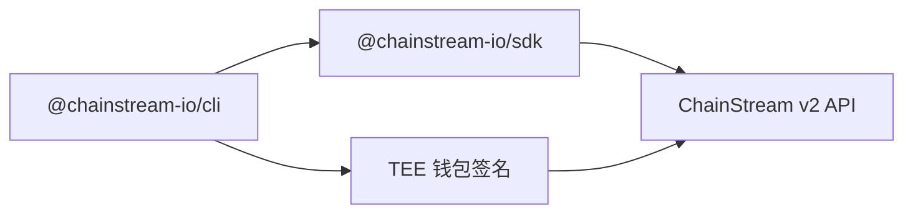

## 什麼是 ChainStream CLI

ChainStream CLI (`@chainstream-io/cli`) 是一個命令列工具，用於在 Solana、BSC 和 Ethereum 上查詢鏈上資料和執行 DeFi 操作。它同時面向人類開發者和 AI Agent 設計。

<CardGroup cols={2}>
  <Card title="資料查詢" icon="magnifying-glass" color="#4D9CFF">
    搜尋代幣、分析錢包、追蹤市場趨勢、查詢近期交易
  </Card>
  <Card title="DeFi 執行" icon="right-left" color="#9333EA">
    兌換代幣、在發射臺建立代幣、透過內建錢包簽名廣播交易
  </Card>
</CardGroup>

## 安裝

無需全域性安裝 — 直接用 `npx` 執行：

```bash
npx @chainstream-io/cli token search --keyword PUMP --chain sol
```

或全域性安裝：

```bash
npm install -g @chainstream-io/cli
chainstream token search --keyword PUMP --chain sol
```

<Note>需要 Node.js 18 或更高版本。</Note>

## 架構



- **基於 SDK** — 所有 API 呼叫透過 `@chainstream-io/sdk`，具備型別化響應、自動重試和任務輪詢
- **TEE 簽名** — DeFi 交易在 TEE（可信執行環境）中遠端簽名；裝置金鑰儲存在本地 `~/.config/chainstream/keys/`
- **API Key 優先** — x402 購買後自動儲存 API Key 到配置；錢包簽名僅在 DeFi 執行時需要

## 支援的鏈

| 鏈 | CLI ID | Data API | DeFi | WebSocket |
|----|--------|----------|------|-----------|
| Solana | `sol` | 支援 | 支援 | 支援 |
| BSC | `bsc` | 支援 | 支援 | 支援 |
| Ethereum | `eth` | 支援 | 支援 | 支援 |

## CLI vs MCP vs SDK

| 能力 | CLI | MCP Server | SDK |
|------|-----|------------|-----|
| 代幣搜尋與分析 | 支援 | 支援 | 支援 |
| 市場趨勢與排行 | 支援 | 支援 | 支援 |
| 錢包畫像與盈虧 | 支援 | 支援 | 支援 |
| DEX 報價 | 支援 | 支援 | 支援 |
| DEX 兌換（簽名） | 支援 | 不支援 | 支援（需 WalletSigner） |
| 代幣建立 | 支援 | 不支援 | 支援（需 WalletSigner） |
| x402 自動支付 | 支援 | 不適用 | 手動 |
| 適用場景 | AI Agent、指令碼、CI | AI 聊天助手 | 自定義應用 |

## 快速開始

```bash
# 1. 认证（仅需一次）
npx @chainstream-io/cli login

# 2. 搜索代币
npx @chainstream-io/cli token search --keyword PUMP --chain sol

# 3. 检查代币安全性
npx @chainstream-io/cli token security --chain sol --address <token_address>

# 4. 查看热门代币
npx @chainstream-io/cli market trending --chain sol --duration 1h

# 5. 分析钱包盈亏
npx @chainstream-io/cli wallet pnl --chain sol --address <wallet_address>
```

## 下一步

<CardGroup cols={3}>
  <Card title="認證" icon="key" href="/zh-Hant/guides/cli/authentication">
    設定 API Key 或錢包登入
  </Card>
  <Card title="命令參考" icon="book" href="/zh-Hant/guides/cli/commands">
    完整的命令和選項列表
  </Card>
  <Card title="x402 支付" icon="credit-card" href="/zh-Hant/guides/cli/x402-payment">
    使用 USDC 自動購買訂閱
  </Card>
</CardGroup>
